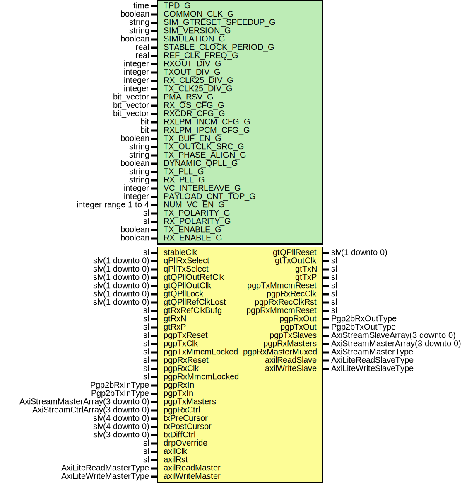

# Entity: Pgp2bGtp7FixedLat

- **File**: Pgp2bGtp7FixedLat.vhd
## Diagram

## Description

-----------------------------------------------------------------------------
 Title      : PGPv2b: https://confluence.slac.stanford.edu/x/q86fD
-----------------------------------------------------------------------------
 Company    : SLAC National Accelerator Laboratory
-----------------------------------------------------------------------------
 Description: Gth7 Fixed Latency Module
-----------------------------------------------------------------------------
 This file is part of 'SLAC Firmware Standard Library'.
 It is subject to the license terms in the LICENSE.txt file found in the
 top-level directory of this distribution and at:
    https://confluence.slac.stanford.edu/display/ppareg/LICENSE.html.
 No part of 'SLAC Firmware Standard Library', including this file,
 may be copied, modified, propagated, or distributed except according to
 the terms contained in the LICENSE.txt file.
-----------------------------------------------------------------------------
## Generics

| Generic name          | Type                 | Value                    | Description                                                                                                                                                                                                          |
| --------------------- | -------------------- | ------------------------ | -------------------------------------------------------------------------------------------------------------------------------------------------------------------------------------------------------------------- |
| TPD_G                 | time                 | 1 ns                     |                                                                                                                                                                                                                      |
| COMMON_CLK_G          | boolean              | false                    |  set true if (stableClk = axilClk)                                                                                                                                                                                   |
| SIM_GTRESET_SPEEDUP_G | string               | "FALSE"                  | ------------------------------------------------------------------------------------------- GT Settings ------------------------------------------------------------------------------------------- Sim Generics --  |
| SIM_VERSION_G         | string               | "2.0"                    |                                                                                                                                                                                                                      |
| SIMULATION_G          | boolean              | false                    |                                                                                                                                                                                                                      |
| STABLE_CLOCK_PERIOD_G | real                 | 4.0E-9                   | units of seconds                                                                                                                                                                                                     |
| REF_CLK_FREQ_G        | real                 | 125.0E6                  |                                                                                                                                                                                                                      |
| RXOUT_DIV_G           | integer              | 2                        | TX/RX Settings - Defaults to 2.5 Gbps operation                                                                                                                                                                      |
| TXOUT_DIV_G           | integer              | 2                        |                                                                                                                                                                                                                      |
| RX_CLK25_DIV_G        | integer              | 5                        |  Set by wizard                                                                                                                                                                                                       |
| TX_CLK25_DIV_G        | integer              | 5                        |  Set by wizard                                                                                                                                                                                                       |
| PMA_RSV_G             | bit_vector           | x"00000333"              |  Set by wizard                                                                                                                                                                                                       |
| RX_OS_CFG_G           | bit_vector           | "0001111110000"          |  Set by wizard                                                                                                                                                                                                       |
| RXCDR_CFG_G           | bit_vector           | x"0000107FE206001041010" |  Set by wizard                                                                                                                                                                                                       |
| RXLPM_INCM_CFG_G      | bit                  | '1'                      |  Set by wizard                                                                                                                                                                                                       |
| RXLPM_IPCM_CFG_G      | bit                  | '0'                      |  Set by wizard                                                                                                                                                                                                       |
| TX_BUF_EN_G           | boolean              | false                    | Allow TX to run in var lat mode by altering these generics                                                                                                                                                           |
| TX_OUTCLK_SRC_G       | string               | "PLLREFCLK"              |                                                                                                                                                                                                                      |
| TX_PHASE_ALIGN_G      | string               | "MANUAL"                 |                                                                                                                                                                                                                      |
| DYNAMIC_QPLL_G        | boolean              | false                    | Configure PLL sources                                                                                                                                                                                                |
| TX_PLL_G              | string               | "PLL0"                   |                                                                                                                                                                                                                      |
| RX_PLL_G              | string               | "PLL1"                   |                                                                                                                                                                                                                      |
| VC_INTERLEAVE_G       | integer              | 0                        |  No interleave Frames                                                                                                                                                                                                |
| PAYLOAD_CNT_TOP_G     | integer              | 7                        |  Top bit for payload counter                                                                                                                                                                                         |
| NUM_VC_EN_G           | integer range 1 to 4 | 4                        |                                                                                                                                                                                                                      |
| TX_POLARITY_G         | sl                   | '0'                      |                                                                                                                                                                                                                      |
| RX_POLARITY_G         | sl                   | '0'                      |                                                                                                                                                                                                                      |
| TX_ENABLE_G           | boolean              | true                     |  Enable TX direction                                                                                                                                                                                                 |
| RX_ENABLE_G           | boolean              | true                     |                                                                                                                                                                                                                      |
## Ports

| Port name        | Direction | Type                             | Description                                              |
| ---------------- | --------- | -------------------------------- | -------------------------------------------------------- |
| stableClk        | in        | sl                               |  GT needs a stable clock to "boot up"                    |
| qPllRxSelect     | in        | slv(1 downto 0)                  |                                                          |
| qPllTxSelect     | in        | slv(1 downto 0)                  |                                                          |
| gtQPllOutRefClk  | in        | slv(1 downto 0)                  |  Signals from QPLLs                                      |
| gtQPllOutClk     | in        | slv(1 downto 0)                  |                                                          |
| gtQPllLock       | in        | slv(1 downto 0)                  |                                                          |
| gtQPllRefClkLost | in        | slv(1 downto 0)                  |                                                          |
| gtQPllReset      | out       | slv(1 downto 0)                  |                                                          |
| gtRxRefClkBufg   | in        | sl                               |  gtrefclk driving rx side, fed through clock buffer      |
| gtTxOutClk       | out       | sl                               |                                                          |
| gtRxN            | in        | sl                               |  GT Serial Receive Negative                              |
| gtRxP            | in        | sl                               |  GT Serial Receive Positive                              |
| gtTxN            | out       | sl                               |  GT Serial Transmit Negative                             |
| gtTxP            | out       | sl                               |  GT Serial Transmit Positive                             |
| pgpTxReset       | in        | sl                               | Tx Clocking                                              |
| pgpTxClk         | in        | sl                               |                                                          |
| pgpTxMmcmReset   | out       | sl                               |                                                          |
| pgpTxMmcmLocked  | in        | sl                               |                                                          |
| pgpRxReset       | in        | sl                               | Rx clocking                                              |
| pgpRxRecClk      | out       | sl                               |  rxrecclk basically                                      |
| pgpRxRecClkRst   | out       | sl                               |  Reset for recovered clock                               |
| pgpRxClk         | in        | sl                               |  Run recClk through external MMCM and sent to this input |
| pgpRxMmcmReset   | out       | sl                               |                                                          |
| pgpRxMmcmLocked  | in        | sl                               |                                                          |
| pgpRxIn          | in        | Pgp2bRxInType                    | Non VC Rx Signals                                        |
| pgpRxOut         | out       | Pgp2bRxOutType                   |                                                          |
| pgpTxIn          | in        | Pgp2bTxInType                    | Non VC Tx Signals                                        |
| pgpTxOut         | out       | Pgp2bTxOutType                   |                                                          |
| pgpTxMasters     | in        | AxiStreamMasterArray(3 downto 0) | Frame Transmit Interface - 1 Lane, Array of 4 VCs        |
| pgpTxSlaves      | out       | AxiStreamSlaveArray(3 downto 0)  |                                                          |
| pgpRxMasters     | out       | AxiStreamMasterArray(3 downto 0) | Frame Receive Interface - 1 Lane, Array of 4 VCs         |
| pgpRxMasterMuxed | out       | AxiStreamMasterType              |                                                          |
| pgpRxCtrl        | in        | AxiStreamCtrlArray(3 downto 0)   |                                                          |
| txPreCursor      | in        | slv(4 downto 0)                  | Debug Interface                                          |
| txPostCursor     | in        | slv(4 downto 0)                  |                                                          |
| txDiffCtrl       | in        | slv(3 downto 0)                  |                                                          |
| drpOverride      | in        | sl                               |                                                          |
| axilClk          | in        | sl                               | AXI-Lite Interface                                       |
| axilRst          | in        | sl                               |                                                          |
| axilReadMaster   | in        | AxiLiteReadMasterType            |                                                          |
| axilReadSlave    | out       | AxiLiteReadSlaveType             |                                                          |
| axilWriteMaster  | in        | AxiLiteWriteMasterType           |                                                          |
| axilWriteSlave   | out       | AxiLiteWriteSlaveType            |                                                          |
## Signals

| Name           | Type                           | Description                                                                                                                                                                                                    |
| -------------- | ------------------------------ | -------------------------------------------------------------------------------------------------------------------------------------------------------------------------------------------------------------- |
| gtRxResetDone  | sl                             |                                                                                                                                                                                                                |
| gtRxResetDoneL | sl                             |                                                                                                                                                                                                                |
| gtRxUserReset  | sl                             |                                                                                                                                                                                                                |
| pgpRxResetInt  | sl                             |                                                                                                                                                                                                                |
| gtRxData       | slv(19 downto 0)               |  Feed to 8B10B decoder                                                                                                                                                                                         |
| dataValid      | sl                             |  no decode or disparity errors                                                                                                                                                                                 |
| dataValidTmp   | sl                             |  no decode or disparity errors                                                                                                                                                                                 |
| phyRxLanesIn   | Pgp2bRxPhyLaneInArray(0 to 0)  |  Output from decoder                                                                                                                                                                                           |
| phyRxLanesOut  | Pgp2bRxPhyLaneOutArray(0 to 0) |  Polarity to GT                                                                                                                                                                                                |
| phyRxReady     | sl                             |  To RxRst                                                                                                                                                                                                      |
| phyRxInit      | sl                             |  To RxRst                                                                                                                                                                                                      |
| gtTxUsrClk     | sl                             | ------------------------------------------------------------------------------------------------  Tx Signals ------------------------------------------------------------------------------------------------  |
| gtTxResetDone  | sl                             |                                                                                                                                                                                                                |
| phyTxLanesOut  | Pgp2bTxPhyLaneOutArray(0 to 0) |  PgpTx Signals                                                                                                                                                                                                 |
| phyTxReady     | sl                             |                                                                                                                                                                                                                |
| stableRst      | sl                             |                                                                                                                                                                                                                |
| drpGnt         | sl                             |                                                                                                                                                                                                                |
| drpRdy         | sl                             |                                                                                                                                                                                                                |
| drpEn          | sl                             |                                                                                                                                                                                                                |
| drpWe          | sl                             |                                                                                                                                                                                                                |
| drpAddr        | slv(8 downto 0)                |                                                                                                                                                                                                                |
| drpDi          | slv(15 downto 0)               |                                                                                                                                                                                                                |
| drpDo          | slv(15 downto 0)               |                                                                                                                                                                                                                |
## Instantiations

- U_Pgp2bLane: surf.Pgp2bLane
 **Description**
------------------------------------------------------------------------------------------------
 PGP Core
------------------------------------------------------------------------------------------------

- U_gtRxUserReset: surf.SynchronizerOneShot
 **Description**
-----------------------------------------------------------------------------------------------
 Oneshot the phy init because clock may drop out and leave it stuck high
-----------------------------------------------------------------------------------------------

- Decoder8b10b_1: surf.Decoder8b10b
- U_Pgp3RxGearboxAligner_1: surf.Pgp3RxGearboxAligner
 **Description**
-----------------------------------------------------------------------------------------------
 Filter on dataValid so that it doesn't drop immediately on errors
 Not currently hooked up but leaving it in so we can try it someday.
-----------------------------------------------------------------------------------------------

- Gtp7Core_1: surf.Gtp7Core
 **Description**
------------------------------------------------------------------------------------------------
 GTP 7 Core in Fixed Latency mode
------------------------------------------------------------------------------------------------

- U_AxiLiteToDrp: surf.AxiLiteToDrp
