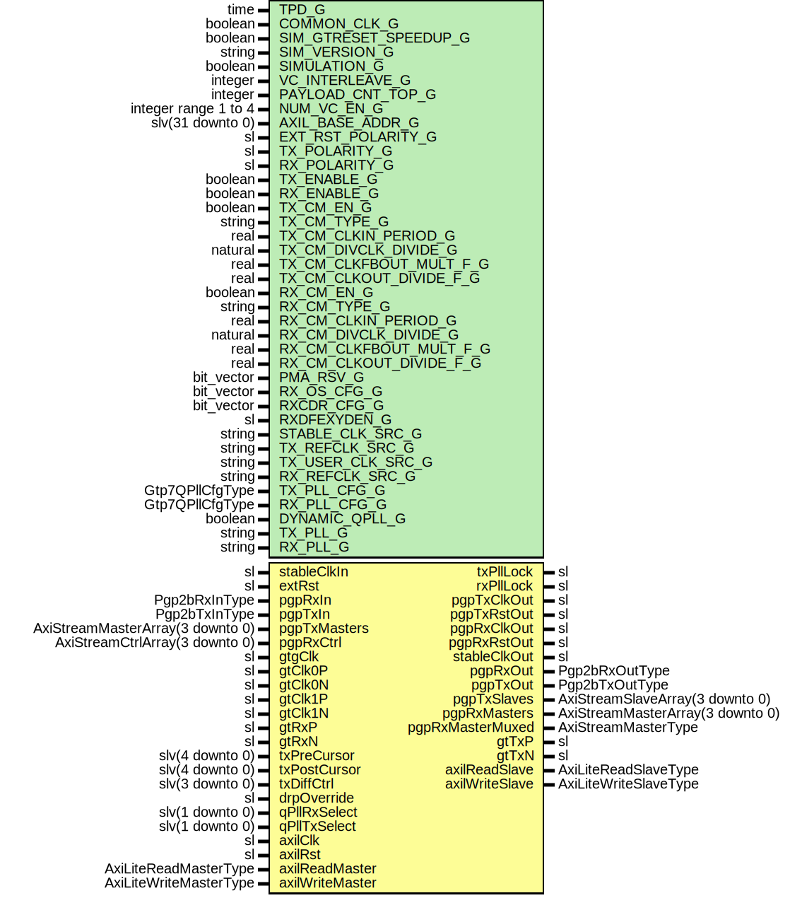

# Entity: Pgp2bGtp7FixedLatWrapper

- **File**: Pgp2bGtp7FixedLatWrapper.vhd
## Diagram

## Description

-----------------------------------------------------------------------------
 Title      : PGPv2b: https://confluence.slac.stanford.edu/x/q86fD
-----------------------------------------------------------------------------
 Company    : SLAC National Accelerator Laboratory
-----------------------------------------------------------------------------
 Description: Gtp7 Fixed Latency Wrapper
-----------------------------------------------------------------------------
 This file is part of 'SLAC Firmware Standard Library'.
 It is subject to the license terms in the LICENSE.txt file found in the
 top-level directory of this distribution and at:
    https://confluence.slac.stanford.edu/display/ppareg/LICENSE.html.
 No part of 'SLAC Firmware Standard Library', including this file,
 may be copied, modified, propagated, or distributed except according to
 the terms contained in the LICENSE.txt file.
-----------------------------------------------------------------------------
## Generics

| Generic name            | Type                 | Value                             | Description                        |
| ----------------------- | -------------------- | --------------------------------- | ---------------------------------- |
| TPD_G                   | time                 | 1 ns                              |                                    |
| COMMON_CLK_G            | boolean              | false                             |  set true if (stableClk = axilClk) |
| SIM_GTRESET_SPEEDUP_G   | boolean              | false                             |                                    |
| SIM_VERSION_G           | string               | "2.0"                             |                                    |
| SIMULATION_G            | boolean              | false                             |                                    |
| VC_INTERLEAVE_G         | integer              | 0                                 |  No interleave Frames              |
| PAYLOAD_CNT_TOP_G       | integer              | 7                                 |  Top bit for payload counter       |
| NUM_VC_EN_G             | integer range 1 to 4 | 4                                 |                                    |
| AXIL_BASE_ADDR_G        | slv(31 downto 0)     | (others => '0')                   |                                    |
| EXT_RST_POLARITY_G      | sl                   | '1'                               |                                    |
| TX_POLARITY_G           | sl                   | '0'                               |                                    |
| RX_POLARITY_G           | sl                   | '0'                               |                                    |
| TX_ENABLE_G             | boolean              | true                              |  Enable TX direction               |
| RX_ENABLE_G             | boolean              | true                              |  Enable RX direction               |
| TX_CM_EN_G              | boolean              | true                              | CM Configurations                  |
| TX_CM_TYPE_G            | string               | "MMCM"                            |                                    |
| TX_CM_CLKIN_PERIOD_G    | real                 | 8.000                             |                                    |
| TX_CM_DIVCLK_DIVIDE_G   | natural              | 8                                 |                                    |
| TX_CM_CLKFBOUT_MULT_F_G | real                 | 8.000                             |                                    |
| TX_CM_CLKOUT_DIVIDE_F_G | real                 | 8.000                             |                                    |
| RX_CM_EN_G              | boolean              | true                              |                                    |
| RX_CM_TYPE_G            | string               | "MMCM"                            |                                    |
| RX_CM_CLKIN_PERIOD_G    | real                 | 8.000                             |                                    |
| RX_CM_DIVCLK_DIVIDE_G   | natural              | 8                                 |                                    |
| RX_CM_CLKFBOUT_MULT_F_G | real                 | 8.000                             |                                    |
| RX_CM_CLKOUT_DIVIDE_F_G | real                 | 8.000                             |                                    |
| PMA_RSV_G               | bit_vector           | x"00018480"                       | MGT Configurations                 |
| RX_OS_CFG_G             | bit_vector           | "0000010000000"                   |  Set by wizard                     |
| RXCDR_CFG_G             | bit_vector           | x"00003000023ff40200020"          |  Set by wizard                     |
| RXDFEXYDEN_G            | sl                   | '0'                               |  Set by wizard                     |
| STABLE_CLK_SRC_G        | string               | "stableClkIn"                     |  or "gtClk0" or "gtClk1"           |
| TX_REFCLK_SRC_G         | string               | "gtClk0"                          |                                    |
| TX_USER_CLK_SRC_G       | string               | "txRefClk"                        |  Could be txOutClk instead         |
| RX_REFCLK_SRC_G         | string               | "gtClk0"                          |                                    |
| TX_PLL_CFG_G            | Gtp7QPllCfgType      | getGtp7QPllCfg(156.25e6, 3.125e9) |                                    |
| RX_PLL_CFG_G            | Gtp7QPllCfgType      | getGtp7QPllCfg(156.25e6, 3.125e9) |                                    |
| DYNAMIC_QPLL_G          | boolean              | false                             |                                    |
| TX_PLL_G                | string               | "PLL0"                            |                                    |
| RX_PLL_G                | string               | "PLL0"                            |                                    |
## Ports

| Port name        | Direction | Type                             | Description                                       |
| ---------------- | --------- | -------------------------------- | ------------------------------------------------- |
| stableClkIn      | in        | sl                               | Manual Reset                                      |
| extRst           | in        | sl                               |                                                   |
| txPllLock        | out       | sl                               | Status and Clock Signals                          |
| rxPllLock        | out       | sl                               |                                                   |
| pgpTxClkOut      | out       | sl                               | Output internally configured clocks               |
| pgpTxRstOut      | out       | sl                               |                                                   |
| pgpRxClkOut      | out       | sl                               |                                                   |
| pgpRxRstOut      | out       | sl                               |                                                   |
| stableClkOut     | out       | sl                               |                                                   |
| pgpRxIn          | in        | Pgp2bRxInType                    | Non VC Rx Signals                                 |
| pgpRxOut         | out       | Pgp2bRxOutType                   |                                                   |
| pgpTxIn          | in        | Pgp2bTxInType                    | Non VC Tx Signals                                 |
| pgpTxOut         | out       | Pgp2bTxOutType                   |                                                   |
| pgpTxMasters     | in        | AxiStreamMasterArray(3 downto 0) | Frame Transmit Interface - 1 Lane, Array of 4 VCs |
| pgpTxSlaves      | out       | AxiStreamSlaveArray(3 downto 0)  |                                                   |
| pgpRxMasters     | out       | AxiStreamMasterArray(3 downto 0) | Frame Receive Interface - 1 Lane, Array of 4 VCs  |
| pgpRxMasterMuxed | out       | AxiStreamMasterType              |                                                   |
| pgpRxCtrl        | in        | AxiStreamCtrlArray(3 downto 0)   |                                                   |
| gtgClk           | in        | sl                               | GT Pins                                           |
| gtClk0P          | in        | sl                               |                                                   |
| gtClk0N          | in        | sl                               |                                                   |
| gtClk1P          | in        | sl                               |                                                   |
| gtClk1N          | in        | sl                               |                                                   |
| gtTxP            | out       | sl                               |                                                   |
| gtTxN            | out       | sl                               |                                                   |
| gtRxP            | in        | sl                               |                                                   |
| gtRxN            | in        | sl                               |                                                   |
| txPreCursor      | in        | slv(4 downto 0)                  | Debug Interface                                   |
| txPostCursor     | in        | slv(4 downto 0)                  |                                                   |
| txDiffCtrl       | in        | slv(3 downto 0)                  |                                                   |
| drpOverride      | in        | sl                               |                                                   |
| qPllRxSelect     | in        | slv(1 downto 0)                  |                                                   |
| qPllTxSelect     | in        | slv(1 downto 0)                  |                                                   |
| axilClk          | in        | sl                               | AXI-Lite Interface                                |
| axilRst          | in        | sl                               |                                                   |
| axilReadMaster   | in        | AxiLiteReadMasterType            |                                                   |
| axilReadSlave    | out       | AxiLiteReadSlaveType             |                                                   |
| axilWriteMaster  | in        | AxiLiteWriteMasterType           |                                                   |
| axilWriteSlave   | out       | AxiLiteWriteSlaveType            |                                                   |
## Signals

| Name                | Type                                | Description |
| ------------------- | ----------------------------------- | ----------- |
| gtClk0              | sl                                  |             |
| gtClk0Div2          | sl                                  |             |
| gtClk1              | sl                                  |             |
| gtClk1Div2          | sl                                  |             |
| txRefClk            | sl                                  |             |
| txOutClk            | sl                                  |             |
| rxRefClk            | sl                                  |             |
| stableClkRef        | sl                                  |             |
| stableClkRefG       | sl                                  |             |
| stableClk           | sl                                  |             |
| stableRst           | sl                                  |             |
| pgpTxClkBase        | sl                                  |             |
| pgpTxClk            | sl                                  |             |
| pgpTxReset          | sl                                  |             |
| pgpTxMmcmReset      | sl                                  |             |
| pgpTxMmcmLocked     | sl                                  |             |
| pgpRxRecClk         | sl                                  |             |
| pgpRxRecClkRst      | sl                                  |             |
| pgpRxClkLoc         | sl                                  |             |
| pgpRxReset          | sl                                  |             |
| pgpRxMmcmReset      | sl                                  |             |
| pgpRxMmcmLocked     | sl                                  |             |
| qPllRefClk          | slv(1 downto 0)                     |             |
| qPllOutClk          | slv(1 downto 0)                     |             |
| qPllOutRefClk       | slv(1 downto 0)                     |             |
| qPllLock            | slv(1 downto 0)                     |             |
| qPllLockDetClk      | slv(1 downto 0)                     |             |
| qPllRefClkLost      | slv(1 downto 0)                     |             |
| qPllReset           | slv(1 downto 0)                     |             |
| locAxilWriteMasters | AxiLiteWriteMasterArray(1 downto 0) |             |
| locAxilWriteSlaves  | AxiLiteWriteSlaveArray(1 downto 0)  |             |
| locAxilReadMasters  | AxiLiteReadMasterArray(1 downto 0)  |             |
| locAxilReadSlaves   | AxiLiteReadSlaveArray(1 downto 0)   |             |
## Constants

| Name                  | Type            | Value                                                                                                                       | Description |
| --------------------- | --------------- | --------------------------------------------------------------------------------------------------------------------------- | ----------- |
| PLL0_CFG_C            | Gtp7QPllCfgType |  ite(TX_PLL_G = "PLL0",  TX_PLL_CFG_G,  RX_PLL_CFG_G) |             |
| PLL1_CFG_C            | Gtp7QPllCfgType |  ite(TX_PLL_G = "PLL1",  TX_PLL_CFG_G,  RX_PLL_CFG_G) |             |
| SIM_GTRESET_SPEEDUP_C | string          |  ite(SIM_GTRESET_SPEEDUP_G,  "TRUE",  "FALSE")        |             |
## Instantiations

- BUFG_stableClkRef: BUFG
- PwrUpRst_Inst: surf.PwrUpRst
**Description**
 Power Up Reset

- RstSync_pgpRxRst: surf.RstSync
**Description**
 PGP RX Reset

- U_Gtp7QuadPll_1: surf.Gtp7QuadPll
- Pgp2bGtp7Fixedlat_Inst: surf.Pgp2bGtp7FixedLat
**Description**
 [out]

- U_AxiLiteCrossbar_1: surf.AxiLiteCrossbar
**Description**
-----------------------------------------------------------------------------------------------
 AXI-Lite crossbar
-----------------------------------------------------------------------------------------------

