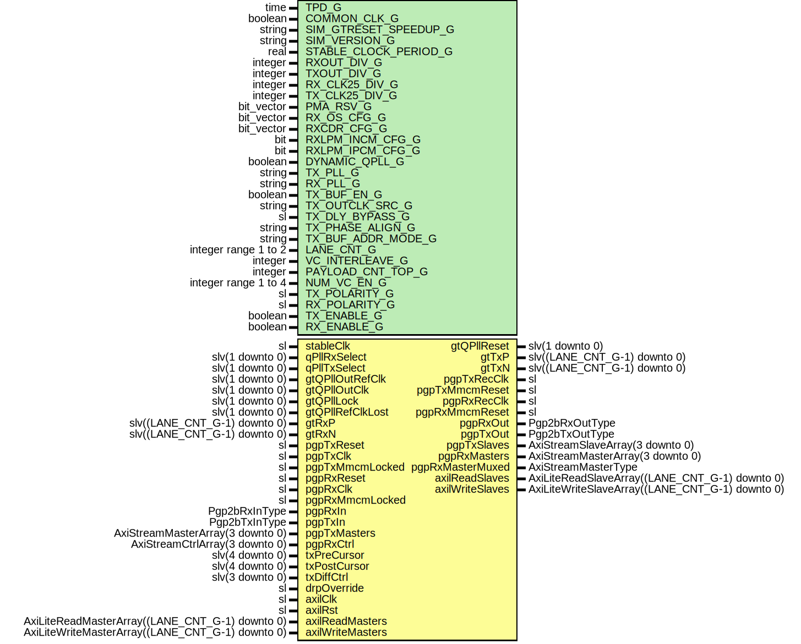

# Entity: Pgp2bGtp7MultiLane

## Diagram

## Description

Title      : PGPv2b: https://confluence.slac.stanford.edu/x/q86fD
Company    : SLAC National Accelerator Laboratory
Description: Gtp7 Variable Latency, multi-lane Module
This file is part of 'SLAC Firmware Standard Library'.
It is subject to the license terms in the LICENSE.txt file found in the
top-level directory of this distribution and at:
   https://confluence.slac.stanford.edu/display/ppareg/LICENSE.html.
No part of 'SLAC Firmware Standard Library', including this file,
may be copied, modified, propagated, or distributed except according to
the terms contained in the LICENSE.txt file.
## Generics

| Generic name          | Type                 | Value                    | Description                       |
| --------------------- | -------------------- | ------------------------ | --------------------------------- |
| TPD_G                 | time                 | 1 ns                     |                                   |
| COMMON_CLK_G          | boolean              | false                    | set true if (stableClk = axilClk) |
| SIM_GTRESET_SPEEDUP_G | string               | "FALSE"                  | GT Settings Sim Generics          |
| SIM_VERSION_G         | string               | "2.0"                    |                                   |
| STABLE_CLOCK_PERIOD_G | real                 | 4.0E-9                   |                                   |
| RXOUT_DIV_G           | integer              | 2                        | Configure PLL                     |
| TXOUT_DIV_G           | integer              | 2                        |                                   |
| RX_CLK25_DIV_G        | integer              | 7                        | Set by wizard                     |
| TX_CLK25_DIV_G        | integer              | 7                        | Set by wizard                     |
| PMA_RSV_G             | bit_vector           | x"00000333"              | Set by wizard                     |
| RX_OS_CFG_G           | bit_vector           | "0001111110000"          | Set by wizard                     |
| RXCDR_CFG_G           | bit_vector           | x"0000107FE206001041010" | Set by wizard                     |
| RXLPM_INCM_CFG_G      | bit                  | '1'                      | Set by wizard                     |
| RXLPM_IPCM_CFG_G      | bit                  | '0'                      | Set by wizard                     |
| DYNAMIC_QPLL_G        | boolean              | false                    |                                   |
| TX_PLL_G              | string               | "PLL0"                   |                                   |
| RX_PLL_G              | string               | "PLL1"                   |                                   |
| TX_BUF_EN_G           | boolean              | true                     | Configure Buffer usage            |
| TX_OUTCLK_SRC_G       | string               | "OUTCLKPMA"              |                                   |
| TX_DLY_BYPASS_G       | sl                   | '1'                      |                                   |
| TX_PHASE_ALIGN_G      | string               | "NONE"                   |                                   |
| TX_BUF_ADDR_MODE_G    | string               | "FULL"                   |                                   |
| LANE_CNT_G            | integer range 1 to 2 | 1                        | Configure Number of Lanes         |
| VC_INTERLEAVE_G       | integer              | 0                        | No interleave Frames              |
| PAYLOAD_CNT_TOP_G     | integer              | 7                        | Top bit for payload counter       |
| NUM_VC_EN_G           | integer range 1 to 4 | 4                        |                                   |
| TX_POLARITY_G         | sl                   | '0'                      |                                   |
| RX_POLARITY_G         | sl                   | '0'                      |                                   |
| TX_ENABLE_G           | boolean              | true                     | Enable TX direction               |
| RX_ENABLE_G           | boolean              | true                     |                                   |
## Ports

| Port name        | Direction | Type                                             | Description                                       |
| ---------------- | --------- | ------------------------------------------------ | ------------------------------------------------- |
| stableClk        | in        | sl                                               | GT needs a stable clock to "boot up"              |
| qPllRxSelect     | in        | slv(1 downto 0)                                  |                                                   |
| qPllTxSelect     | in        | slv(1 downto 0)                                  |                                                   |
| gtQPllOutRefClk  | in        | slv(1 downto 0)                                  |                                                   |
| gtQPllOutClk     | in        | slv(1 downto 0)                                  |                                                   |
| gtQPllLock       | in        | slv(1 downto 0)                                  |                                                   |
| gtQPllRefClkLost | in        | slv(1 downto 0)                                  |                                                   |
| gtQPllReset      | out       | slv(1 downto 0)                                  |                                                   |
| gtTxP            | out       | slv((LANE_CNT_G-1) downto 0)                     | GT Serial Transmit Positive                       |
| gtTxN            | out       | slv((LANE_CNT_G-1) downto 0)                     | GT Serial Transmit Negative                       |
| gtRxP            | in        | slv((LANE_CNT_G-1) downto 0)                     | GT Serial Receive Positive                        |
| gtRxN            | in        | slv((LANE_CNT_G-1) downto 0)                     | GT Serial Receive Negative                        |
| pgpTxReset       | in        | sl                                               | Tx Clocking                                       |
| pgpTxRecClk      | out       | sl                                               | recovered clock                                   |
| pgpTxClk         | in        | sl                                               |                                                   |
| pgpTxMmcmReset   | out       | sl                                               |                                                   |
| pgpTxMmcmLocked  | in        | sl                                               |                                                   |
| pgpRxReset       | in        | sl                                               | Rx clocking                                       |
| pgpRxRecClk      | out       | sl                                               | recovered clock                                   |
| pgpRxClk         | in        | sl                                               |                                                   |
| pgpRxMmcmReset   | out       | sl                                               |                                                   |
| pgpRxMmcmLocked  | in        | sl                                               |                                                   |
| pgpRxIn          | in        | Pgp2bRxInType                                    | Non VC Rx Signals                                 |
| pgpRxOut         | out       | Pgp2bRxOutType                                   |                                                   |
| pgpTxIn          | in        | Pgp2bTxInType                                    | Non VC Tx Signals                                 |
| pgpTxOut         | out       | Pgp2bTxOutType                                   |                                                   |
| pgpTxMasters     | in        | AxiStreamMasterArray(3 downto 0)                 | Frame Transmit Interface - 1 Lane, Array of 4 VCs |
| pgpTxSlaves      | out       | AxiStreamSlaveArray(3 downto 0)                  |                                                   |
| pgpRxMasters     | out       | AxiStreamMasterArray(3 downto 0)                 | Frame Receive Interface - 1 Lane, Array of 4 VCs  |
| pgpRxMasterMuxed | out       | AxiStreamMasterType                              |                                                   |
| pgpRxCtrl        | in        | AxiStreamCtrlArray(3 downto 0)                   |                                                   |
| txPreCursor      | in        | slv(4 downto 0)                                  | Debug Interface                                   |
| txPostCursor     | in        | slv(4 downto 0)                                  |                                                   |
| txDiffCtrl       | in        | slv(3 downto 0)                                  |                                                   |
| drpOverride      | in        | sl                                               |                                                   |
| axilClk          | in        | sl                                               | AXI-Lite Interface                                |
| axilRst          | in        | sl                                               |                                                   |
| axilReadMasters  | in        | AxiLiteReadMasterArray((LANE_CNT_G-1) downto 0)  |                                                   |
| axilReadSlaves   | out       | AxiLiteReadSlaveArray((LANE_CNT_G-1) downto 0)   |                                                   |
| axilWriteMasters | in        | AxiLiteWriteMasterArray((LANE_CNT_G-1) downto 0) |                                                   |
| axilWriteSlaves  | out       | AxiLiteWriteSlaveArray((LANE_CNT_G-1) downto 0)  |                                                   |
## Signals

| Name            | Type                                            | Description        |
| --------------- | ----------------------------------------------- | ------------------ |
| gtQPllResets    | QPllResetsVector((LANE_CNT_G-1) downto 0)       |                    |
| pgpRxMmcmResets | slv((LANE_CNT_G-1) downto 0)                    | PgpRx Signals      |
| pgpRxRecClock   | slv((LANE_CNT_G-1) downto 0)                    |                    |
| gtRxResetDone   | slv((LANE_CNT_G-1) downto 0)                    |                    |
| gtRxUserReset   | sl                                              |                    |
| gtRxUserResetIn | sl                                              |                    |
| phyRxLanesIn    | Pgp2bRxPhyLaneInArray((LANE_CNT_G-1) downto 0)  |                    |
| phyRxLanesOut   | Pgp2bRxPhyLaneOutArray((LANE_CNT_G-1) downto 0) |                    |
| phyRxReady      | sl                                              |                    |
| phyRxInit       | sl                                              |                    |
| rxChBondLevel   | slv(2 downto 0)                                 | Rx Channel Bonding |
| rxChBondIn      | Slv4Array(LANE_CNT_G-1 downto 0)                |                    |
| rxChBondOut     | Slv4Array(LANE_CNT_G-1 downto 0)                |                    |
| pgpTxMmcmResets | slv((LANE_CNT_G-1) downto 0)                    | PgpTx Signals      |
| pgpTxRecClock   | slv((LANE_CNT_G-1) downto 0)                    |                    |
| gtTxResetDone   | slv((LANE_CNT_G-1) downto 0)                    |                    |
| gtTxUserResetIn | sl                                              |                    |
| phyTxLanesOut   | Pgp2bTxPhyLaneOutArray((LANE_CNT_G-1) downto 0) |                    |
| phyTxReady      | sl                                              |                    |
| stableRst       | sl                                              |                    |
| drpGnt          | slv(LANE_CNT_G-1 downto 0)                      |                    |
| drpRdy          | slv(LANE_CNT_G-1 downto 0)                      |                    |
| drpEn           | slv(LANE_CNT_G-1 downto 0)                      |                    |
| drpWe           | slv(LANE_CNT_G-1 downto 0)                      |                    |
| drpAddr         | Slv9Array(LANE_CNT_G-1 downto 0)                |                    |
| drpDi           | Slv16Array(LANE_CNT_G-1 downto 0)               |                    |
| drpDo           | Slv16Array(LANE_CNT_G-1 downto 0)               |                    |
## Types

| Name             | Type                                        | Description |
| ---------------- | ------------------------------------------- | ----------- |
| QPllResetsVector | array (integer range<>) of slv(1 downto 0)  |             |
## Instantiations

- U_Pgp2bLane: surf.Pgp2bLane
