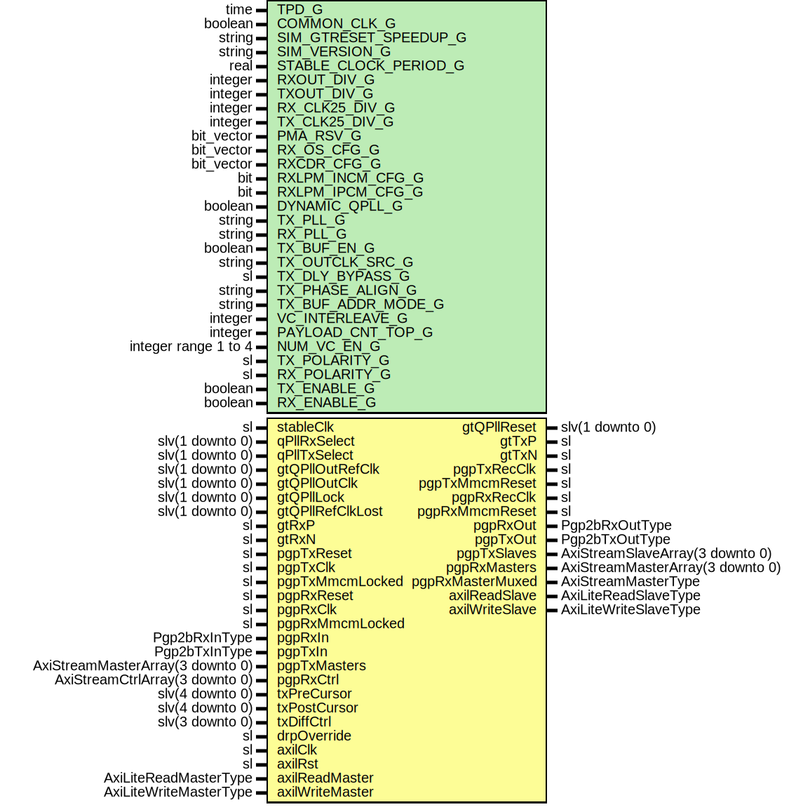

# Entity: Pgp2bGtp7VarLat

- **File**: Pgp2bGtp7VarLat.vhd
## Diagram

## Description

-----------------------------------------------------------------------------
 Title      : PGPv2b: https://confluence.slac.stanford.edu/x/q86fD
-----------------------------------------------------------------------------
 Company    : SLAC National Accelerator Laboratory
-----------------------------------------------------------------------------
 Description: Gtp7 Variable Latency Wrapper
-----------------------------------------------------------------------------
 This file is part of 'SLAC Firmware Standard Library'.
 It is subject to the license terms in the LICENSE.txt file found in the
 top-level directory of this distribution and at:
    https://confluence.slac.stanford.edu/display/ppareg/LICENSE.html.
 No part of 'SLAC Firmware Standard Library', including this file,
 may be copied, modified, propagated, or distributed except according to
 the terms contained in the LICENSE.txt file.
-----------------------------------------------------------------------------
## Generics

| Generic name          | Type                 | Value                    | Description                                                                                                                                                                                                       |
| --------------------- | -------------------- | ------------------------ | ----------------------------------------------------------------------------------------------------------------------------------------------------------------------------------------------------------------- |
| TPD_G                 | time                 | 1 ns                     |                                                                                                                                                                                                                   |
| COMMON_CLK_G          | boolean              | false                    |  set true if (stableClk = axilClk)                                                                                                                                                                                |
| SIM_GTRESET_SPEEDUP_G | string               | "FALSE"                  | ------------------------------------------------------------------------------------------- GT Settings ------------------------------------------------------------------------------------------- Sim Generics  |
| SIM_VERSION_G         | string               | "2.0"                    |                                                                                                                                                                                                                   |
| STABLE_CLOCK_PERIOD_G | real                 | 4.0E-9                   | units of seconds                                                                                                                                                                                                  |
| RXOUT_DIV_G           | integer              | 2                        | Configure PLL                                                                                                                                                                                                     |
| TXOUT_DIV_G           | integer              | 2                        |                                                                                                                                                                                                                   |
| RX_CLK25_DIV_G        | integer              | 7                        |  Set by wizard                                                                                                                                                                                                    |
| TX_CLK25_DIV_G        | integer              | 7                        |  Set by wizard                                                                                                                                                                                                    |
| PMA_RSV_G             | bit_vector           | x"00000333"              |  Set by wizard                                                                                                                                                                                                    |
| RX_OS_CFG_G           | bit_vector           | "0001111110000"          |  Set by wizard                                                                                                                                                                                                    |
| RXCDR_CFG_G           | bit_vector           | x"0000107FE206001041010" |  Set by wizard                                                                                                                                                                                                    |
| RXLPM_INCM_CFG_G      | bit                  | '1'                      |  Set by wizard                                                                                                                                                                                                    |
| RXLPM_IPCM_CFG_G      | bit                  | '0'                      |  Set by wizard                                                                                                                                                                                                    |
| DYNAMIC_QPLL_G        | boolean              | false                    |                                                                                                                                                                                                                   |
| TX_PLL_G              | string               | "PLL0"                   |                                                                                                                                                                                                                   |
| RX_PLL_G              | string               | "PLL1"                   |                                                                                                                                                                                                                   |
| TX_BUF_EN_G           | boolean              | true                     | Configure Buffer usage                                                                                                                                                                                            |
| TX_OUTCLK_SRC_G       | string               | "OUTCLKPMA"              |                                                                                                                                                                                                                   |
| TX_DLY_BYPASS_G       | sl                   | '1'                      |                                                                                                                                                                                                                   |
| TX_PHASE_ALIGN_G      | string               | "NONE"                   |                                                                                                                                                                                                                   |
| TX_BUF_ADDR_MODE_G    | string               | "FULL"                   |                                                                                                                                                                                                                   |
| VC_INTERLEAVE_G       | integer              | 0                        |  No interleave Frames                                                                                                                                                                                             |
| PAYLOAD_CNT_TOP_G     | integer              | 7                        |  Top bit for payload counter                                                                                                                                                                                      |
| NUM_VC_EN_G           | integer range 1 to 4 | 4                        |                                                                                                                                                                                                                   |
| TX_POLARITY_G         | sl                   | '0'                      |                                                                                                                                                                                                                   |
| RX_POLARITY_G         | sl                   | '0'                      |                                                                                                                                                                                                                   |
| TX_ENABLE_G           | boolean              | true                     |  Enable TX direction                                                                                                                                                                                              |
| RX_ENABLE_G           | boolean              | true                     |                                                                                                                                                                                                                   |
## Ports

| Port name        | Direction | Type                             | Description                               |
| ---------------- | --------- | -------------------------------- | ----------------------------------------- |
| stableClk        | in        | sl                               |  GT needs a stable clock to "boot up"     |
| qPllRxSelect     | in        | slv(1 downto 0)                  |                                           |
| qPllTxSelect     | in        | slv(1 downto 0)                  |                                           |
| gtQPllOutRefClk  | in        | slv(1 downto 0)                  |                                           |
| gtQPllOutClk     | in        | slv(1 downto 0)                  |                                           |
| gtQPllLock       | in        | slv(1 downto 0)                  |                                           |
| gtQPllRefClkLost | in        | slv(1 downto 0)                  |                                           |
| gtQPllReset      | out       | slv(1 downto 0)                  |                                           |
| gtTxP            | out       | sl                               |  GT Serial Transmit Positive              |
| gtTxN            | out       | sl                               |  GT Serial Transmit Negative              |
| gtRxP            | in        | sl                               |  GT Serial Receive Positive               |
| gtRxN            | in        | sl                               |  GT Serial Receive Negative               |
| pgpTxReset       | in        | sl                               | Tx Clocking                               |
| pgpTxRecClk      | out       | sl                               |  recovered clock                          |
| pgpTxClk         | in        | sl                               |                                           |
| pgpTxMmcmReset   | out       | sl                               |                                           |
| pgpTxMmcmLocked  | in        | sl                               |                                           |
| pgpRxReset       | in        | sl                               | Rx clocking                               |
| pgpRxRecClk      | out       | sl                               |  recovered clock                          |
| pgpRxClk         | in        | sl                               |                                           |
| pgpRxMmcmReset   | out       | sl                               |                                           |
| pgpRxMmcmLocked  | in        | sl                               |                                           |
| pgpRxIn          | in        | Pgp2bRxInType                    | Non VC Rx Signals                         |
| pgpRxOut         | out       | Pgp2bRxOutType                   |                                           |
| pgpTxIn          | in        | Pgp2bTxInType                    | Non VC Tx Signals                         |
| pgpTxOut         | out       | Pgp2bTxOutType                   |                                           |
| pgpTxMasters     | in        | AxiStreamMasterArray(3 downto 0) | Frame Transmit Interface - Array of 4 VCs |
| pgpTxSlaves      | out       | AxiStreamSlaveArray(3 downto 0)  |                                           |
| pgpRxMasters     | out       | AxiStreamMasterArray(3 downto 0) | Frame Receive Interface - Array of 4 VCs  |
| pgpRxMasterMuxed | out       | AxiStreamMasterType              |                                           |
| pgpRxCtrl        | in        | AxiStreamCtrlArray(3 downto 0)   |                                           |
| txPreCursor      | in        | slv(4 downto 0)                  | Debug Interface                           |
| txPostCursor     | in        | slv(4 downto 0)                  |                                           |
| txDiffCtrl       | in        | slv(3 downto 0)                  |                                           |
| drpOverride      | in        | sl                               |                                           |
| axilClk          | in        | sl                               | AXI-Lite Interface                        |
| axilRst          | in        | sl                               |                                           |
| axilReadMaster   | in        | AxiLiteReadMasterType            |                                           |
| axilReadSlave    | out       | AxiLiteReadSlaveType             |                                           |
| axilWriteMaster  | in        | AxiLiteWriteMasterType           |                                           |
| axilWriteSlave   | out       | AxiLiteWriteSlaveType            |                                           |
## Instantiations

- MuliLane_Inst: surf.Pgp2bGtp7MultiLane
