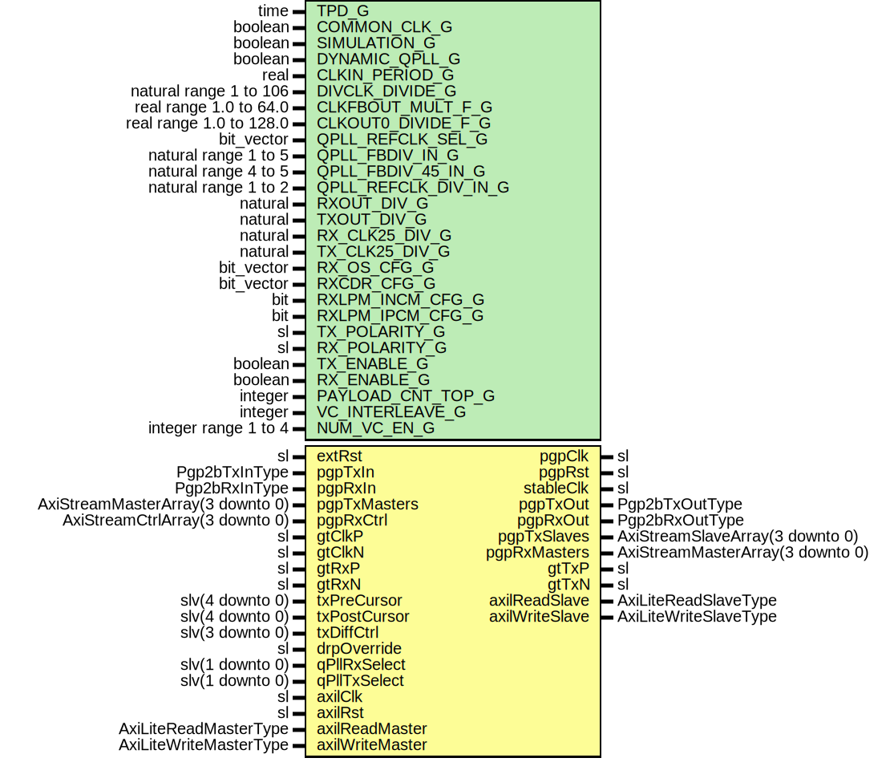

# Entity: Pgp2bGtp7VarLatWrapper

- **File**: Pgp2bGtp7VarLatWrapper.vhd
## Diagram

## Description

Title      : PGPv2b: https://confluence.slac.stanford.edu/x/q86fD
Company    : SLAC National Accelerator Laboratory
Description: Example PGP2b front end wrapper
Note: Default generic configurations are for the AC701 development board
Note: Default uses 125 MHz reference clock to generate 3.125 Gbps PGP link
This file is part of 'SLAC Firmware Standard Library'.
It is subject to the license terms in the LICENSE.txt file found in the
top-level directory of this distribution and at:
   https://confluence.slac.stanford.edu/display/ppareg/LICENSE.html.
No part of 'SLAC Firmware Standard Library', including this file,
may be copied, modified, propagated, or distributed except according to
the terms contained in the LICENSE.txt file.
## Generics

| Generic name         | Type                    | Value                    | Description                                                         |
| -------------------- | ----------------------- | ------------------------ | ------------------------------------------------------------------- |
| TPD_G                | time                    | 1 ns                     |                                                                     |
| COMMON_CLK_G         | boolean                 | false                    | set true if (stableClk = axilClk)                                   |
| SIMULATION_G         | boolean                 | false                    |                                                                     |
| DYNAMIC_QPLL_G       | boolean                 | false                    |                                                                     |
| CLKIN_PERIOD_G       | real                    | 6.4                      | MMCM Configurations                                                 |
| DIVCLK_DIVIDE_G      | natural range 1 to 106  | 1                        |                                                                     |
| CLKFBOUT_MULT_F_G    | real range 1.0 to 64.0  | 6.0                      |                                                                     |
| CLKOUT0_DIVIDE_F_G   | real range 1.0 to 128.0 | 6.0                      |                                                                     |
| QPLL_REFCLK_SEL_G    | bit_vector              | "001"                    | Quad PLL Configurations (Defaults: gtClkP = 125 MHz Configuration)  |
| QPLL_FBDIV_IN_G      | natural range 1 to 5    | 5                        |                                                                     |
| QPLL_FBDIV_45_IN_G   | natural range 4 to 5    | 5                        |                                                                     |
| QPLL_REFCLK_DIV_IN_G | natural range 1 to 2    | 1                        |                                                                     |
| RXOUT_DIV_G          | natural                 | 2                        | MGT Configurations (Defaults: gtClkP = 125 MHz Configuration)       |
| TXOUT_DIV_G          | natural                 | 2                        |                                                                     |
| RX_CLK25_DIV_G       | natural                 | 5                        |                                                                     |
| TX_CLK25_DIV_G       | natural                 | 5                        |                                                                     |
| RX_OS_CFG_G          | bit_vector              | "0000010000000"          |                                                                     |
| RXCDR_CFG_G          | bit_vector              | x"0001107FE206021081010" |                                                                     |
| RXLPM_INCM_CFG_G     | bit                     | '0'                      |                                                                     |
| RXLPM_IPCM_CFG_G     | bit                     | '1'                      |                                                                     |
| TX_POLARITY_G        | sl                      | '0'                      | Configure PGP                                                       |
| RX_POLARITY_G        | sl                      | '0'                      |                                                                     |
| TX_ENABLE_G          | boolean                 | true                     |                                                                     |
| RX_ENABLE_G          | boolean                 | true                     |                                                                     |
| PAYLOAD_CNT_TOP_G    | integer                 | 7                        | Top bit for payload counter                                         |
| VC_INTERLEAVE_G      | integer                 | 1                        | Interleave Frames                                                   |
| NUM_VC_EN_G          | integer range 1 to 4    | 4                        |                                                                     |
## Ports

| Port name       | Direction | Type                             | Description        |
| --------------- | --------- | -------------------------------- | ------------------ |
| extRst          | in        | sl                               | Manual Reset       |
| pgpClk          | out       | sl                               | Clocks and Reset   |
| pgpRst          | out       | sl                               |                    |
| stableClk       | out       | sl                               |                    |
| pgpTxIn         | in        | Pgp2bTxInType                    | Non VC TX Signals  |
| pgpTxOut        | out       | Pgp2bTxOutType                   |                    |
| pgpRxIn         | in        | Pgp2bRxInType                    | Non VC RX Signals  |
| pgpRxOut        | out       | Pgp2bRxOutType                   |                    |
| pgpTxMasters    | in        | AxiStreamMasterArray(3 downto 0) | Frame TX Interface |
| pgpTxSlaves     | out       | AxiStreamSlaveArray(3 downto 0)  |                    |
| pgpRxMasters    | out       | AxiStreamMasterArray(3 downto 0) | Frame RX Interface |
| pgpRxCtrl       | in        | AxiStreamCtrlArray(3 downto 0)   |                    |
| gtClkP          | in        | sl                               | GT Pins            |
| gtClkN          | in        | sl                               |                    |
| gtTxP           | out       | sl                               |                    |
| gtTxN           | out       | sl                               |                    |
| gtRxP           | in        | sl                               |                    |
| gtRxN           | in        | sl                               |                    |
| txPreCursor     | in        | slv(4 downto 0)                  | Debug Interface    |
| txPostCursor    | in        | slv(4 downto 0)                  |                    |
| txDiffCtrl      | in        | slv(3 downto 0)                  |                    |
| drpOverride     | in        | sl                               |                    |
| qPllRxSelect    | in        | slv(1 downto 0)                  |                    |
| qPllTxSelect    | in        | slv(1 downto 0)                  |                    |
| axilClk         | in        | sl                               | AXI-Lite Interface |
| axilRst         | in        | sl                               |                    |
| axilReadMaster  | in        | AxiLiteReadMasterType            |                    |
| axilReadSlave   | out       | AxiLiteReadSlaveType             |                    |
| axilWriteMaster | in        | AxiLiteWriteMasterType           |                    |
| axilWriteSlave  | out       | AxiLiteWriteSlaveType            |                    |
## Signals

| Name             | Type            | Description |
| ---------------- | --------------- | ----------- |
| refClk           | sl              |             |
| refClkDiv2       | sl              |             |
| stableClock      | sl              |             |
| extRstSync       | sl              |             |
| pgpClock         | sl              |             |
| pgpTxRecClk      | sl              |             |
| pgpReset         | sl              |             |
| pgpTxMmcmLocked  | sl              |             |
| pgpTxMmcmReset   | sl              |             |
| pllRefClk        | slv(1 downto 0) |             |
| pllLockDetClk    | slv(1 downto 0) |             |
| qPllReset        | slv(1 downto 0) |             |
| gtQPllOutRefClk  | slv(1 downto 0) |             |
| gtQPllOutClk     | slv(1 downto 0) |             |
| gtQPllLock       | slv(1 downto 0) |             |
| gtQPllRefClkLost | slv(1 downto 0) |             |
| gtQPllReset      | slv(1 downto 0) |             |
## Instantiations

- IBUFDS_GTE2_Inst: IBUFDS_GTE2
- BUFG_Inst: BUFG
- ClockManager7_Inst: surf.ClockManager7
- Quad_Pll_Inst: surf.Gtp7QuadPll
- Pgp2bGtp7VarLat_Inst: surf.Pgp2bGtp7VarLat
