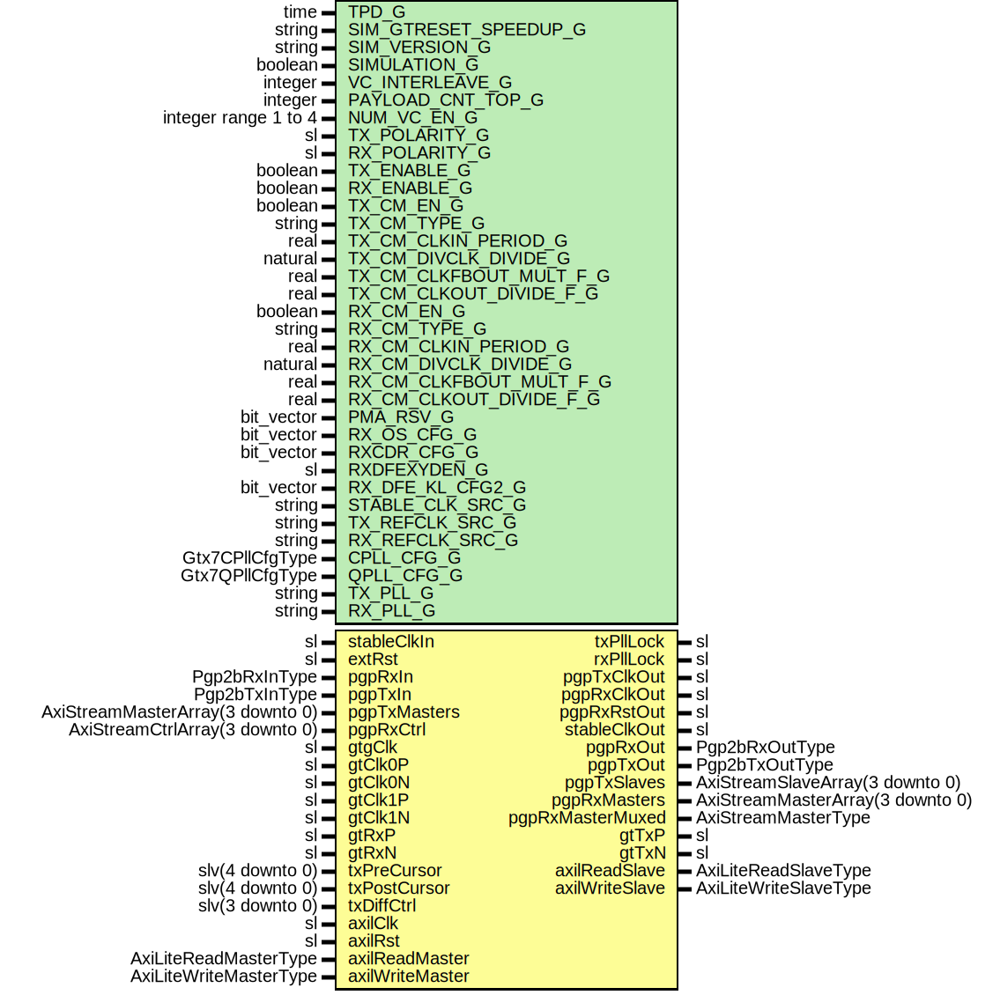

# Entity: Pgp2bGtx7FixedLatWrapper

- **File**: Pgp2bGtx7FixedLatWrapper.vhd
## Diagram

## Description

-----------------------------------------------------------------------------
 Title      : PGPv2b: https://confluence.slac.stanford.edu/x/q86fD
-----------------------------------------------------------------------------
 Company    : SLAC National Accelerator Laboratory
-----------------------------------------------------------------------------
 Description: Gtx7 Fixed Latency Wrapper
-----------------------------------------------------------------------------
 This file is part of 'SLAC Firmware Standard Library'.
 It is subject to the license terms in the LICENSE.txt file found in the
 top-level directory of this distribution and at:
    https://confluence.slac.stanford.edu/display/ppareg/LICENSE.html.
 No part of 'SLAC Firmware Standard Library', including this file,
 may be copied, modified, propagated, or distributed except according to
 the terms contained in the LICENSE.txt file.
-----------------------------------------------------------------------------
## Generics

| Generic name            | Type                 | Value                             | Description                  |
| ----------------------- | -------------------- | --------------------------------- | ---------------------------- |
| TPD_G                   | time                 | 1 ns                              |                              |
| SIM_GTRESET_SPEEDUP_G   | string               | "FALSE"                           |                              |
| SIM_VERSION_G           | string               | "4.0"                             |                              |
| SIMULATION_G            | boolean              | false                             |                              |
| VC_INTERLEAVE_G         | integer              | 0                                 |  No interleave Frames        |
| PAYLOAD_CNT_TOP_G       | integer              | 7                                 |  Top bit for payload counter |
| NUM_VC_EN_G             | integer range 1 to 4 | 4                                 |                              |
| TX_POLARITY_G           | sl                   | '0'                               |                              |
| RX_POLARITY_G           | sl                   | '0'                               |                              |
| TX_ENABLE_G             | boolean              | true                              |  Enable TX direction         |
| RX_ENABLE_G             | boolean              | true                              |  Enable RX direction         |
| TX_CM_EN_G              | boolean              | false                             | CM Configurations            |
| TX_CM_TYPE_G            | string               | "MMCM"                            |                              |
| TX_CM_CLKIN_PERIOD_G    | real                 | 8.000                             |                              |
| TX_CM_DIVCLK_DIVIDE_G   | natural              | 8                                 |                              |
| TX_CM_CLKFBOUT_MULT_F_G | real                 | 8.000                             |                              |
| TX_CM_CLKOUT_DIVIDE_F_G | real                 | 8.000                             |                              |
| RX_CM_EN_G              | boolean              | false                             |                              |
| RX_CM_TYPE_G            | string               | "MMCM"                            |                              |
| RX_CM_CLKIN_PERIOD_G    | real                 | 8.000                             |                              |
| RX_CM_DIVCLK_DIVIDE_G   | natural              | 8                                 |                              |
| RX_CM_CLKFBOUT_MULT_F_G | real                 | 8.000                             |                              |
| RX_CM_CLKOUT_DIVIDE_F_G | real                 | 8.000                             |                              |
| PMA_RSV_G               | bit_vector           | x"00018480"                       | MGT Configurations           |
| RX_OS_CFG_G             | bit_vector           | "0000010000000"                   |  Set by wizard               |
| RXCDR_CFG_G             | bit_vector           | x"03000023ff40200020"             |  Set by wizard               |
| RXDFEXYDEN_G            | sl                   | '0'                               |  Set by wizard               |
| RX_DFE_KL_CFG2_G        | bit_vector           | x"3008E56A"                       |                              |
| STABLE_CLK_SRC_G        | string               | "gtClk0"                          |  or "gtClk0" or "gtClk1"     |
| TX_REFCLK_SRC_G         | string               | "gtClk0"                          |                              |
| RX_REFCLK_SRC_G         | string               | "gtClk1"                          |                              |
| CPLL_CFG_G              | Gtx7CPllCfgType      | getGtx7CPllCfg(250.0E6, 3.125E9)  |                              |
| QPLL_CFG_G              | Gtx7QPllCfgType      | getGtx7QPllCfg(156.25e6, 3.125e9) |                              |
| TX_PLL_G                | string               | "QPLL"                            |                              |
| RX_PLL_G                | string               | "CPLL"                            |                              |
## Ports

| Port name        | Direction | Type                             | Description                                       |
| ---------------- | --------- | -------------------------------- | ------------------------------------------------- |
| stableClkIn      | in        | sl                               | Manual Reset                                      |
| extRst           | in        | sl                               |                                                   |
| txPllLock        | out       | sl                               | Status and Clock Signals                          |
| rxPllLock        | out       | sl                               |                                                   |
| pgpTxClkOut      | out       | sl                               | Output internally configured clocks               |
| pgpRxClkOut      | out       | sl                               |                                                   |
| pgpRxRstOut      | out       | sl                               |                                                   |
| stableClkOut     | out       | sl                               |                                                   |
| pgpRxIn          | in        | Pgp2bRxInType                    | Non VC Rx Signals                                 |
| pgpRxOut         | out       | Pgp2bRxOutType                   |                                                   |
| pgpTxIn          | in        | Pgp2bTxInType                    | Non VC Tx Signals                                 |
| pgpTxOut         | out       | Pgp2bTxOutType                   |                                                   |
| pgpTxMasters     | in        | AxiStreamMasterArray(3 downto 0) | Frame Transmit Interface - 1 Lane, Array of 4 VCs |
| pgpTxSlaves      | out       | AxiStreamSlaveArray(3 downto 0)  |                                                   |
| pgpRxMasters     | out       | AxiStreamMasterArray(3 downto 0) | Frame Receive Interface - 1 Lane, Array of 4 VCs  |
| pgpRxMasterMuxed | out       | AxiStreamMasterType              |                                                   |
| pgpRxCtrl        | in        | AxiStreamCtrlArray(3 downto 0)   |                                                   |
| gtgClk           | in        | sl                               | GT Pins                                           |
| gtClk0P          | in        | sl                               |                                                   |
| gtClk0N          | in        | sl                               |                                                   |
| gtClk1P          | in        | sl                               |                                                   |
| gtClk1N          | in        | sl                               |                                                   |
| gtTxP            | out       | sl                               |                                                   |
| gtTxN            | out       | sl                               |                                                   |
| gtRxP            | in        | sl                               |                                                   |
| gtRxN            | in        | sl                               |                                                   |
| txPreCursor      | in        | slv(4 downto 0)                  | Debug Interface                                   |
| txPostCursor     | in        | slv(4 downto 0)                  |                                                   |
| txDiffCtrl       | in        | slv(3 downto 0)                  |                                                   |
| axilClk          | in        | sl                               | AXI-Lite Interface                                |
| axilRst          | in        | sl                               |                                                   |
| axilReadMaster   | in        | AxiLiteReadMasterType            |                                                   |
| axilReadSlave    | out       | AxiLiteReadSlaveType             |                                                   |
| axilWriteMaster  | in        | AxiLiteWriteMasterType           |                                                   |
| axilWriteSlave   | out       | AxiLiteWriteSlaveType            |                                                   |
## Signals

| Name            | Type | Description |
| --------------- | ---- | ----------- |
| gtClk0          | sl   |             |
| gtClk1          | sl   |             |
| txRefClk        | sl   |             |
| txOutClk        | sl   |             |
| rxRefClk        | sl   |             |
| stableClkRef    | sl   |             |
| stableClkRefG   | sl   |             |
| stableClk       | sl   |             |
| stableRst       | sl   |             |
| pgpTxClkBase    | sl   |             |
| pgpTxClk        | sl   |             |
| pgpTxReset      | sl   |             |
| pgpRxRecClk     | sl   |             |
| pgpRxRecClkRst  | sl   |             |
| pgpRxClkLoc     | sl   |             |
| pgpRxReset      | sl   |             |
| pgpRxMmcmReset  | sl   |             |
| pgpRxMmcmLocked | sl   |             |
| gtCPllRefClk    | sl   |             |
| gtCPllLock      | sl   |             |
| qPllRefClk      | sl   |             |
| qPllOutClk      | sl   |             |
| qPllOutRefClk   | sl   |             |
| qPllLock        | sl   |             |
| pllLockDetClk   | sl   |             |
| qPllRefClkLost  | sl   |             |
| qPllReset       | sl   |             |
## Constants

| Name       | Type        | Value                                                                                                                                                               | Description |
| ---------- | ----------- | ------------------------------------------------------------------------------------------------------------------------------------------------------------------- | ----------- |
| GTX7_CFG_C | Gtx7CfgType |  getGtx7Cfg(TX_PLL_G,  RX_PLL_G,  CPLL_CFG_G,  QPLL_CFG_G) |             |
## Instantiations

- BUFG_stableClkRef: BUFG
- PwrUpRst_Inst: surf.PwrUpRst
**Description**
 Power Up Reset

- RstSync_pgpTxRst: surf.RstSync
**Description**
 PGP RX Reset

- Pgp2bGtx7Fixedlat_Inst: surf.Pgp2bGtx7Fixedlat
