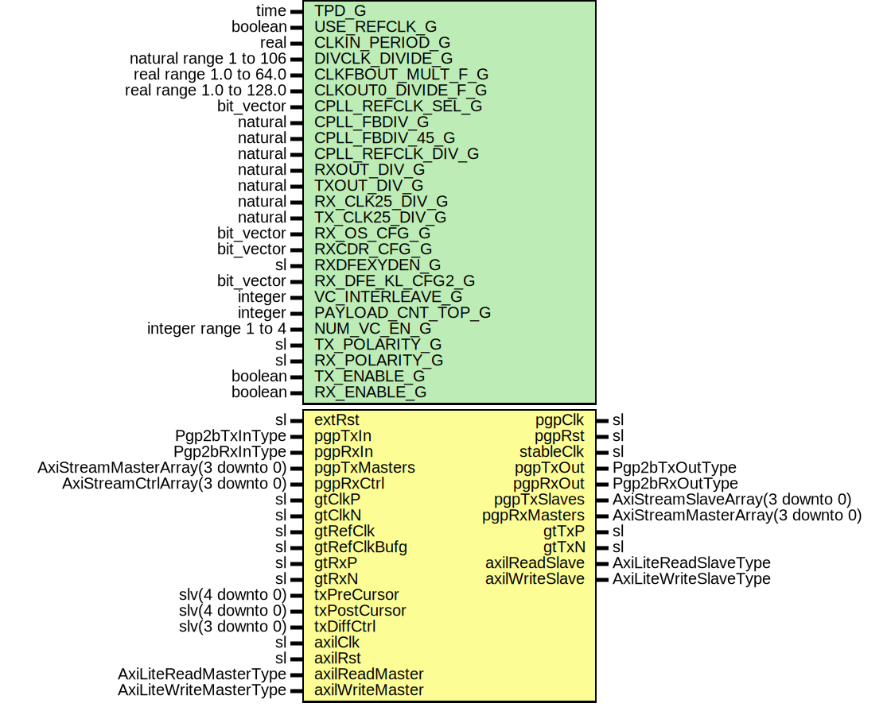

# Entity: Pgp2bGtx7VarLatWrapper

## Diagram

## Description

Title      : PGPv2b: https://confluence.slac.stanford.edu/x/q86fD
Company    : SLAC National Accelerator Laboratory
Description: Example PGP 3.125 Gbps front end wrapper
Note: Default generic configurations are for the KC705 development board
Note: Default uses 125 MHz reference clock to generate 3.125 Gbps PGP link
This file is part of 'SLAC Firmware Standard Library'.
It is subject to the license terms in the LICENSE.txt file found in the
top-level directory of this distribution and at:
   https://confluence.slac.stanford.edu/display/ppareg/LICENSE.html.
No part of 'SLAC Firmware Standard Library', including this file,
may be copied, modified, propagated, or distributed except according to
the terms contained in the LICENSE.txt file.
## Generics

| Generic name       | Type                    | Value                 | Description                                                                                                                                                                                                                                                                                                                                                                                                               |
| ------------------ | ----------------------- | --------------------- | ------------------------------------------------------------------------------------------------------------------------------------------------------------------------------------------------------------------------------------------------------------------------------------------------------------------------------------------------------------------------------------------------------------------------- |
| TPD_G              | time                    | 1 ns                  |                                                                                                                                                                                                                                                                                                                                                                                                                           |
| USE_REFCLK_G       | boolean                 | false                 | MMCM Configurations (Defaults: gtClkP = 125 MHz Configuration) See page 40 of https://www.xilinx.com/support/documentation/user_guides/ug362.pdf CLKIN_PERIOD_G (ns) is 1/2 of the reference rate because the MMCM gets a div/2 copy MMCM internal frequency is set by:    FVCO = 1000 * CLKFBOUT_MULT_F_G/(CLKIN1_PERIOD_G * DIVCLK_DIVIDE_G) And must be within the specified operating range of the PLL (around 1Ghz)  |
| CLKIN_PERIOD_G     | real                    | 16.0                  | gtClkP/2                                                                                                                                                                                                                                                                                                                                                                                                                  |
| DIVCLK_DIVIDE_G    | natural range 1 to 106  | 2                     |                                                                                                                                                                                                                                                                                                                                                                                                                           |
| CLKFBOUT_MULT_F_G  | real range 1.0 to 64.0  | 31.875                |                                                                                                                                                                                                                                                                                                                                                                                                                           |
| CLKOUT0_DIVIDE_F_G | real range 1.0 to 128.0 | 6.375                 |                                                                                                                                                                                                                                                                                                                                                                                                                           |
| CPLL_REFCLK_SEL_G  | bit_vector              | "001"                 | CPLL Configurations (Defaults: gtClkP = 125 MHz Configuration) See page 48 of https://www.xilinx.com/support/documentation/user_guides/ug476_7Series_Transceivers.pdf fPllClkOut = fPLLClkIn * ( CPLL_FBDIV_G * CPLL_FBDIV_45_G ) / CPLL_REFCLK_DIV_G    CPPL_FBDIV_G      = 1,2,3,4,5    CPPL_FBDIV_45_G   = 4,5    CPLL_REFCLK_DIV_G = 1,2 fPllClkOut must bet between 1.6Ghz - 3.3Ghz                                  |
| CPLL_FBDIV_G       | natural                 | 5                     |                                                                                                                                                                                                                                                                                                                                                                                                                           |
| CPLL_FBDIV_45_G    | natural                 | 5                     |                                                                                                                                                                                                                                                                                                                                                                                                                           |
| CPLL_REFCLK_DIV_G  | natural                 | 1                     |                                                                                                                                                                                                                                                                                                                                                                                                                           |
| RXOUT_DIV_G        | natural                 | 2                     | MGT Configurations (Defaults: gtClkP = 125 MHz Configuration) Rx Line rate = (fPllClkOut * 2) / RXOUT_DIV_G (1,2,4,6,16) Tx Line rate = (fPllClkOut * 2) / TXOUT_DIV_G (1,2,4,6,16) Set RX_CLK25_DIV and TX_CLK25_DIV so that the input reference clock / setting is close to 25Mhz                                                                                                                                       |
| TXOUT_DIV_G        | natural                 | 2                     |                                                                                                                                                                                                                                                                                                                                                                                                                           |
| RX_CLK25_DIV_G     | natural                 | 5                     |                                                                                                                                                                                                                                                                                                                                                                                                                           |
| TX_CLK25_DIV_G     | natural                 | 5                     |                                                                                                                                                                                                                                                                                                                                                                                                                           |
| RX_OS_CFG_G        | bit_vector              | "0000010000000"       |                                                                                                                                                                                                                                                                                                                                                                                                                           |
| RXCDR_CFG_G        | bit_vector              | x"03000023ff40200020" |                                                                                                                                                                                                                                                                                                                                                                                                                           |
| RXDFEXYDEN_G       | sl                      | '1'                   |                                                                                                                                                                                                                                                                                                                                                                                                                           |
| RX_DFE_KL_CFG2_G   | bit_vector              | x"301148AC"           |                                                                                                                                                                                                                                                                                                                                                                                                                           |
| VC_INTERLEAVE_G    | integer                 | 0                     | No interleave Frames                                                                                                                                                                                                                                                                                                                                                                                                      |
| PAYLOAD_CNT_TOP_G  | integer                 | 7                     | Top bit for payload counter                                                                                                                                                                                                                                                                                                                                                                                               |
| NUM_VC_EN_G        | integer range 1 to 4    | 4                     |                                                                                                                                                                                                                                                                                                                                                                                                                           |
| TX_POLARITY_G      | sl                      | '0'                   |                                                                                                                                                                                                                                                                                                                                                                                                                           |
| RX_POLARITY_G      | sl                      | '0'                   |                                                                                                                                                                                                                                                                                                                                                                                                                           |
| TX_ENABLE_G        | boolean                 | true                  | Enable TX direction                                                                                                                                                                                                                                                                                                                                                                                                       |
| RX_ENABLE_G        | boolean                 | true                  |                                                                                                                                                                                                                                                                                                                                                                                                                           |
## Ports

| Port name       | Direction | Type                             | Description        |
| --------------- | --------- | -------------------------------- | ------------------ |
| extRst          | in        | sl                               | Manual Reset       |
| pgpClk          | out       | sl                               | Clocks and Reset   |
| pgpRst          | out       | sl                               |                    |
| stableClk       | out       | sl                               |                    |
| pgpTxIn         | in        | Pgp2bTxInType                    | Non VC TX Signals  |
| pgpTxOut        | out       | Pgp2bTxOutType                   |                    |
| pgpRxIn         | in        | Pgp2bRxInType                    | Non VC RX Signals  |
| pgpRxOut        | out       | Pgp2bRxOutType                   |                    |
| pgpTxMasters    | in        | AxiStreamMasterArray(3 downto 0) | Frame TX Interface |
| pgpTxSlaves     | out       | AxiStreamSlaveArray(3 downto 0)  |                    |
| pgpRxMasters    | out       | AxiStreamMasterArray(3 downto 0) | Frame RX Interface |
| pgpRxCtrl       | in        | AxiStreamCtrlArray(3 downto 0)   |                    |
| gtClkP          | in        | sl                               | GT Pins            |
| gtClkN          | in        | sl                               |                    |
| gtRefClk        | in        | sl                               |                    |
| gtRefClkBufg    | in        | sl                               |                    |
| gtTxP           | out       | sl                               |                    |
| gtTxN           | out       | sl                               |                    |
| gtRxP           | in        | sl                               |                    |
| gtRxN           | in        | sl                               |                    |
| txPreCursor     | in        | slv(4 downto 0)                  | Debug Interface    |
| txPostCursor    | in        | slv(4 downto 0)                  |                    |
| txDiffCtrl      | in        | slv(3 downto 0)                  |                    |
| axilClk         | in        | sl                               | AXI-Lite Interface |
| axilRst         | in        | sl                               |                    |
| axilReadMaster  | in        | AxiLiteReadMasterType            |                    |
| axilReadSlave   | out       | AxiLiteReadSlaveType             |                    |
| axilWriteMaster | in        | AxiLiteWriteMasterType           |                    |
| axilWriteSlave  | out       | AxiLiteWriteSlaveType            |                    |
## Signals

| Name        | Type | Description |
| ----------- | ---- | ----------- |
| refClk      | sl   |             |
| refClkDiv2  | sl   |             |
| stableClock | sl   |             |
| extRstSync  | sl   |             |
| pgpClock    | sl   |             |
| pgpReset    | sl   |             |
## Instantiations

- RstSync_Inst: surf.RstSync
- ClockManager7_Inst: surf.ClockManager7
- Pgp2bGtx7VarLat_Inst: surf.Pgp2bGtx7VarLat
