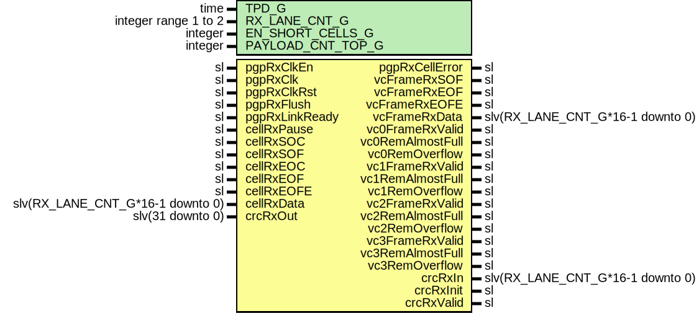

# Entity: Pgp2bRxCell

- **File**: Pgp2bRxCell.vhd
## Diagram

## Description

Title      : PGPv2b: https://confluence.slac.stanford.edu/x/q86fD
Company    : SLAC National Accelerator Laboratory
Description:
Cell Receive interface module for the Pretty Good Protocol core.
This file is part of 'SLAC Firmware Standard Library'.
It is subject to the license terms in the LICENSE.txt file found in the
top-level directory of this distribution and at:
   https://confluence.slac.stanford.edu/display/ppareg/LICENSE.html.
No part of 'SLAC Firmware Standard Library', including this file,
may be copied, modified, propagated, or distributed except according to
the terms contained in the LICENSE.txt file.
## Generics

| Generic name      | Type                 | Value | Description                  |
| ----------------- | -------------------- | ----- | ---------------------------- |
| TPD_G             | time                 | 1 ns  |                              |
| RX_LANE_CNT_G     | integer range 1 to 2 | 1     | Number of receive lanes, 1-2 |
| EN_SHORT_CELLS_G  | integer              | 1     | Enable short non-EOF cells   |
| PAYLOAD_CNT_TOP_G | integer              | 7     | Top bit for payload counter  |
## Ports

| Port name        | Direction | Type                             | Description                   |
| ---------------- | --------- | -------------------------------- | ----------------------------- |
| pgpRxClkEn       | in        | sl                               | Master clock Enable           |
| pgpRxClk         | in        | sl                               | Master clock                  |
| pgpRxClkRst      | in        | sl                               | Synchronous reset input       |
| pgpRxFlush       | in        | sl                               | Flush the link                |
| pgpRxLinkReady   | in        | sl                               | Local side has link           |
| pgpRxCellError   | out       | sl                               | A cell error has occured      |
| cellRxPause      | in        | sl                               | Cell data pause               |
| cellRxSOC        | in        | sl                               | Cell data start of cell       |
| cellRxSOF        | in        | sl                               | Cell data start of frame      |
| cellRxEOC        | in        | sl                               | Cell data end of cell         |
| cellRxEOF        | in        | sl                               | Cell data end of frame        |
| cellRxEOFE       | in        | sl                               | Cell data end of frame error  |
| cellRxData       | in        | slv(RX_LANE_CNT_G*16-1 downto 0) | Cell data data                |
| vcFrameRxSOF     | out       | sl                               | PGP frame data start of frame |
| vcFrameRxEOF     | out       | sl                               | PGP frame data end of frame   |
| vcFrameRxEOFE    | out       | sl                               | PGP frame data error          |
| vcFrameRxData    | out       | slv(RX_LANE_CNT_G*16-1 downto 0) | PGP frame data                |
| vc0FrameRxValid  | out       | sl                               | PGP frame data is valid       |
| vc0RemAlmostFull | out       | sl                               | Remote buffer almost full     |
| vc0RemOverflow   | out       | sl                               | Remote buffer overflow        |
| vc1FrameRxValid  | out       | sl                               | PGP frame data is valid       |
| vc1RemAlmostFull | out       | sl                               | Remote buffer almost full     |
| vc1RemOverflow   | out       | sl                               | Remote buffer overflow        |
| vc2FrameRxValid  | out       | sl                               | PGP frame data is valid       |
| vc2RemAlmostFull | out       | sl                               | Remote buffer almost full     |
| vc2RemOverflow   | out       | sl                               | Remote buffer overflow        |
| vc3FrameRxValid  | out       | sl                               | PGP frame data is valid       |
| vc3RemAlmostFull | out       | sl                               | Remote buffer almost full     |
| vc3RemOverflow   | out       | sl                               | Remote buffer overflow        |
| crcRxIn          | out       | slv(RX_LANE_CNT_G*16-1 downto 0) | Receive data for CRC          |
| crcRxInit        | out       | sl                               | Receive CRC value init        |
| crcRxValid       | out       | sl                               | Receive data for CRC is valid |
| crcRxOut         | in        | slv(31 downto 0)                 | Receive calculated CRC value  |
## Signals

| Name          | Type                             | Description |
| ------------- | -------------------------------- | ----------- |
| dly0SOC       | sl                               |             |
| dly0SOF       | sl                               |             |
| dly0EOC       | sl                               |             |
| dly0EOF       | sl                               |             |
| dly0EOFE      | sl                               |             |
| dly0Data      | slv(RX_LANE_CNT_G*16-1 downto 0) |             |
| dly1SOC       | sl                               |             |
| dly1SOF       | sl                               |             |
| dly1EOC       | sl                               |             |
| dly1EOF       | sl                               |             |
| dly1EOFE      | sl                               |             |
| dly1Data      | slv(RX_LANE_CNT_G*16-1 downto 0) |             |
| dly2SOC       | sl                               |             |
| dly2SOF       | sl                               |             |
| dly2EOC       | sl                               |             |
| dly2EOF       | sl                               |             |
| dly2EOFE      | sl                               |             |
| dly2Data      | slv(RX_LANE_CNT_G*16-1 downto 0) |             |
| dly3SOC       | sl                               |             |
| dly3SOF       | sl                               |             |
| dly3EOC       | sl                               |             |
| dly3EOF       | sl                               |             |
| dly3EOFE      | sl                               |             |
| dly3Data      | slv(RX_LANE_CNT_G*16-1 downto 0) |             |
| dly4SOC       | sl                               |             |
| dly4SOF       | sl                               |             |
| dly4EOC       | sl                               |             |
| dly4EOF       | sl                               |             |
| dly4EOFE      | sl                               |             |
| dly4Data      | slv(RX_LANE_CNT_G*16-1 downto 0) |             |
| dly5SOC       | sl                               |             |
| dly5SOF       | sl                               |             |
| dly5EOC       | sl                               |             |
| dly5EOF       | sl                               |             |
| dly5EOFE      | sl                               |             |
| dly5Data      | slv(RX_LANE_CNT_G*16-1 downto 0) |             |
| dly6SOC       | sl                               |             |
| dly6SOF       | sl                               |             |
| dly6EOC       | sl                               |             |
| dly6EOF       | sl                               |             |
| dly6EOFE      | sl                               |             |
| dly6Data      | slv(RX_LANE_CNT_G*16-1 downto 0) |             |
| dly7SOC       | sl                               |             |
| dly7SOF       | sl                               |             |
| dly7EOC       | sl                               |             |
| dly7EOF       | sl                               |             |
| dly7EOFE      | sl                               |             |
| dly7Data      | slv(RX_LANE_CNT_G*16-1 downto 0) |             |
| intCrcRxValid | sl                               |             |
| crcNotZero    | sl                               |             |
| linkDownCnt   | slv(4 downto 0)                  |             |
| compSOC       | sl                               |             |
| compData      | slv(RX_LANE_CNT_G*16-1 downto 0) |             |
| detSOC        | sl                               |             |
| detSOF        | sl                               |             |
| outData       | slv(RX_LANE_CNT_G*16-1 downto 0) |             |
| detEOC        | sl                               |             |
| detEOF        | sl                               |             |
| detEOFE       | sl                               |             |
| inCellEn      | sl                               |             |
| nxtCellEn     | sl                               |             |
| inCellSerErr  | sl                               |             |
| inCellSOF     | sl                               |             |
| inCellEOC     | sl                               |             |
| inCellEOF     | sl                               |             |
| inCellEOFE    | sl                               |             |
| inCellCnt     | slv(PAYLOAD_CNT_TOP_G downto 0)  |             |
| vcInFrame     | slv(3 downto 0)                  |             |
| currVc        | slv(1 downto 0)                  |             |
| serErr        | sl                               |             |
| vc0Serial     | slv(5 downto 0)                  |             |
| vc0Valid      | sl                               |             |
| vc1Serial     | slv(5 downto 0)                  |             |
| vc1Valid      | sl                               |             |
| vc2Serial     | slv(5 downto 0)                  |             |
| vc2Valid      | sl                               |             |
| vc3Serial     | slv(5 downto 0)                  |             |
| vc3Valid      | sl                               |             |
| abortVc       | slv(1 downto 0)                  |             |
| abortEn       | sl                               |             |
| intCellError  | sl                               |             |
| dlyCellError  | sl                               |             |
## Processes
- unnamed: ( pgpRxClk )
- unnamed: ( pgpRxClk )
**Description**
Detect current VC, check cell serial number

- unnamed: ( pgpRxClk )
**Description**
Receive cell tracking

- unnamed: ( pgpRxClk )
**Description**
Data Output

- unnamed: ( pgpRxClk )
**Description**
Update buffer status on successfull cell reception

