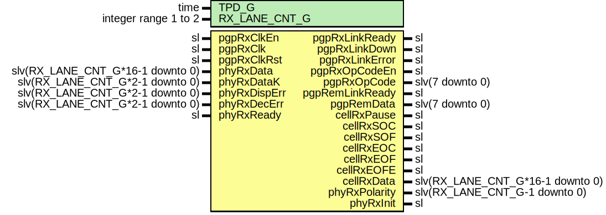

# Entity: Pgp2bRxPhy

## Diagram

## Description

Title      : PGPv2b: https://confluence.slac.stanford.edu/x/q86fD
Company    : SLAC National Accelerator Laboratory
Description:
Physical interface receive module for the Pretty Good Protocol version 2 core.
This file is part of 'SLAC Firmware Standard Library'.
It is subject to the license terms in the LICENSE.txt file found in the
top-level directory of this distribution and at:
   https://confluence.slac.stanford.edu/display/ppareg/LICENSE.html.
No part of 'SLAC Firmware Standard Library', including this file,
may be copied, modified, propagated, or distributed except according to
the terms contained in the LICENSE.txt file.
## Generics

| Generic name  | Type                 | Value | Description                  |
| ------------- | -------------------- | ----- | ---------------------------- |
| TPD_G         | time                 | 1 ns  |                              |
| RX_LANE_CNT_G | integer range 1 to 2 | 1     | Number of receive lanes, 1-2 |
## Ports

| Port name       | Direction | Type                             | Description                          |
| --------------- | --------- | -------------------------------- | ------------------------------------ |
| pgpRxClkEn      | in        | sl                               | Master clock Enable                  |
| pgpRxClk        | in        | sl                               | Master clock                         |
| pgpRxClkRst     | in        | sl                               | Synchronous reset input              |
| pgpRxLinkReady  | out       | sl                               | Local side has link                  |
| pgpRxLinkDown   | out       | sl                               | A link down event has occured        |
| pgpRxLinkError  | out       | sl                               | A link error has occured             |
| pgpRxOpCodeEn   | out       | sl                               | Opcode receive enable                |
| pgpRxOpCode     | out       | slv(7 downto 0)                  | Opcode receive value                 |
| pgpRemLinkReady | out       | sl                               | Far end side has link                |
| pgpRemData      | out       | slv(7 downto 0)                  | Far end side User Data               |
| cellRxPause     | out       | sl                               | Cell data pause                      |
| cellRxSOC       | out       | sl                               | Cell data start of cell              |
| cellRxSOF       | out       | sl                               | Cell data start of frame             |
| cellRxEOC       | out       | sl                               | Cell data end of cell                |
| cellRxEOF       | out       | sl                               | Cell data end of frame               |
| cellRxEOFE      | out       | sl                               | Cell data end of frame error         |
| cellRxData      | out       | slv(RX_LANE_CNT_G*16-1 downto 0) | Cell data data                       |
| phyRxPolarity   | out       | slv(RX_LANE_CNT_G-1 downto 0)    | PHY receive signal polarity          |
| phyRxData       | in        | slv(RX_LANE_CNT_G*16-1 downto 0) | PHY receive data                     |
| phyRxDataK      | in        | slv(RX_LANE_CNT_G*2-1 downto 0)  | PHY receive data is K character      |
| phyRxDispErr    | in        | slv(RX_LANE_CNT_G*2-1 downto 0)  | PHY receive data has disparity error |
| phyRxDecErr     | in        | slv(RX_LANE_CNT_G*2-1 downto 0)  | PHY receive data not in table        |
| phyRxReady      | in        | sl                               | PHY receive interface is ready       |
| phyRxInit       | out       | sl                               | PHY receive interface init;          |
## Signals

| Name                | Type                             | Description |
| ------------------- | -------------------------------- | ----------- |
| dly0RxData          | slv(RX_LANE_CNT_G*16-1 downto 0) |             |
| dly0RxDataK         | slv(RX_LANE_CNT_G*2-1 downto 0)  |             |
| dly0RxDispErr       | slv(RX_LANE_CNT_G*2-1 downto 0)  |             |
| dly0RxDecErr        | slv(RX_LANE_CNT_G*2-1 downto 0)  |             |
| dly1RxData          | slv(RX_LANE_CNT_G*16-1 downto 0) |             |
| dly1RxDataK         | slv(RX_LANE_CNT_G*2-1 downto 0)  |             |
| dly1RxDispErr       | slv(RX_LANE_CNT_G*2-1 downto 0)  |             |
| dly1RxDecErr        | slv(RX_LANE_CNT_G*2-1 downto 0)  |             |
| rxDetectLts         | sl                               |             |
| rxDetectLtsOk       | sl                               |             |
| rxDetectLtsRaw      | slv(1 downto 0)                  |             |
| rxDetectInvert      | slv(RX_LANE_CNT_G-1 downto 0)    |             |
| rxDetectInvertRaw   | slv(RX_LANE_CNT_G-1 downto 0)    |             |
| rxDetectRemLink     | sl                               |             |
| rxDetectRemData     | slv(7 downto 0)                  |             |
| rxDetectOpCodeEn    | sl                               |             |
| rxDetectOpCodeEnRaw | slv(1 downto 0)                  |             |
| rxDetectSOC         | sl                               |             |
| rxDetectSOCRaw      | slv(1 downto 0)                  |             |
| rxDetectSOF         | sl                               |             |
| rxDetectSOFRaw      | slv(1 downto 0)                  |             |
| rxDetectEOC         | sl                               |             |
| rxDetectEOCRaw      | slv(1 downto 0)                  |             |
| rxDetectEOF         | sl                               |             |
| rxDetectEOFRaw      | slv(1 downto 0)                  |             |
| rxDetectEOFE        | sl                               |             |
| rxDetectEOFERaw     | slv(1 downto 0)                  |             |
| nxtRxLinkReady      | sl                               |             |
| stateCntRst         | sl                               |             |
| stateCnt            | slv(19 downto 0)                 |             |
| ltsCntRst           | sl                               |             |
| ltsCntEn            | sl                               |             |
| ltsCnt              | slv(7 downto 0)                  |             |
| intRxLinkReady      | sl                               |             |
| intRxPolarity       | slv(RX_LANE_CNT_G-1 downto 0)    |             |
| nxtRxPolarity       | slv(RX_LANE_CNT_G-1 downto 0)    |             |
| dlyRxLinkDown       | sl                               |             |
| intRxLinkError      | sl                               |             |
| dlyRxLinkError      | sl                               |             |
| intRxInit           | sl                               |             |
| nxtRxInit           | sl                               |             |
| curState            | slv(2 downto 0)                  |             |
| nxtState            | slv(2 downto 0)                  |             |
## Constants

| Name       | Type            | Value  | Description         |
| ---------- | --------------- | ------ | ------------------- |
| ST_RESET_C | slv(2 downto 0) |  "001" | Physical Link State |
| ST_LOCK_C  | slv(2 downto 0) |  "010" |                     |
| ST_WAIT_C  | slv(2 downto 0) |  "011" |                     |
| ST_INVRT_C | slv(2 downto 0) |  "100" |                     |
| ST_READY_C | slv(2 downto 0) |  "101" |                     |
## Processes
- unnamed: ( pgpRxClk, pgpRxClkRst )
**Description**
State transition sync logic.

- unnamed: ( curState, stateCnt, ltsCnt, rxDetectLts, rxDetectLtsOk,
            rxDetectInvert, intRxPolarity, phyRxReady, dly1RxDecErr, dly1RxDispErr )
**Description**
Link control state machine

- unnamed: ( pgpRxClk, pgpRxClkRst )
**Description**
Receive data pipeline

- unnamed: ( pgpRxClk, pgpRxClkRst )
**Description**
Link init ordered set detect

