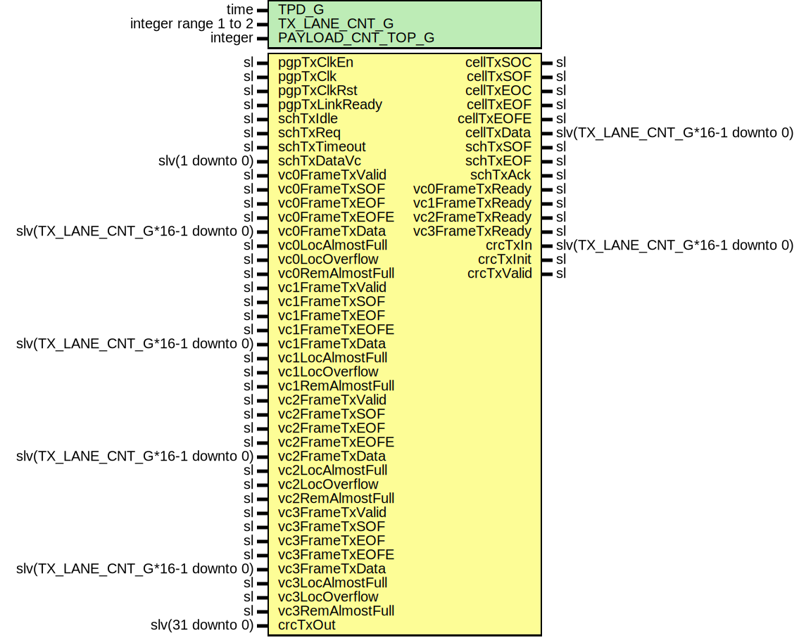

# Entity: Pgp2bTxCell

## Diagram

## Description

Title      : PGPv2b: https://confluence.slac.stanford.edu/x/q86fD
Company    : SLAC National Accelerator Laboratory
Description:
Cell Transmit interface module for the Pretty Good Protocol core.
This file is part of 'SLAC Firmware Standard Library'.
It is subject to the license terms in the LICENSE.txt file found in the
top-level directory of this distribution and at:
   https://confluence.slac.stanford.edu/display/ppareg/LICENSE.html.
No part of 'SLAC Firmware Standard Library', including this file,
may be copied, modified, propagated, or distributed except according to
the terms contained in the LICENSE.txt file.
## Generics

| Generic name      | Type                 | Value | Description                 |
| ----------------- | -------------------- | ----- | --------------------------- |
| TPD_G             | time                 | 1 ns  |                             |
| TX_LANE_CNT_G     | integer range 1 to 2 | 1     | Number of bonded lanes, 1-2 |
| PAYLOAD_CNT_TOP_G | integer              | 7     | Top bit for payload counter |
## Ports

| Port name        | Direction | Type                             | Description                    |
| ---------------- | --------- | -------------------------------- | ------------------------------ |
| pgpTxClkEn       | in        | sl                               | Master clock Enable            |
| pgpTxClk         | in        | sl                               | Master clock                   |
| pgpTxClkRst      | in        | sl                               | Synchronous reset input        |
| pgpTxLinkReady   | in        | sl                               | Local side has link            |
| cellTxSOC        | out       | sl                               | Cell data start of cell        |
| cellTxSOF        | out       | sl                               | Cell data start of frame       |
| cellTxEOC        | out       | sl                               | Cell data end of cell          |
| cellTxEOF        | out       | sl                               | Cell data end of frame         |
| cellTxEOFE       | out       | sl                               | Cell data end of frame error   |
| cellTxData       | out       | slv(TX_LANE_CNT_G*16-1 downto 0) | Cell data data                 |
| schTxSOF         | out       | sl                               | Cell contained SOF             |
| schTxEOF         | out       | sl                               | Cell contained EOF             |
| schTxIdle        | in        | sl                               | Force IDLE transmit            |
| schTxReq         | in        | sl                               | Cell transmit request          |
| schTxAck         | out       | sl                               | Cell transmit acknowledge      |
| schTxTimeout     | in        | sl                               | Cell transmit timeout          |
| schTxDataVc      | in        | slv(1 downto 0)                  | Cell transmit virtual channel  |
| vc0FrameTxValid  | in        | sl                               | User frame data is valid       |
| vc0FrameTxReady  | out       | sl                               | PGP is ready                   |
| vc0FrameTxSOF    | in        | sl                               | User frame data start of frame |
| vc0FrameTxEOF    | in        | sl                               | User frame data end of frame   |
| vc0FrameTxEOFE   | in        | sl                               | User frame data error          |
| vc0FrameTxData   | in        | slv(TX_LANE_CNT_G*16-1 downto 0) | User frame data                |
| vc0LocAlmostFull | in        | sl                               | Local buffer almost full       |
| vc0LocOverflow   | in        | sl                               | Local buffer full              |
| vc0RemAlmostFull | in        | sl                               | Remote buffer almost full      |
| vc1FrameTxValid  | in        | sl                               | User frame data is valid       |
| vc1FrameTxReady  | out       | sl                               | PGP is ready                   |
| vc1FrameTxSOF    | in        | sl                               | User frame data start of frame |
| vc1FrameTxEOF    | in        | sl                               | User frame data end of frame   |
| vc1FrameTxEOFE   | in        | sl                               | User frame data error          |
| vc1FrameTxData   | in        | slv(TX_LANE_CNT_G*16-1 downto 0) | User frame data                |
| vc1LocAlmostFull | in        | sl                               | Local buffer almost full       |
| vc1LocOverflow   | in        | sl                               | Local buffer full              |
| vc1RemAlmostFull | in        | sl                               | Remote buffer almost full      |
| vc2FrameTxValid  | in        | sl                               | User frame data is valid       |
| vc2FrameTxReady  | out       | sl                               | PGP is ready                   |
| vc2FrameTxSOF    | in        | sl                               | User frame data start of frame |
| vc2FrameTxEOF    | in        | sl                               | User frame data end of frame   |
| vc2FrameTxEOFE   | in        | sl                               | User frame data error          |
| vc2FrameTxData   | in        | slv(TX_LANE_CNT_G*16-1 downto 0) | User frame data                |
| vc2LocAlmostFull | in        | sl                               | Local buffer almost full       |
| vc2LocOverflow   | in        | sl                               | Local buffer full              |
| vc2RemAlmostFull | in        | sl                               | Remote buffer almost full      |
| vc3FrameTxValid  | in        | sl                               | User frame data is valid       |
| vc3FrameTxReady  | out       | sl                               | PGP is ready                   |
| vc3FrameTxSOF    | in        | sl                               | User frame data start of frame |
| vc3FrameTxEOF    | in        | sl                               | User frame data end of frame   |
| vc3FrameTxEOFE   | in        | sl                               | User frame data error          |
| vc3FrameTxData   | in        | slv(TX_LANE_CNT_G*16-1 downto 0) | User frame data                |
| vc3LocAlmostFull | in        | sl                               | Local buffer almost full       |
| vc3LocOverflow   | in        | sl                               | Local buffer full              |
| vc3RemAlmostFull | in        | sl                               | Remote buffer almost full      |
| crcTxIn          | out       | slv(TX_LANE_CNT_G*16-1 downto 0) | Transmit data for CRC          |
| crcTxInit        | out       | sl                               | Transmit CRC value init        |
| crcTxValid       | out       | sl                               | Transmit data for CRC is valid |
| crcTxOut         | in        | slv(31 downto 0)                 | Transmit calculated CRC value  |
## Signals

| Name             | Type                             | Description     |
| ---------------- | -------------------------------- | --------------- |
| muxFrameTxValid  | sl                               |                 |
| muxFrameTxSOF    | sl                               |                 |
| muxFrameTxEOF    | sl                               |                 |
| muxFrameTxEOFE   | sl                               |                 |
| muxFrameTxData   | slv(TX_LANE_CNT_G*16-1 downto 0) |                 |
| muxRemAlmostFull | sl                               |                 |
| cellCnt          | slv(PAYLOAD_CNT_TOP_G downto 0)  |                 |
| cellCntRst       | sl                               |                 |
| nxtFrameTxReady  | sl                               |                 |
| nxtType          | slv(2 downto 0)                  |                 |
| nxtTypeLast      | slv(2 downto 0)                  |                 |
| curTypeLast      | slv(2 downto 0)                  |                 |
| nxtTxSOF         | sl                               |                 |
| nxtTxEOF         | sl                               |                 |
| nxtTxAck         | sl                               |                 |
| nxtData          | slv(TX_LANE_CNT_G*16-1 downto 0) |                 |
| eocWord          | slv(TX_LANE_CNT_G*16-1 downto 0) |                 |
| socWord          | slv(TX_LANE_CNT_G*16-1 downto 0) |                 |
| crcWordA         | slv(TX_LANE_CNT_G*16-1 downto 0) |                 |
| crcWordB         | slv(TX_LANE_CNT_G*16-1 downto 0) |                 |
| serialCntEn      | sl                               |                 |
| vc0Serial        | slv(5 downto 0)                  |                 |
| vc1Serial        | slv(5 downto 0)                  |                 |
| vc2Serial        | slv(5 downto 0)                  |                 |
| vc3Serial        | slv(5 downto 0)                  |                 |
| muxSerial        | slv(5 downto 0)                  |                 |
| dly0Data         | slv(TX_LANE_CNT_G*16-1 downto 0) |                 |
| dly0Type         | slv(2 downto 0)                  |                 |
| dly1Data         | slv(TX_LANE_CNT_G*16-1 downto 0) |                 |
| dly1Type         | slv(2 downto 0)                  |                 |
| dly2Data         | slv(TX_LANE_CNT_G*16-1 downto 0) |                 |
| dly2Type         | slv(2 downto 0)                  |                 |
| dly3Data         | slv(TX_LANE_CNT_G*16-1 downto 0) |                 |
| dly3Type         | slv(2 downto 0)                  |                 |
| dly4Data         | slv(TX_LANE_CNT_G*16-1 downto 0) |                 |
| dly4Type         | slv(2 downto 0)                  |                 |
| int0FrameTxReady | sl                               |                 |
| int1FrameTxReady | sl                               |                 |
| int2FrameTxReady | sl                               |                 |
| int3FrameTxReady | sl                               |                 |
| intTimeout       | sl                               |                 |
| intOverflow      | slv(3 downto 0)                  |                 |
| curState         | slv(2 downto 0)                  | Transmit states |
| nxtState         | slv(2 downto 0)                  |                 |
## Constants

| Name       | Type            | Value  | Description          |
| ---------- | --------------- | ------ | -------------------- |
| TX_DATA_C  | slv(2 downto 0) |  "000" | Transmit Data Marker |
| TX_SOC_C   | slv(2 downto 0) |  "001" |                      |
| TX_SOF_C   | slv(2 downto 0) |  "010" |                      |
| TX_EOC_C   | slv(2 downto 0) |  "011" |                      |
| TX_EOF_C   | slv(2 downto 0) |  "100" |                      |
| TX_EOFE_C  | slv(2 downto 0) |  "101" |                      |
| TX_CRCA_C  | slv(2 downto 0) |  "110" |                      |
| TX_CRCB_C  | slv(2 downto 0) |  "111" |                      |
| ST_IDLE_C  | slv(2 downto 0) |  "001" |                      |
| ST_EMPTY_C | slv(2 downto 0) |  "010" |                      |
| ST_SOC_C   | slv(2 downto 0) |  "011" |                      |
| ST_DATA_C  | slv(2 downto 0) |  "100" |                      |
| ST_CRCA_C  | slv(2 downto 0) |  "101" |                      |
| ST_CRCB_C  | slv(2 downto 0) |  "110" |                      |
| ST_EOC_C   | slv(2 downto 0) |  "111" |                      |
## Processes
- unnamed: ( vc0FrameTxValid, vc0FrameTxSOF, vc0FrameTxEOF, vc0FrameTxEOFE, vc0FrameTxData, vc0RemAlmostFull,
             vc1FrameTxValid, vc1FrameTxSOF, vc1FrameTxEOF, vc1FrameTxEOFE, vc1FrameTxData, Vc1RemAlmostFull,
             vc2FrameTxValid, vc2FrameTxSOF, vc2FrameTxEOF, vc2FrameTxEOFE, vc2FrameTxData, Vc2RemAlmostFull,
             vc3FrameTxValid, vc3FrameTxSOF, vc3FrameTxEOF, vc3FrameTxEOFE, vc3FrameTxData, Vc3RemAlmostFull,
             vc0Serial, vc1Serial, vc2Serial, vc3Serial, schTxDataVc )
- unnamed: ( pgpTxClk )
**Description**
Simple state machine to control transmission of data frames

- unnamed: ( curState, schTxIdle, schTxReq, intTimeout, cellCnt, eocWord, socWord, curTypeLast,
            muxFrameTxValid, muxFrameTxSOF, muxFrameTxEOF, muxFrameTxEOFE, muxFrameTxData,
            muxRemAlmostFull )
**Description**
Async state control

- unnamed: ( pgpTxClk )
**Description**
Delay chain to allow CRC data to catch up.

- unnamed: ( pgpTxClk )
**Description**
Output stage

