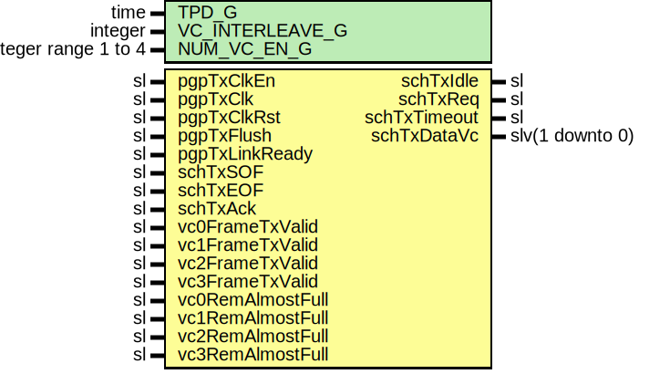

# Entity: Pgp2bTxSched

- **File**: Pgp2bTxSched.vhd
## Diagram

## Description

-----------------------------------------------------------------------------
 Title      : PGPv2b: https://confluence.slac.stanford.edu/x/q86fD
-----------------------------------------------------------------------------
 Company    : SLAC National Accelerator Laboratory
-----------------------------------------------------------------------------
 Description:
 Transmit scheduler interface module for the Pretty Good Protocol core.
-----------------------------------------------------------------------------
 This file is part of 'SLAC Firmware Standard Library'.
 It is subject to the license terms in the LICENSE.txt file found in the
 top-level directory of this distribution and at:
    https://confluence.slac.stanford.edu/display/ppareg/LICENSE.html.
 No part of 'SLAC Firmware Standard Library', including this file,
 may be copied, modified, propagated, or distributed except according to
 the terms contained in the LICENSE.txt file.
-----------------------------------------------------------------------------
## Generics

| Generic name    | Type                 | Value | Description        |
| --------------- | -------------------- | ----- | ------------------ |
| TPD_G           | time                 | 1 ns  |                    |
| VC_INTERLEAVE_G | integer              | 1     |  Interleave Frames |
| NUM_VC_EN_G     | integer range 1 to 4 | 4     |                    |
## Ports

| Port name        | Direction | Type            | Description                    |
| ---------------- | --------- | --------------- | ------------------------------ |
| pgpTxClkEn       | in        | sl              |  Master clock Enable           |
| pgpTxClk         | in        | sl              |  Master clock                  |
| pgpTxClkRst      | in        | sl              |  Synchronous reset input       |
| pgpTxFlush       | in        | sl              |  Flush the link                |
| pgpTxLinkReady   | in        | sl              |  Local side has link           |
| schTxSOF         | in        | sl              |  Cell contained SOF            |
| schTxEOF         | in        | sl              |  Cell contained EOF            |
| schTxIdle        | out       | sl              |  Force IDLE transmit           |
| schTxReq         | out       | sl              |  Cell transmit request         |
| schTxAck         | in        | sl              |  Cell transmit acknowledge     |
| schTxTimeout     | out       | sl              |  Cell transmit timeout         |
| schTxDataVc      | out       | slv(1 downto 0) |  Cell transmit virtual channel |
| vc0FrameTxValid  | in        | sl              |  User frame data is valid      |
| vc1FrameTxValid  | in        | sl              |  User frame data is valid      |
| vc2FrameTxValid  | in        | sl              |  User frame data is valid      |
| vc3FrameTxValid  | in        | sl              |  User frame data is valid      |
| vc0RemAlmostFull | in        | sl              |  Remote flow control           |
| vc1RemAlmostFull | in        | sl              |  Remote flow control           |
| vc2RemAlmostFull | in        | sl              |  Remote flow control           |
| vc3RemAlmostFull | in        | sl              |  Remote flow control           |
## Signals

| Name         | Type             | Description |
| ------------ | ---------------- | ----------- |
| currValid    | sl               |             |
| currVc       | slv(1 downto 0)  |             |
| nextVc       | slv(1 downto 0)  |             |
| arbVc        | slv(1 downto 0)  |             |
| arbValid     | sl               |             |
| vcInFrame    | slv(3 downto 0)  |             |
| intTxReq     | sl               |             |
| intTxIdle    | sl               |             |
| nxtTxReq     | sl               |             |
| nxtTxIdle    | sl               |             |
| nxtTxTimeout | sl               |             |
| intTxTimeout | sl               |             |
| vcTimerA     | slv(23 downto 0) |             |
| vcTimerB     | slv(23 downto 0) |             |
| vcTimerC     | slv(23 downto 0) |             |
| vcTimerD     | slv(23 downto 0) |             |
| vcTimeout    | slv(3 downto 0)  |             |
| gateTxValid  | slv(3 downto 0)  |             |
| curState     | slv(2 downto 0)  |             |
| nxtState     | slv(2 downto 0)  |             |
## Constants

| Name       | Type            | Value  | Description       |
| ---------- | --------------- | ------ | ----------------- |
| ST_RST_C   | slv(2 downto 0) |  "001" |  Schedular state  |
| ST_ARB_C   | slv(2 downto 0) |  "010" |                   |
| ST_CELL_C  | slv(2 downto 0) |  "011" |                   |
| ST_GAP_A_C | slv(2 downto 0) |  "100" |                   |
| ST_GAP_B_C | slv(2 downto 0) |  "101" |                   |
| ST_GAP_C_C | slv(2 downto 0) |  "110" |                   |
## Processes
- unnamed: ( pgpTxClk )
 **Description**
 State transition logic 
- unnamed: ( curState, arbValid, arbVc, currVc, schTxAck, vcInFrame, currValid, vcTimeout )
 **Description**
 Scheduler state machine 
- unnamed: ( currVc, gateTxValid )
 **Description**
 Arbitrate for the next VC value based upon current VC value and status of valid inputs 
- unnamed: ( pgpTxClk )
 **Description**
 Lock in the status of the last cell transmitted 
- unnamed: ( pgpTxClk )
 **Description**
 Detect frame transmit timeout, enabled only in VC non interleave mode 
