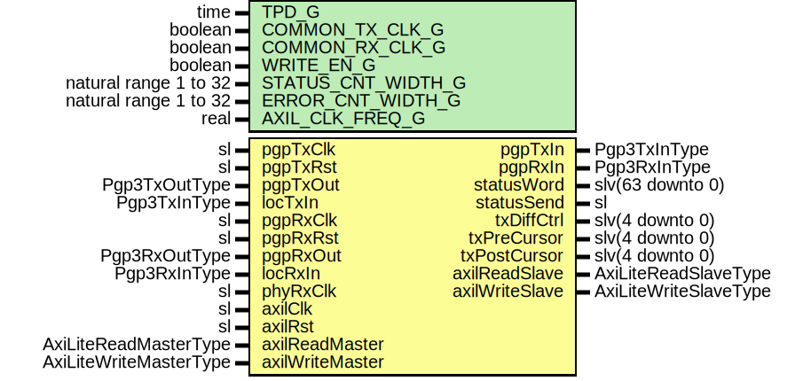

# Entity: Pgp3AxiL

- **File**: Pgp3AxiL.vhd
## Diagram

## Description

Title      : PGPv3: https://confluence.slac.stanford.edu/x/OndODQ
Company    : SLAC National Accelerator Laboratory
Description: AXI-Lite block to manage the PGPv3 interface
This file is part of 'SLAC Firmware Standard Library'.
It is subject to the license terms in the LICENSE.txt file found in the
top-level directory of this distribution and at:
   https://confluence.slac.stanford.edu/display/ppareg/LICENSE.html.
No part of 'SLAC Firmware Standard Library', including this file,
may be copied, modified, propagated, or distributed except according to
the terms contained in the LICENSE.txt file.
## Generics

| Generic name       | Type                  | Value    | Description                                           |
| ------------------ | --------------------- | -------- | ----------------------------------------------------- |
| TPD_G              | time                  | 1 ns     |                                                       |
| COMMON_TX_CLK_G    | boolean               | false    | Set to true if axiClk and pgpTxClk are the same clock |
| COMMON_RX_CLK_G    | boolean               | false    | Set to true if axiClk and pgpRxClk are the same clock |
| WRITE_EN_G         | boolean               | false    | Set to false when on remote end of a link             |
| STATUS_CNT_WIDTH_G | natural range 1 to 32 | 16       |                                                       |
| ERROR_CNT_WIDTH_G  | natural range 1 to 32 | 8        |                                                       |
| AXIL_CLK_FREQ_G    | real                  | 125.0E+6 |                                                       |
## Ports

| Port name       | Direction | Type                   | Description                                  |
| --------------- | --------- | ---------------------- | -------------------------------------------- |
| pgpTxClk        | in        | sl                     | TX PGP Interface (pgpTxClk)                  |
| pgpTxRst        | in        | sl                     |                                              |
| pgpTxIn         | out       | Pgp3TxInType           |                                              |
| pgpTxOut        | in        | Pgp3TxOutType          |                                              |
| locTxIn         | in        | Pgp3TxInType           |                                              |
| pgpRxClk        | in        | sl                     | RX PGP Interface (pgpRxClk)                  |
| pgpRxRst        | in        | sl                     |                                              |
| pgpRxIn         | out       | Pgp3RxInType           |                                              |
| pgpRxOut        | in        | Pgp3RxOutType          |                                              |
| locRxIn         | in        | Pgp3RxInType           |                                              |
| statusWord      | out       | slv(63 downto 0)       | Status Bus (axilClk domain)                  |
| statusSend      | out       | sl                     |                                              |
| phyRxClk        | in        | sl                     |                                              |
| txDiffCtrl      | out       | slv(4 downto 0)        | Debug Interface (axilClk domain)             |
| txPreCursor     | out       | slv(4 downto 0)        |                                              |
| txPostCursor    | out       | slv(4 downto 0)        |                                              |
| axilClk         | in        | sl                     | AXI-Lite Register Interface (axilClk domain) |
| axilRst         | in        | sl                     |                                              |
| axilReadMaster  | in        | AxiLiteReadMasterType  |                                              |
| axilReadSlave   | out       | AxiLiteReadSlaveType   |                                              |
| axilWriteMaster | in        | AxiLiteWriteMasterType |                                              |
| axilWriteSlave  | out       | AxiLiteWriteSlaveType  |                                              |
## Signals

| Name            | Type                                                                                                              | Description                                                                                |
| --------------- | ----------------------------------------------------------------------------------------------------------------- | ------------------------------------------------------------------------------------------ |
| rxStatusSend    | sl                                                                                                                | Local signals                                                                              |
| rxErrorOut      | slv(RX_ERROR_COUNTERS_C-1 downto 0)                                                                               |                                                                                            |
| rxErrorCntOut   | SlVectorArray(RX_ERROR_COUNTERS_C-1 downto 0,  ERROR_CNT_WIDTH_G-1 downto 0)   |                                                                                            |
| rxStatusCntOut  | SlVectorArray(RX_STATUS_COUNTERS_C-1 downto 0,  STATUS_CNT_WIDTH_G-1 downto 0) |                                                                                            |
| txErrorOut      | slv(TX_ERROR_COUNTERS_C-1 downto 0)                                                                               |                                                                                            |
| txErrorCntOut   | SlVectorArray(TX_ERROR_COUNTERS_C-1 downto 0,  ERROR_CNT_WIDTH_G-1 downto 0)   |                                                                                            |
| txStatusCntOut  | SlVectorArray(TX_STATUS_COUNTERS_C-1 downto 0,  STATUS_CNT_WIDTH_G-1 downto 0) |                                                                                            |
| rxErrorIrqEn    | slv(RX_ERROR_COUNTERS_C-1 downto 0)                                                                               |                                                                                            |
| syncFlowCntlDis | sl                                                                                                                |   signal txFlush         : sl;  signal rxFlush         : sl;  signal rxReset         : sl; |
| syncSkpInterval | slv(31 downto 0)                                                                                                  |                                                                                            |
| gearboxAlignCnt | SlVectorArray(0 downto 0,  7 downto 0)                                         |                                                                                            |
| r               | RegType                                                                                                           |                                                                                            |
| rin             | RegType                                                                                                           |                                                                                            |
| rxStatusSync    | RxStatusType                                                                                                      |                                                                                            |
| txStatusSync    | TxStatusType                                                                                                      |                                                                                            |
## Constants

| Name                 | Type    | Value                                                                                                                                                                                                                                                                                                                                                                                                                                                                                                                                                                                                                                                                                                                                                                                                                                                                     | Description |
| -------------------- | ------- | ------------------------------------------------------------------------------------------------------------------------------------------------------------------------------------------------------------------------------------------------------------------------------------------------------------------------------------------------------------------------------------------------------------------------------------------------------------------------------------------------------------------------------------------------------------------------------------------------------------------------------------------------------------------------------------------------------------------------------------------------------------------------------------------------------------------------------------------------------------------------- | ----------- |
| STATUS_OUT_TOP_C     | integer |  ite(STATUS_CNT_WIDTH_G > 7,  7,  STATUS_CNT_WIDTH_G-1)                                                                                                                                                                                                                                                                                                                                                                                                                                                                                                                                                                                                                                                                                                                                             |             |
| RX_ERROR_COUNTERS_C  | integer |  52                                                                                                                                                                                                                                                                                                                                                                                                                                                                                                                                                                                                                                                                                                                                                                                                                                                                       |             |
| TX_ERROR_COUNTERS_C  | integer |  36                                                                                                                                                                                                                                                                                                                                                                                                                                                                                                                                                                                                                                                                                                                                                                                                                                                                       |             |
| RX_STATUS_COUNTERS_C | integer |  1                                                                                                                                                                                                                                                                                                                                                                                                                                                                                                                                                                                                                                                                                                                                                                                                                                                                        |             |
| TX_STATUS_COUNTERS_C | integer |  1                                                                                                                                                                                                                                                                                                                                                                                                                                                                                                                                                                                                                                                                                                                                                                                                                                                                        |             |
| REG_INIT_C           | RegType |  (       txDiffCtrl     => (others => '1'),        txPreCursor    => "00111",        txPostCursor   => "00111",        countReset     => '0',        loopBack       => (others => '0'),        flowCntlDis    => PGP3_TX_IN_INIT_C.flowCntlDis,        txDisable      => PGP3_TX_IN_INIT_C.disable,        skpInterval    => PGP3_TX_IN_INIT_C.skpInterval,        autoStatus     => '0',        axilWriteSlave => AXI_LITE_WRITE_SLAVE_INIT_C,        axilReadSlave  => AXI_LITE_READ_SLAVE_INIT_C       ) |             |
## Types

| Name                | Type                                        | Description |
| ------------------- | ------------------------------------------- | ----------- |
| ErrorCountSlvArray  | array (natural range <>) of ErrorCountSlv   |             |
| StatusCountSlvArray | array (natural range <>) of StatusCountSlv  |             |
| RegType             |                                             |             |
| RxStatusType        |                                             |             |
| TxStatusType        |                                             |             |
## Processes
- U_RxErrorIrqEn: ( r )
- unnamed: ( axilClk )
**Description**
AXI Registers
Sync

- unnamed: ( axilRst, axilReadMaster, axilWriteMaster, r, rxStatusSync, txStatusSync )
**Description**
Async

## Instantiations

- U_RxOpCodeSync: surf.SynchronizerFifo
- U_RxError: surf.SyncStatusVector
**Description**
Errror counters and non counted values

- U_RxStatus: surf.SyncStatusVector
**Description**
Status counters

- U_RxClkFreq: surf.SyncClockFreq
- U_RxEbDataSync: surf.SynchronizerFifo
- U_RxPhyDataSync: surf.SynchronizerFifo
- U_RxGearboxStatus: surf.SyncStatusVector
- U_remLinkData: surf.SynchronizerFifo
- U_TxOpCodeSync: surf.SynchronizerFifo
**Description**
Transmit Status
OpCode Capture

- U_TxError: surf.SyncStatusVector
**Description**
Errror counters and non counted values

- U_TxStatus: surf.SyncStatusVector
**Description**
Status counters

- U_TxClkFreq: surf.SyncClockFreq
- U_FlowCntlDis: surf.Synchronizer
**Description**
Tx Control Sync
Sync flow cntl disable

- U_SKP_SYNC: surf.SynchronizerFifo
