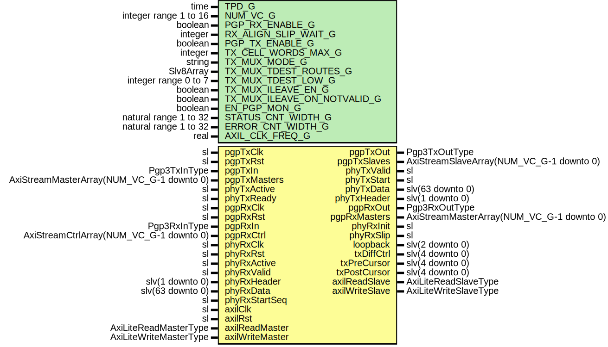

# Entity: Pgp3Core

## Diagram

## Description

Title      : PGPv3: https://confluence.slac.stanford.edu/x/OndODQ
Company    : SLAC National Accelerator Laboratory
Description: PGPv3 Core
This file is part of 'SLAC Firmware Standard Library'.
It is subject to the license terms in the LICENSE.txt file found in the
top-level directory of this distribution and at:
   https://confluence.slac.stanford.edu/display/ppareg/LICENSE.html.
No part of 'SLAC Firmware Standard Library', including this file,
may be copied, modified, propagated, or distributed except according to
the terms contained in the LICENSE.txt file.
## Generics

| Generic name                | Type                  | Value                            | Description                     |
| --------------------------- | --------------------- | -------------------------------- | ------------------------------- |
| TPD_G                       | time                  | 1 ns                             |                                 |
| NUM_VC_G                    | integer range 1 to 16 | 4                                |                                 |
| PGP_RX_ENABLE_G             | boolean               | true                             |                                 |
| RX_ALIGN_SLIP_WAIT_G        | integer               | 32                               |                                 |
| PGP_TX_ENABLE_G             | boolean               | true                             |                                 |
| TX_CELL_WORDS_MAX_G         | integer               | PGP3_DEFAULT_TX_CELL_WORDS_MAX_C | Number of 64-bit words per cell |
| TX_MUX_MODE_G               | string                | "INDEXED"                        | Or "ROUTED"                     |
| TX_MUX_TDEST_ROUTES_G       | Slv8Array             | (0 => "--------")                | Only used in ROUTED mode        |
| TX_MUX_TDEST_LOW_G          | integer range 0 to 7  | 0                                |                                 |
| TX_MUX_ILEAVE_EN_G          | boolean               | true                             |                                 |
| TX_MUX_ILEAVE_ON_NOTVALID_G | boolean               | true                             |                                 |
| EN_PGP_MON_G                | boolean               | true                             |                                 |
| STATUS_CNT_WIDTH_G          | natural range 1 to 32 | 16                               |                                 |
| ERROR_CNT_WIDTH_G           | natural range 1 to 32 | 8                                |                                 |
| AXIL_CLK_FREQ_G             | real                  | 125.0E+6                         |                                 |
## Ports

| Port name       | Direction | Type                                      | Description                                  |
| --------------- | --------- | ----------------------------------------- | -------------------------------------------- |
| pgpTxClk        | in        | sl                                        | Tx User interface                            |
| pgpTxRst        | in        | sl                                        |                                              |
| pgpTxIn         | in        | Pgp3TxInType                              |                                              |
| pgpTxOut        | out       | Pgp3TxOutType                             |                                              |
| pgpTxMasters    | in        | AxiStreamMasterArray(NUM_VC_G-1 downto 0) |                                              |
| pgpTxSlaves     | out       | AxiStreamSlaveArray(NUM_VC_G-1 downto 0)  |                                              |
| phyTxActive     | in        | sl                                        | Tx PHY interface                             |
| phyTxReady      | in        | sl                                        |                                              |
| phyTxValid      | out       | sl                                        |                                              |
| phyTxStart      | out       | sl                                        |                                              |
| phyTxData       | out       | slv(63 downto 0)                          |                                              |
| phyTxHeader     | out       | slv(1 downto 0)                           |                                              |
| pgpRxClk        | in        | sl                                        | Rx User interface                            |
| pgpRxRst        | in        | sl                                        |                                              |
| pgpRxIn         | in        | Pgp3RxInType                              |                                              |
| pgpRxOut        | out       | Pgp3RxOutType                             |                                              |
| pgpRxMasters    | out       | AxiStreamMasterArray(NUM_VC_G-1 downto 0) |                                              |
| pgpRxCtrl       | in        | AxiStreamCtrlArray(NUM_VC_G-1 downto 0)   |                                              |
| phyRxClk        | in        | sl                                        | Rx PHY interface                             |
| phyRxRst        | in        | sl                                        |                                              |
| phyRxInit       | out       | sl                                        |                                              |
| phyRxActive     | in        | sl                                        |                                              |
| phyRxValid      | in        | sl                                        |                                              |
| phyRxHeader     | in        | slv(1 downto 0)                           |                                              |
| phyRxData       | in        | slv(63 downto 0)                          |                                              |
| phyRxStartSeq   | in        | sl                                        |                                              |
| phyRxSlip       | out       | sl                                        |                                              |
| loopback        | out       | slv(2 downto 0)                           | Debug Interface                              |
| txDiffCtrl      | out       | slv(4 downto 0)                           |                                              |
| txPreCursor     | out       | slv(4 downto 0)                           |                                              |
| txPostCursor    | out       | slv(4 downto 0)                           |                                              |
| axilClk         | in        | sl                                        | AXI-Lite Register Interface (axilClk domain) |
| axilRst         | in        | sl                                        |                                              |
| axilReadMaster  | in        | AxiLiteReadMasterType                     |                                              |
| axilReadSlave   | out       | AxiLiteReadSlaveType                      |                                              |
| axilWriteMaster | in        | AxiLiteWriteMasterType                    |                                              |
| axilWriteSlave  | out       | AxiLiteWriteSlaveType                     |                                              |
## Signals

| Name           | Type                                    | Description |
| -------------- | --------------------------------------- | ----------- |
| locRxLinkReady | sl                                      |             |
| remRxFifoCtrl  | AxiStreamCtrlArray(NUM_VC_G-1 downto 0) |             |
| remRxLinkReady | sl                                      |             |
| pgpTxInInt     | Pgp3TxInType                            |             |
| pgpTxOutInt    | Pgp3TxOutType                           |             |
| pgpRxInInt     | Pgp3RxInType                            |             |
| pgpRxOutInt    | Pgp3RxOutType                           |             |
## Instantiations

- U_Pgp3Tx_1: surf.Pgp3Tx
- U_Pgp3Rx_1: surf.Pgp3Rx
**Description**
[out]

