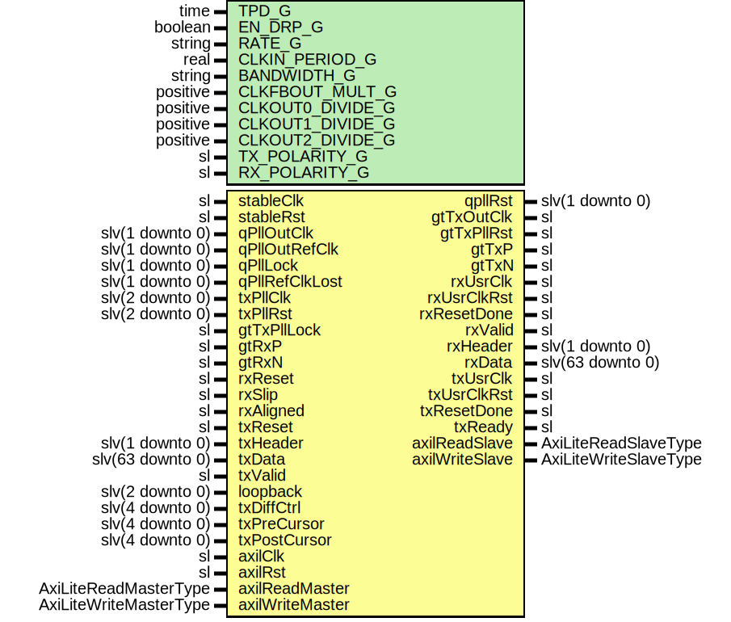

# Entity: Pgp3Gtp7IpWrapper

## Diagram

## Description

Title      : PGPv3: https://confluence.slac.stanford.edu/x/OndODQ
Company    : SLAC National Accelerator Laboratory
Description: PGPv3 GTP7 IP Core Wrapper
This file is part of 'SLAC Firmware Standard Library'.
It is subject to the license terms in the LICENSE.txt file found in the
top-level directory of this distribution and at:
   https://confluence.slac.stanford.edu/display/ppareg/LICENSE.html.
No part of 'SLAC Firmware Standard Library', including this file,
may be copied, modified, propagated, or distributed except according to
the terms contained in the LICENSE.txt file.
## Generics

| Generic name     | Type     | Value      | Description    |
| ---------------- | -------- | ---------- | -------------- |
| TPD_G            | time     | 1 ns       |                |
| EN_DRP_G         | boolean  | true       |                |
| RATE_G           | string   | "6.25Gbps" | or "3.125Gbps" |
| CLKIN_PERIOD_G   | real     |            |                |
| BANDWIDTH_G      | string   |            |                |
| CLKFBOUT_MULT_G  | positive |            |                |
| CLKOUT0_DIVIDE_G | positive |            |                |
| CLKOUT1_DIVIDE_G | positive |            |                |
| CLKOUT2_DIVIDE_G | positive |            |                |
| TX_POLARITY_G    | sl       | '0'        |                |
| RX_POLARITY_G    | sl       | '0'        |                |
## Ports

| Port name       | Direction | Type                   | Description            |
| --------------- | --------- | ---------------------- | ---------------------- |
| stableClk       | in        | sl                     |                        |
| stableRst       | in        | sl                     |                        |
| qPllOutClk      | in        | slv(1 downto 0)        | QPLL Interface         |
| qPllOutRefClk   | in        | slv(1 downto 0)        |                        |
| qPllLock        | in        | slv(1 downto 0)        |                        |
| qPllRefClkLost  | in        | slv(1 downto 0)        |                        |
| qpllRst         | out       | slv(1 downto 0)        |                        |
| gtTxOutClk      | out       | sl                     | TX PLL Interface       |
| gtTxPllRst      | out       | sl                     |                        |
| txPllClk        | in        | slv(2 downto 0)        |                        |
| txPllRst        | in        | slv(2 downto 0)        |                        |
| gtTxPllLock     | in        | sl                     |                        |
| gtRxP           | in        | sl                     | GTH FPGA IO            |
| gtRxN           | in        | sl                     |                        |
| gtTxP           | out       | sl                     |                        |
| gtTxN           | out       | sl                     |                        |
| rxUsrClk        | out       | sl                     | Rx ports               |
| rxUsrClkRst     | out       | sl                     |                        |
| rxReset         | in        | sl                     |                        |
| rxResetDone     | out       | sl                     |                        |
| rxValid         | out       | sl                     |                        |
| rxHeader        | out       | slv(1 downto 0)        |                        |
| rxData          | out       | slv(63 downto 0)       |                        |
| rxSlip          | in        | sl                     |                        |
| rxAligned       | in        | sl                     |                        |
| txUsrClk        | out       | sl                     | Tx Ports               |
| txUsrClkRst     | out       | sl                     |                        |
| txReset         | in        | sl                     |                        |
| txResetDone     | out       | sl                     |                        |
| txHeader        | in        | slv(1 downto 0)        |                        |
| txData          | in        | slv(63 downto 0)       |                        |
| txValid         | in        | sl                     |                        |
| txReady         | out       | sl                     |                        |
| loopback        | in        | slv(2 downto 0)        | Debug Interface        |
| txDiffCtrl      | in        | slv(4 downto 0)        |                        |
| txPreCursor     | in        | slv(4 downto 0)        |                        |
| txPostCursor    | in        | slv(4 downto 0)        |                        |
| axilClk         | in        | sl                     | AXI-Lite DRP Interface |
| axilRst         | in        | sl                     |                        |
| axilReadMaster  | in        | AxiLiteReadMasterType  |                        |
| axilReadSlave   | out       | AxiLiteReadSlaveType   |                        |
| axilWriteMaster | in        | AxiLiteWriteMasterType |                        |
| axilWriteSlave  | out       | AxiLiteWriteSlaveType  |                        |
## Signals

| Name                 | Type             | Description |
| -------------------- | ---------------- | ----------- |
| gtRxOutClk           | sl               |             |
| gtRxOutClkBufg       | sl               |             |
| clkFb                | sl               |             |
| gtRxPllRst           | sl               |             |
| gtRxPllLock          | sl               |             |
| rxSlipGearbox        | sl               |             |
| pllOut               | slv(2 downto 1)  |             |
| rxPllClk             | slv(2 downto 1)  |             |
| rxPllRst             | slv(2 downto 1)  |             |
| rxUsrClkInt          | sl               |             |
| rxUsrClk2Int         | sl               |             |
| txUsrClkInt          | sl               |             |
| txUsrClk2Int         | sl               |             |
| drpAddr              | slv(8 downto 0)  |             |
| drpDi                | slv(15 downto 0) |             |
| drpDo                | slv(15 downto 0) |             |
| drpEn                | sl               |             |
| drpWe                | sl               |             |
| drpRdy               | sl               |             |
| txHeaderGearbox      | slv(1 downto 0)  |             |
| txDataGearbox        | slv(31 downto 0) |             |
| txSequenceGearbox    | slv(6 downto 0)  |             |
| rxHeaderValidGearbox | sl               |             |
| rxHeaderGearbox      | slv(1 downto 0)  |             |
| rxDataValidGearbox   | sl               |             |
| rxDataGearbox        | slv(31 downto 0) |             |
## Instantiations

- U_Bufg: BUFG
- U_RX_PLL: PLLE2_ADV
- U_rxPllClk1: BUFG
- U_rxPllClk2: BUFG
- U_TxGearbox: surf.Pgp3Gtp7TxGearbox
- U_RxGearbox: surf.Pgp3Gtp7RxGearbox
- U_RxSlip: surf.SynchronizerOneShot
