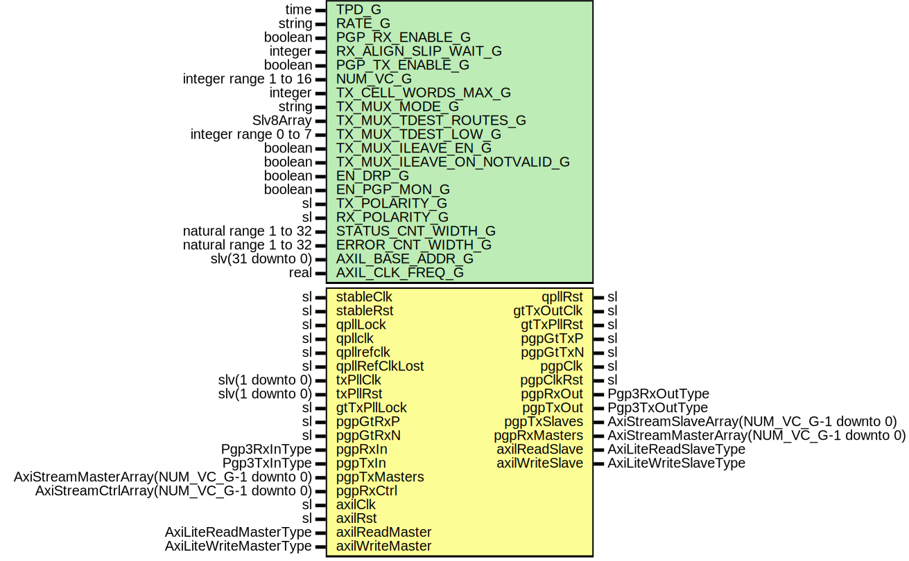

# Entity: Pgp3Gtx7

- **File**: Pgp3Gtx7.vhd
## Diagram

## Description

-----------------------------------------------------------------------------
 Title      : PGPv3: https://confluence.slac.stanford.edu/x/OndODQ
-----------------------------------------------------------------------------
 Company    : SLAC National Accelerator Laboratory
-----------------------------------------------------------------------------
 Description: PGPv3 GTX7 Core Module
-----------------------------------------------------------------------------
 This file is part of 'SLAC Firmware Standard Library'.
 It is subject to the license terms in the LICENSE.txt file found in the
 top-level directory of this distribution and at:
    https://confluence.slac.stanford.edu/display/ppareg/LICENSE.html.
 No part of 'SLAC Firmware Standard Library', including this file,
 may be copied, modified, propagated, or distributed except according to
 the terms contained in the LICENSE.txt file.
-----------------------------------------------------------------------------
## Generics

| Generic name                | Type                  | Value                            | Description                                                                                                                                                                                           |
| --------------------------- | --------------------- | -------------------------------- | ----------------------------------------------------------------------------------------------------------------------------------------------------------------------------------------------------- |
| TPD_G                       | time                  | 1 ns                             |                                                                                                                                                                                                       |
| RATE_G                      | string                | "10.3125Gbps"                    |  or "6.25Gbps" or "3.125Gbps"                                                                                                                                                                         |
| PGP_RX_ENABLE_G             | boolean               | true                             | ------------------------------------------------------------------------------------------- PGP Settings -------------------------------------------------------------------------------------------  |
| RX_ALIGN_SLIP_WAIT_G        | integer               | 32                               |                                                                                                                                                                                                       |
| PGP_TX_ENABLE_G             | boolean               | true                             |                                                                                                                                                                                                       |
| NUM_VC_G                    | integer range 1 to 16 | 4                                |                                                                                                                                                                                                       |
| TX_CELL_WORDS_MAX_G         | integer               | PGP3_DEFAULT_TX_CELL_WORDS_MAX_C |  Number of 64-bit words per cell                                                                                                                                                                      |
| TX_MUX_MODE_G               | string                | "INDEXED"                        |  Or "ROUTED"                                                                                                                                                                                          |
| TX_MUX_TDEST_ROUTES_G       | Slv8Array             | (0      => "--------")           |  Only used in ROUTED mode                                                                                                                                                                             |
| TX_MUX_TDEST_LOW_G          | integer range 0 to 7  | 0                                |                                                                                                                                                                                                       |
| TX_MUX_ILEAVE_EN_G          | boolean               | true                             |                                                                                                                                                                                                       |
| TX_MUX_ILEAVE_ON_NOTVALID_G | boolean               | true                             |                                                                                                                                                                                                       |
| EN_DRP_G                    | boolean               | false                            |                                                                                                                                                                                                       |
| EN_PGP_MON_G                | boolean               | false                            |                                                                                                                                                                                                       |
| TX_POLARITY_G               | sl                    | '0'                              |                                                                                                                                                                                                       |
| RX_POLARITY_G               | sl                    | '0'                              |                                                                                                                                                                                                       |
| STATUS_CNT_WIDTH_G          | natural range 1 to 32 | 16                               |                                                                                                                                                                                                       |
| ERROR_CNT_WIDTH_G           | natural range 1 to 32 | 8                                |                                                                                                                                                                                                       |
| AXIL_BASE_ADDR_G            | slv(31 downto 0)      | (others => '0')                  |                                                                                                                                                                                                       |
| AXIL_CLK_FREQ_G             | real                  | 156.25E+6                        |                                                                                                                                                                                                       |
## Ports

| Port name       | Direction | Type                                      | Description                                  |
| --------------- | --------- | ----------------------------------------- | -------------------------------------------- |
| stableClk       | in        | sl                                        |  GT needs a stable clock to "boot up"        |
| stableRst       | in        | sl                                        |                                              |
| qpllLock        | in        | sl                                        | QPLL Interface                               |
| qpllclk         | in        | sl                                        |                                              |
| qpllrefclk      | in        | sl                                        |                                              |
| qpllRefClkLost  | in        | sl                                        |                                              |
| qpllRst         | out       | sl                                        |                                              |
| gtTxOutClk      | out       | sl                                        | TX PLL Interface                             |
| gtTxPllRst      | out       | sl                                        |                                              |
| txPllClk        | in        | slv(1 downto 0)                           |                                              |
| txPllRst        | in        | slv(1 downto 0)                           |                                              |
| gtTxPllLock     | in        | sl                                        |                                              |
| pgpGtTxP        | out       | sl                                        | Gt Serial IO                                 |
| pgpGtTxN        | out       | sl                                        |                                              |
| pgpGtRxP        | in        | sl                                        |                                              |
| pgpGtRxN        | in        | sl                                        |                                              |
| pgpClk          | out       | sl                                        | Clocking                                     |
| pgpClkRst       | out       | sl                                        |                                              |
| pgpRxIn         | in        | Pgp3RxInType                              | Non VC Rx Signals                            |
| pgpRxOut        | out       | Pgp3RxOutType                             |                                              |
| pgpTxIn         | in        | Pgp3TxInType                              | Non VC Tx Signals                            |
| pgpTxOut        | out       | Pgp3TxOutType                             |                                              |
| pgpTxMasters    | in        | AxiStreamMasterArray(NUM_VC_G-1 downto 0) | Frame Transmit Interface                     |
| pgpTxSlaves     | out       | AxiStreamSlaveArray(NUM_VC_G-1 downto 0)  |                                              |
| pgpRxMasters    | out       | AxiStreamMasterArray(NUM_VC_G-1 downto 0) | Frame Receive Interface                      |
| pgpRxCtrl       | in        | AxiStreamCtrlArray(NUM_VC_G-1 downto 0)   |                                              |
| axilClk         | in        | sl                                        | AXI-Lite Register Interface (axilClk domain) |
| axilRst         | in        | sl                                        |                                              |
| axilReadMaster  | in        | AxiLiteReadMasterType                     |                                              |
| axilReadSlave   | out       | AxiLiteReadSlaveType                      |                                              |
| axilWriteMaster | in        | AxiLiteWriteMasterType                    |                                              |
| axilWriteSlave  | out       | AxiLiteWriteSlaveType                     |                                              |
## Signals

| Name             | Type                                                   | Description     |
| ---------------- | ------------------------------------------------------ | --------------- |
| pgpRxClkInt      | sl                                                     |                 |
| pgpRxRstInt      | sl                                                     |                 |
| pgpTxClkInt      | sl                                                     |                 |
| pgpTxRstInt      | sl                                                     |                 |
| phyRxClk         | sl                                                     |  PgpRx Signals  |
| phyRxRst         | sl                                                     |                 |
| phyRxInit        | sl                                                     |                 |
| phyRxActive      | sl                                                     |                 |
| phyRxValid       | sl                                                     |                 |
| phyRxHeader      | slv(1 downto 0)                                        |                 |
| phyRxData        | slv(63 downto 0)                                       |                 |
| phyRxStartSeq    | sl                                                     |                 |
| phyRxSlip        | sl                                                     |                 |
| phyTxActive      | sl                                                     |  PgpTx Signals  |
| phyTxStart       | sl                                                     |                 |
| phyTxDataRdy     | sl                                                     |                 |
| phyTxData        | slv(63 downto 0)                                       |                 |
| phyTxHeader      | slv(1 downto 0)                                        |                 |
| axilReadMasters  | AxiLiteReadMasterArray(NUM_AXIL_MASTERS_C-1 downto 0)  |                 |
| axilReadSlaves   | AxiLiteReadSlaveArray(NUM_AXIL_MASTERS_C-1 downto 0)   |                 |
| axilWriteMasters | AxiLiteWriteMasterArray(NUM_AXIL_MASTERS_C-1 downto 0) |                 |
| axilWriteSlaves  | AxiLiteWriteSlaveArray(NUM_AXIL_MASTERS_C-1 downto 0)  |                 |
| loopback         | slv(2 downto 0)                                        |                 |
| txDiffCtrl       | slv(4 downto 0)                                        |                 |
| txPreCursor      | slv(4 downto 0)                                        |                 |
| txPostCursor     | slv(4 downto 0)                                        |                 |
## Constants

| Name               | Type                                                            | Value                                                                                                                                                                                                                                                                                                                                                                                                                                                                                | Description |
| ------------------ | --------------------------------------------------------------- | ------------------------------------------------------------------------------------------------------------------------------------------------------------------------------------------------------------------------------------------------------------------------------------------------------------------------------------------------------------------------------------------------------------------------------------------------------------------------------------ | ----------- |
| NUM_AXIL_MASTERS_C | integer                                                         |  2                                                                                                                                                                                                                                                                                                                                                                                                                                                                                   |             |
| PGP_AXIL_INDEX_C   | integer                                                         |  0                                                                                                                                                                                                                                                                                                                                                                                                                                                                                   |             |
| DRP_AXIL_INDEX_C   | integer                                                         |  1                                                                                                                                                                                                                                                                                                                                                                                                                                                                                   |             |
| XBAR_CONFIG_C      | AxiLiteCrossbarMasterConfigArray(NUM_AXIL_MASTERS_C-1 downto 0) |  (       PGP_AXIL_INDEX_C => (          baseAddr      => AXIL_BASE_ADDR_G,           addrBits      => 12,           connectivity  => X"FFFF"),        DRP_AXIL_INDEX_C => (          baseAddr      => AXIL_BASE_ADDR_G + X"1000",           addrBits      => 11,           connectivity  => X"FFFF")) |             |
## Instantiations

- U_Pgp3Core: surf.Pgp3Core
- U_Pgp3Gtx7IpWrapper: surf.Pgp3Gtx7IpWrapper
**Description**
 [out]
------------------------
 Wrapper for GTH IP core
------------------------

