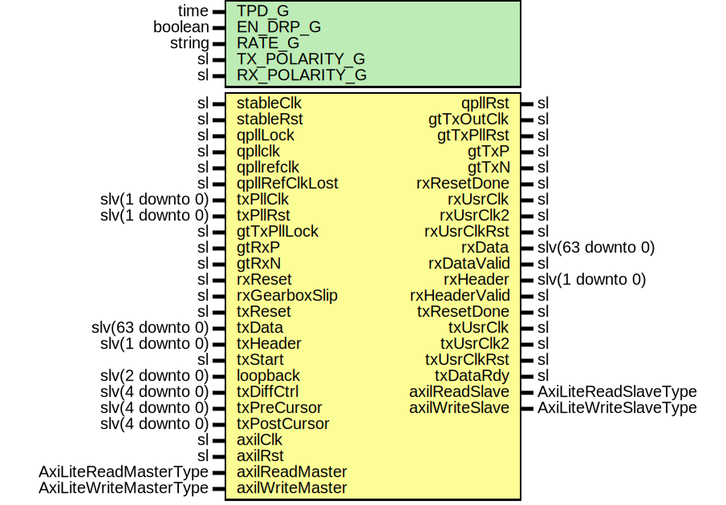

# Entity: Pgp3Gtx7IpWrapper

- **File**: Pgp3Gtx7IpWrapper.vhd
## Diagram

## Description

-----------------------------------------------------------------------------
 Title      : PGPv3: https://confluence.slac.stanford.edu/x/OndODQ
-----------------------------------------------------------------------------
 Company    : SLAC National Accelerator Laboratory
-----------------------------------------------------------------------------
 Description: PGPv3 GTX7 IP Core Wrapper
-----------------------------------------------------------------------------
 This file is part of 'SLAC Firmware Standard Library'.
 It is subject to the license terms in the LICENSE.txt file found in the
 top-level directory of this distribution and at:
    https://confluence.slac.stanford.edu/display/ppareg/LICENSE.html.
 No part of 'SLAC Firmware Standard Library', including this file,
 may be copied, modified, propagated, or distributed except according to
 the terms contained in the LICENSE.txt file.
-----------------------------------------------------------------------------
## Generics

| Generic name  | Type    | Value         | Description                   |
| ------------- | ------- | ------------- | ----------------------------- |
| TPD_G         | time    | 1 ns          |                               |
| EN_DRP_G      | boolean | true          |                               |
| RATE_G        | string  | "10.3125Gbps" |  or "6.25Gbps" or "3.125Gbps" |
| TX_POLARITY_G | sl      | '0'           |                               |
| RX_POLARITY_G | sl      | '0'           |                               |
## Ports

| Port name       | Direction | Type                   | Description            |
| --------------- | --------- | ---------------------- | ---------------------- |
| stableClk       | in        | sl                     |                        |
| stableRst       | in        | sl                     |                        |
| qpllLock        | in        | sl                     | QPLL Interface         |
| qpllclk         | in        | sl                     |                        |
| qpllrefclk      | in        | sl                     |                        |
| qpllRefClkLost  | in        | sl                     |                        |
| qpllRst         | out       | sl                     |                        |
| gtTxOutClk      | out       | sl                     | TX PLL Interface       |
| gtTxPllRst      | out       | sl                     |                        |
| txPllClk        | in        | slv(1 downto 0)        |                        |
| txPllRst        | in        | slv(1 downto 0)        |                        |
| gtTxPllLock     | in        | sl                     |                        |
| gtRxP           | in        | sl                     | GTH FPGA IO            |
| gtRxN           | in        | sl                     |                        |
| gtTxP           | out       | sl                     |                        |
| gtTxN           | out       | sl                     |                        |
| rxReset         | in        | sl                     | Rx ports               |
| rxResetDone     | out       | sl                     |                        |
| rxUsrClk        | out       | sl                     |                        |
| rxUsrClk2       | out       | sl                     |                        |
| rxUsrClkRst     | out       | sl                     |                        |
| rxData          | out       | slv(63 downto 0)       |                        |
| rxDataValid     | out       | sl                     |                        |
| rxHeader        | out       | slv(1 downto 0)        |                        |
| rxHeaderValid   | out       | sl                     |                        |
| rxGearboxSlip   | in        | sl                     |                        |
| txReset         | in        | sl                     | Tx Ports               |
| txResetDone     | out       | sl                     |                        |
| txUsrClk        | out       | sl                     |                        |
| txUsrClk2       | out       | sl                     |                        |
| txUsrClkRst     | out       | sl                     |                        |
| txDataRdy       | out       | sl                     |                        |
| txData          | in        | slv(63 downto 0)       |                        |
| txHeader        | in        | slv(1 downto 0)        |                        |
| txStart         | in        | sl                     |                        |
| loopback        | in        | slv(2 downto 0)        | Debug Interface        |
| txDiffCtrl      | in        | slv(4 downto 0)        |                        |
| txPreCursor     | in        | slv(4 downto 0)        |                        |
| txPostCursor    | in        | slv(4 downto 0)        |                        |
| axilClk         | in        | sl                     | AXI-Lite DRP Interface |
| axilRst         | in        | sl                     |                        |
| axilReadMaster  | in        | AxiLiteReadMasterType  |                        |
| axilReadSlave   | out       | AxiLiteReadSlaveType   |                        |
| axilWriteMaster | in        | AxiLiteWriteMasterType |                        |
| axilWriteSlave  | out       | AxiLiteWriteSlaveType  |                        |
## Signals

| Name              | Type             | Description |
| ----------------- | ---------------- | ----------- |
| gtRxOutClk        | sl               |             |
| gtRxPllRst        | sl               |             |
| gtRxPllLock       | sl               |             |
| rxPllClk          | slv(1 downto 0)  |             |
| rxPllRst          | slv(1 downto 0)  |             |
| rxUsrClkInt       | sl               |             |
| rxUsrClk2Int      | sl               |             |
| txUsrClkInt       | sl               |             |
| txUsrClk2Int      | sl               |             |
| drpAddr           | slv(8 downto 0)  |             |
| drpDi             | slv(15 downto 0) |             |
| drpDo             | slv(15 downto 0) |             |
| drpEn             | sl               |             |
| drpWe             | sl               |             |
| drpRdy            | sl               |             |
| txGearBoxReady    | sl               |             |
| txGearBoxReadyDly | sl               |             |
## Processes
- unnamed: ( txUsrClk2Int )
## Instantiations

- U_RX_PLL: surf.ClockManager7
