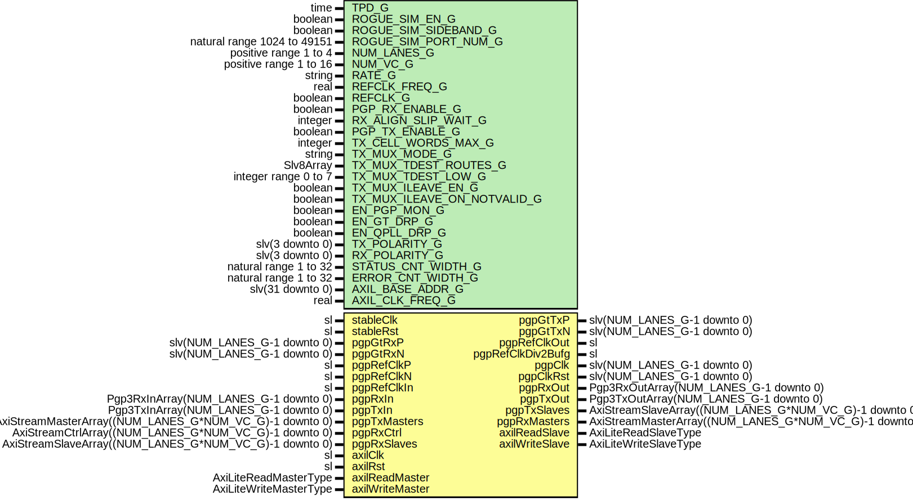

# Entity: Pgp3Gtx7Wrapper

- **File**: Pgp3Gtx7Wrapper.vhd
## Diagram

## Description

Title      : PGPv3: https://confluence.slac.stanford.edu/x/OndODQ
Company    : SLAC National Accelerator Laboratory
Description: PGPv3 GTX7 Wrapper
This file is part of 'SLAC Firmware Standard Library'.
It is subject to the license terms in the LICENSE.txt file found in the
top-level directory of this distribution and at:
   https://confluence.slac.stanford.edu/display/ppareg/LICENSE.html.
No part of 'SLAC Firmware Standard Library', including this file,
may be copied, modified, propagated, or distributed except according to
the terms contained in the LICENSE.txt file.
## Generics

| Generic name                | Type                        | Value                            | Description                                      |
| --------------------------- | --------------------------- | -------------------------------- | ------------------------------------------------ |
| TPD_G                       | time                        | 1 ns                             |                                                  |
| ROGUE_SIM_EN_G              | boolean                     | false                            |                                                  |
| ROGUE_SIM_SIDEBAND_G        | boolean                     | true                             |                                                  |
| ROGUE_SIM_PORT_NUM_G        | natural range 1024 to 49151 | 9000                             |                                                  |
| NUM_LANES_G                 | positive range 1 to 4       | 1                                |                                                  |
| NUM_VC_G                    | positive range 1 to 16      | 4                                |                                                  |
| RATE_G                      | string                      | "10.3125Gbps"                    | or "6.25Gbps" or "3.125Gbps"                     |
| REFCLK_FREQ_G               | real                        | 312.5E+6                         |                                                  |
| REFCLK_G                    | boolean                     | false                            |  FALSE: use pgpRefClkP/N,  TRUE: use pgpRefClkIn |
| PGP_RX_ENABLE_G             | boolean                     | true                             | PGP Settings                                     |
| RX_ALIGN_SLIP_WAIT_G        | integer                     | 32                               |                                                  |
| PGP_TX_ENABLE_G             | boolean                     | true                             |                                                  |
| TX_CELL_WORDS_MAX_G         | integer                     | PGP3_DEFAULT_TX_CELL_WORDS_MAX_C | Number of 64-bit words per cell                  |
| TX_MUX_MODE_G               | string                      | "INDEXED"                        | Or "ROUTED"                                      |
| TX_MUX_TDEST_ROUTES_G       | Slv8Array                   | (0      => "--------")           | Only used in ROUTED mode                         |
| TX_MUX_TDEST_LOW_G          | integer range 0 to 7        | 0                                |                                                  |
| TX_MUX_ILEAVE_EN_G          | boolean                     | true                             |                                                  |
| TX_MUX_ILEAVE_ON_NOTVALID_G | boolean                     | true                             |                                                  |
| EN_PGP_MON_G                | boolean                     | false                            |                                                  |
| EN_GT_DRP_G                 | boolean                     | false                            |                                                  |
| EN_QPLL_DRP_G               | boolean                     | false                            |                                                  |
| TX_POLARITY_G               | slv(3 downto 0)             | x"0"                             |                                                  |
| RX_POLARITY_G               | slv(3 downto 0)             | x"0"                             |                                                  |
| STATUS_CNT_WIDTH_G          | natural range 1 to 32       | 16                               |                                                  |
| ERROR_CNT_WIDTH_G           | natural range 1 to 32       | 8                                |                                                  |
| AXIL_BASE_ADDR_G            | slv(31 downto 0)            | (others => '0')                  |                                                  |
| AXIL_CLK_FREQ_G             | real                        | 156.25E+6                        |                                                  |
## Ports

| Port name         | Direction | Type                                                    | Description                          |
| ----------------- | --------- | ------------------------------------------------------- | ------------------------------------ |
| stableClk         | in        | sl                                                      | GT needs a stable clock to "boot up" |
| stableRst         | in        | sl                                                      |                                      |
| pgpGtTxP          | out       | slv(NUM_LANES_G-1 downto 0)                             | Gt Serial IO                         |
| pgpGtTxN          | out       | slv(NUM_LANES_G-1 downto 0)                             |                                      |
| pgpGtRxP          | in        | slv(NUM_LANES_G-1 downto 0)                             |                                      |
| pgpGtRxN          | in        | slv(NUM_LANES_G-1 downto 0)                             |                                      |
| pgpRefClkP        | in        | sl                                                      | GT Clocking                          |
| pgpRefClkN        | in        | sl                                                      |                                      |
| pgpRefClkIn       | in        | sl                                                      |                                      |
| pgpRefClkOut      | out       | sl                                                      |                                      |
| pgpRefClkDiv2Bufg | out       | sl                                                      |                                      |
| pgpClk            | out       | slv(NUM_LANES_G-1 downto 0)                             | Clocking                             |
| pgpClkRst         | out       | slv(NUM_LANES_G-1 downto 0)                             |                                      |
| pgpRxIn           | in        | Pgp3RxInArray(NUM_LANES_G-1 downto 0)                   | Non VC Rx Signals                    |
| pgpRxOut          | out       | Pgp3RxOutArray(NUM_LANES_G-1 downto 0)                  |                                      |
| pgpTxIn           | in        | Pgp3TxInArray(NUM_LANES_G-1 downto 0)                   | Non VC Tx Signals                    |
| pgpTxOut          | out       | Pgp3TxOutArray(NUM_LANES_G-1 downto 0)                  |                                      |
| pgpTxMasters      | in        | AxiStreamMasterArray((NUM_LANES_G*NUM_VC_G)-1 downto 0) | Frame Transmit Interface             |
| pgpTxSlaves       | out       | AxiStreamSlaveArray((NUM_LANES_G*NUM_VC_G)-1 downto 0)  |                                      |
| pgpRxMasters      | out       | AxiStreamMasterArray((NUM_LANES_G*NUM_VC_G)-1 downto 0) | Frame Receive Interface              |
| pgpRxCtrl         | in        | AxiStreamCtrlArray((NUM_LANES_G*NUM_VC_G)-1 downto 0)   | Used in implementation only          |
| pgpRxSlaves       | in        | AxiStreamSlaveArray((NUM_LANES_G*NUM_VC_G)-1 downto 0)  | Used in simulation only              |
| axilClk           | in        | sl                                                      | Stable Clock                         |
| axilRst           | in        | sl                                                      |                                      |
| axilReadMaster    | in        | AxiLiteReadMasterType                                   |                                      |
| axilReadSlave     | out       | AxiLiteReadSlaveType                                    |                                      |
| axilWriteMaster   | in        | AxiLiteWriteMasterType                                  |                                      |
| axilWriteSlave    | out       | AxiLiteWriteSlaveType                                   |                                      |
## Signals

| Name             | Type                                                   | Description |
| ---------------- | ------------------------------------------------------ | ----------- |
| qpllLock         | slv(3 downto 0)                                        |             |
| qpllClk          | slv(3 downto 0)                                        |             |
| qpllRefclk       | slv(3 downto 0)                                        |             |
| qpllRefClkLost   | slv(3 downto 0)                                        |             |
| qpllRst          | slv(3 downto 0)                                        |             |
| gtTxOutClk       | slv(3 downto 0)                                        |             |
| gtTxPllRst       | slv(3 downto 0)                                        |             |
| gtTxPllLock      | slv(3 downto 0)                                        |             |
| txPllClk         | slv(1 downto 0)                                        |             |
| txPllRst         | slv(1 downto 0)                                        |             |
| lockedStrobe     | slv(3 downto 0)                                        |             |
| pllLock          | sl                                                     |             |
| pgpRefClkDiv2    | sl                                                     |             |
| pgpRefClk        | sl                                                     |             |
| axilReadMasters  | AxiLiteReadMasterArray(NUM_AXIL_MASTERS_C-1 downto 0)  |             |
| axilReadSlaves   | AxiLiteReadSlaveArray(NUM_AXIL_MASTERS_C-1 downto 0)   |             |
| axilWriteMasters | AxiLiteWriteMasterArray(NUM_AXIL_MASTERS_C-1 downto 0) |             |
| axilWriteSlaves  | AxiLiteWriteSlaveArray(NUM_AXIL_MASTERS_C-1 downto 0)  |             |
## Constants

| Name               | Type                                                            | Value                                                                                                                                                                             | Description |
| ------------------ | --------------------------------------------------------------- | --------------------------------------------------------------------------------------------------------------------------------------------------------------------------------- | ----------- |
| NUM_AXIL_MASTERS_C | integer                                                         |  NUM_LANES_G+1                                                                                                                                                                    |             |
| QPLL_AXIL_INDEX_C  | integer                                                         |  NUM_AXIL_MASTERS_C-1                                                                                                                                                             |             |
| XBAR_CONFIG_C      | AxiLiteCrossbarMasterConfigArray(NUM_AXIL_MASTERS_C-1 downto 0) |        genAxiLiteConfig(NUM_AXIL_MASTERS_C,  AXIL_BASE_ADDR_G,  16,  13) |             |
