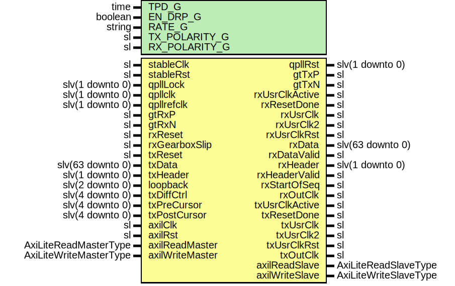

# Entity: Pgp3GtyUsIpWrapper

## Diagram

## Description

Title      : PGPv3: https://confluence.slac.stanford.edu/x/OndODQ
Company    : SLAC National Accelerator Laboratory
Description: PGPv3 GTY Ultrascale+ IP core Wrapper
This file is part of 'SLAC Firmware Standard Library'.
It is subject to the license terms in the LICENSE.txt file found in the
top-level directory of this distribution and at:
   https://confluence.slac.stanford.edu/display/ppareg/LICENSE.html.
No part of 'SLAC Firmware Standard Library', including this file,
may be copied, modified, propagated, or distributed except according to
the terms contained in the LICENSE.txt file.
## Generics

| Generic name  | Type    | Value         | Description   |
| ------------- | ------- | ------------- | ------------- |
| TPD_G         | time    | 1 ns          |               |
| EN_DRP_G      | boolean | true          |               |
| RATE_G        | string  | "10.3125Gbps" | or "6.25Gbps" |
| TX_POLARITY_G | sl      | '0'           |               |
| RX_POLARITY_G | sl      | '0'           |               |
## Ports

| Port name       | Direction | Type                   | Description            |
| --------------- | --------- | ---------------------- | ---------------------- |
| stableClk       | in        | sl                     |                        |
| stableRst       | in        | sl                     |                        |
| qpllLock        | in        | slv(1 downto 0)        | QPLL Interface         |
| qpllclk         | in        | slv(1 downto 0)        |                        |
| qpllrefclk      | in        | slv(1 downto 0)        |                        |
| qpllRst         | out       | slv(1 downto 0)        |                        |
| gtRxP           | in        | sl                     | GTH FPGA IO            |
| gtRxN           | in        | sl                     |                        |
| gtTxP           | out       | sl                     |                        |
| gtTxN           | out       | sl                     |                        |
| rxReset         | in        | sl                     | Rx ports               |
| rxUsrClkActive  | out       | sl                     |                        |
| rxResetDone     | out       | sl                     |                        |
| rxUsrClk        | out       | sl                     |                        |
| rxUsrClk2       | out       | sl                     |                        |
| rxUsrClkRst     | out       | sl                     |                        |
| rxData          | out       | slv(63 downto 0)       |                        |
| rxDataValid     | out       | sl                     |                        |
| rxHeader        | out       | slv(1 downto 0)        |                        |
| rxHeaderValid   | out       | sl                     |                        |
| rxStartOfSeq    | out       | sl                     |                        |
| rxGearboxSlip   | in        | sl                     |                        |
| rxOutClk        | out       | sl                     |                        |
| txReset         | in        | sl                     | Tx Ports               |
| txUsrClkActive  | out       | sl                     |                        |
| txResetDone     | out       | sl                     |                        |
| txUsrClk        | out       | sl                     |                        |
| txUsrClk2       | out       | sl                     |                        |
| txUsrClkRst     | out       | sl                     |                        |
| txData          | in        | slv(63 downto 0)       |                        |
| txHeader        | in        | slv(1 downto 0)        |                        |
| txOutClk        | out       | sl                     |                        |
| loopback        | in        | slv(2 downto 0)        |                        |
| txDiffCtrl      | in        | slv(4 downto 0)        |                        |
| txPreCursor     | in        | slv(4 downto 0)        |                        |
| txPostCursor    | in        | slv(4 downto 0)        |                        |
| axilClk         | in        | sl                     | AXI-Lite DRP Interface |
| axilRst         | in        | sl                     |                        |
| axilReadMaster  | in        | AxiLiteReadMasterType  |                        |
| axilReadSlave   | out       | AxiLiteReadSlaveType   |                        |
| axilWriteMaster | in        | AxiLiteWriteMasterType |                        |
| axilWriteSlave  | out       | AxiLiteWriteSlaveType  |                        |
## Signals

| Name              | Type             | Description |
| ----------------- | ---------------- | ----------- |
| dummy1            | sl               |             |
| dummy2            | sl               |             |
| dummy3            | slv(3 downto 0)  |             |
| dummy4            | sl               |             |
| dummy5            | sl               |             |
| dummy6            | sl               |             |
| dummy7            | sl               |             |
| dummy8            | sl               |             |
| dummy9            | sl               |             |
| dummy10           | sl               |             |
| dummy11           | sl               |             |
| zeroBit           | sl               |             |
| txsequence_in     | slv(6 downto 0)  |             |
| txheader_in       | slv(5 downto 0)  |             |
| rxUsrClk2Int      | sl               |             |
| rxUsrClkActiveInt | sl               |             |
| txUsrClk2Int      | sl               |             |
| txUsrClkActiveInt | sl               |             |
| drpAddr           | slv(9 downto 0)  |             |
| drpDi             | slv(15 downto 0) |             |
| drpDo             | slv(15 downto 0) |             |
| drpEn             | sl               |             |
| drpWe             | sl               |             |
| drpRdy            | sl               |             |
## Instantiations

- U_RstSync_TX: surf.RstSync
- U_RstSync_RX: surf.RstSync
**Description**
[out]

