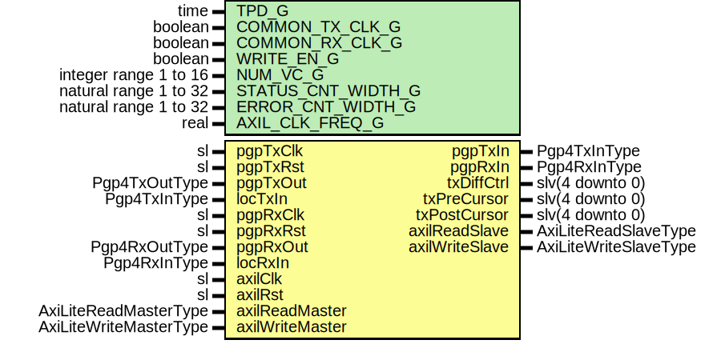

# Entity: Pgp4AxiL

## Diagram

## Description

Title      : PGPv4: https://confluence.slac.stanford.edu/x/1dzgEQ
Company    : SLAC National Accelerator Laboratory
Description: AXI-Lite block to manage the PGPv4 interface
This file is part of 'SLAC Firmware Standard Library'.
It is subject to the license terms in the LICENSE.txt file found in the
top-level directory of this distribution and at:
   https://confluence.slac.stanford.edu/display/ppareg/LICENSE.html.
No part of 'SLAC Firmware Standard Library', including this file,
may be copied, modified, propagated, or distributed except according to
the terms contained in the LICENSE.txt file.
## Generics

| Generic name       | Type                  | Value    | Description                                           |
| ------------------ | --------------------- | -------- | ----------------------------------------------------- |
| TPD_G              | time                  | 1 ns     |                                                       |
| COMMON_TX_CLK_G    | boolean               | false    | Set to true if axiClk and pgpTxClk are the same clock |
| COMMON_RX_CLK_G    | boolean               | false    | Set to true if axiClk and pgpRxClk are the same clock |
| WRITE_EN_G         | boolean               | true     | Set to false when on remote end of a link             |
| NUM_VC_G           | integer range 1 to 16 | 4        |                                                       |
| STATUS_CNT_WIDTH_G | natural range 1 to 32 | 16       |                                                       |
| ERROR_CNT_WIDTH_G  | natural range 1 to 32 | 8        |                                                       |
| AXIL_CLK_FREQ_G    | real                  | 125.0E+6 |                                                       |
## Ports

| Port name       | Direction | Type                   | Description                                  |
| --------------- | --------- | ---------------------- | -------------------------------------------- |
| pgpTxClk        | in        | sl                     | TX PGP Interface (pgpTxClk)                  |
| pgpTxRst        | in        | sl                     |                                              |
| pgpTxIn         | out       | Pgp4TxInType           |                                              |
| pgpTxOut        | in        | Pgp4TxOutType          |                                              |
| locTxIn         | in        | Pgp4TxInType           |                                              |
| pgpRxClk        | in        | sl                     | RX PGP Interface (pgpRxClk)                  |
| pgpRxRst        | in        | sl                     |                                              |
| pgpRxIn         | out       | Pgp4RxInType           |                                              |
| pgpRxOut        | in        | Pgp4RxOutType          |                                              |
| locRxIn         | in        | Pgp4RxInType           |                                              |
| txDiffCtrl      | out       | slv(4 downto 0)        | Debug Interface (axilClk domain)             |
| txPreCursor     | out       | slv(4 downto 0)        |                                              |
| txPostCursor    | out       | slv(4 downto 0)        |                                              |
| axilClk         | in        | sl                     | AXI-Lite Register Interface (axilClk domain) |
| axilRst         | in        | sl                     |                                              |
| axilReadMaster  | in        | AxiLiteReadMasterType  |                                              |
| axilReadSlave   | out       | AxiLiteReadSlaveType   |                                              |
| axilWriteMaster | in        | AxiLiteWriteMasterType |                                              |
| axilWriteSlave  | out       | AxiLiteWriteSlaveType  |                                              |
## Signals

| Name             | Type                                                                                                              | Description |
| ---------------- | ----------------------------------------------------------------------------------------------------------------- | ----------- |
| r                | RegType                                                                                                           |             |
| rin              | RegType                                                                                                           |             |
| rxClkFreq        | slv(31 downto 0)                                                                                                  | RX          |
| resetRx          | sl                                                                                                                |             |
| remLinkData      | slv(47 downto 0)                                                                                                  |             |
| rxOpCodeData     | slv(47 downto 0)                                                                                                  |             |
| remRxPause       | slv(NUM_VC_G-1 downto 0)                                                                                          |             |
| remRxPauseCnt    | SlVectorArray(NUM_VC_G-1 downto 0,  STATUS_CNT_WIDTH_G-1 downto 0)             |             |
| remRxOverflow    | slv(NUM_VC_G-1 downto 0)                                                                                          |             |
| remRxOverflowCnt | SlVectorArray(NUM_VC_G-1 downto 0,  ERROR_CNT_WIDTH_G-1 downto 0)              |             |
| rxStatus         | slv(RX_STATUS_CNT_SIZE_C-1 downto 0)                                                                              |             |
| rxStatusCnt      | SlVectorArray(RX_STATUS_CNT_SIZE_C-1 downto 0,  STATUS_CNT_WIDTH_G-1 downto 0) |             |
| rxError          | slv(RX_ERROR_CNT_SIZE_C-1 downto 0)                                                                               |             |
| rxErrorCnt       | SlVectorArray(RX_ERROR_CNT_SIZE_C-1 downto 0,  ERROR_CNT_WIDTH_G-1 downto 0)   |             |
| txClkFreq        | slv(31 downto 0)                                                                                                  | TX          |
| skpInterval      | slv(31 downto 0)                                                                                                  |             |
| flowCntlDis      | sl                                                                                                                |             |
| txDisable        | sl                                                                                                                |             |
| resetTx          | sl                                                                                                                |             |
| locData          | slv(47 downto 0)                                                                                                  |             |
| txOpCodeData     | slv(47 downto 0)                                                                                                  |             |
| locPause         | slv(NUM_VC_G-1 downto 0)                                                                                          |             |
| locPauseCnt      | SlVectorArray(NUM_VC_G-1 downto 0,  STATUS_CNT_WIDTH_G-1 downto 0)             |             |
| locOverflow      | slv(NUM_VC_G-1 downto 0)                                                                                          |             |
| locOverflowCnt   | SlVectorArray(NUM_VC_G-1 downto 0,  ERROR_CNT_WIDTH_G-1 downto 0)              |             |
| txStatus         | slv(TX_STATUS_CNT_SIZE_C-1 downto 0)                                                                              |             |
| txStatusCnt      | SlVectorArray(TX_STATUS_CNT_SIZE_C-1 downto 0,  STATUS_CNT_WIDTH_G-1 downto 0) |             |
| txError          | slv(TX_ERROR_CNT_SIZE_C-1 downto 0)                                                                               |             |
| txErrorCnt       | SlVectorArray(TX_ERROR_CNT_SIZE_C-1 downto 0,  ERROR_CNT_WIDTH_G-1 downto 0)   |             |
## Constants

| Name                 | Type    | Value                                                                                                                                                                                                                                                                                                                                                                                                                                                                                                                                                                                                                                                                                                                                                                                                                                                                                                                                                                           | Description |
| -------------------- | ------- | ------------------------------------------------------------------------------------------------------------------------------------------------------------------------------------------------------------------------------------------------------------------------------------------------------------------------------------------------------------------------------------------------------------------------------------------------------------------------------------------------------------------------------------------------------------------------------------------------------------------------------------------------------------------------------------------------------------------------------------------------------------------------------------------------------------------------------------------------------------------------------------------------------------------------------------------------------------------------------- | ----------- |
| RX_STATUS_CNT_SIZE_C | integer |  2                                                                                                                                                                                                                                                                                                                                                                                                                                                                                                                                                                                                                                                                                                                                                                                                                                                                                                                                                                              |             |
| RX_ERROR_CNT_SIZE_C  | integer |  16                                                                                                                                                                                                                                                                                                                                                                                                                                                                                                                                                                                                                                                                                                                                                                                                                                                                                                                                                                             |             |
| TX_STATUS_CNT_SIZE_C | integer |  2                                                                                                                                                                                                                                                                                                                                                                                                                                                                                                                                                                                                                                                                                                                                                                                                                                                                                                                                                                              |             |
| TX_ERROR_CNT_SIZE_C  | integer |  3                                                                                                                                                                                                                                                                                                                                                                                                                                                                                                                                                                                                                                                                                                                                                                                                                                                                                                                                                                              |             |
| REG_INIT_C           | RegType |  (       countReset     => '0',        skpInterval    => PGP4_TX_IN_INIT_C.skpInterval,        loopBack       => (others => '0'),        flowCntlDis    => PGP4_TX_IN_INIT_C.flowCntlDis,        txDisable      => PGP4_TX_IN_INIT_C.disable,        resetTx        => PGP4_TX_IN_INIT_C.resetTx,        resetRx        => PGP4_RX_IN_INIT_C.resetRx,        txDiffCtrl     => (others => '1'),        txPreCursor    => "00111",        txPostCursor   => "00111",        axilWriteSlave => AXI_LITE_WRITE_SLAVE_INIT_C,        axilReadSlave  => AXI_LITE_READ_SLAVE_INIT_C) |             |
## Types

| Name    | Type | Description |
| ------- | ---- | ----------- |
| RegType |      |             |
## Processes
- unnamed: ( axilReadMaster, axilRst, axilWriteMaster, locData, locOverflowCnt,
            locPause, locPauseCnt, r, remLinkData, remRxOverflowCnt,
            remRxPause, remRxPauseCnt, rxClkFreq, rxError, rxErrorCnt,
            rxOpCodeData, rxStatus, rxStatusCnt, txClkFreq, txError,
            txErrorCnt, txOpCodeData, txStatus, txStatusCnt )
**Description**
AXI-Lite Registers

- unnamed: ( axilClk )
## Instantiations

- U_RxClkFreq: surf.SyncClockFreq
**Description**
RX SYNC

- U_RxSyncVec: surf.SynchronizerVector
- U_remLinkData: surf.SynchronizerFifo
- U_RxOpCode: surf.SynchronizerFifo
- U_remRxPause: surf.SyncStatusVector
- U_remRxOverflow: surf.SyncStatusVector
- U_rxStatusCnt: surf.SyncStatusVector
- U_rxErrorCnt: surf.SyncStatusVector
- U_TxClkFreq: surf.SyncClockFreq
**Description**
TX SYNC

- U_SKP_SYNC: surf.SynchronizerVector
- U_TxSyncVec: surf.SynchronizerVector
- U_locData: surf.SynchronizerFifo
- U_TxOpCode: surf.SynchronizerFifo
- U_locPause: surf.SyncStatusVector
- U_locOverflow: surf.SyncStatusVector
- U_txStatusCnt: surf.SyncStatusVector
- U_txErrorCnt: surf.SyncStatusVector
