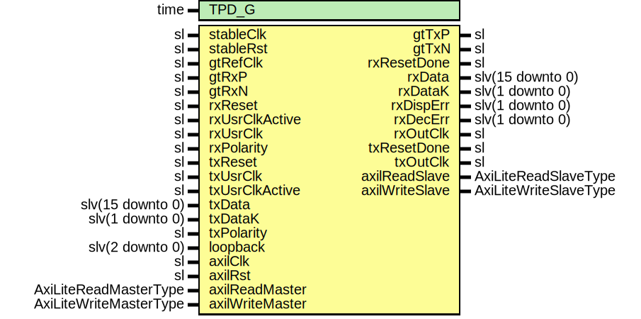

# Entity: PgpGthCoreWrapper

- **File**: PgpGthCoreWrapper.vhd
## Diagram

## Description

-----------------------------------------------------------------------------
 Title      : PGPv2b: https://confluence.slac.stanford.edu/x/q86fD
-----------------------------------------------------------------------------
 Company    : SLAC National Accelerator Laboratory
-----------------------------------------------------------------------------
 Description: PGPv2b GTH Ultrascale IP Core Wrapper
-----------------------------------------------------------------------------
 This file is part of 'Example Project Firmware'.
 It is subject to the license terms in the LICENSE.txt file found in the
 top-level directory of this distribution and at:
    https://confluence.slac.stanford.edu/display/ppareg/LICENSE.html.
 No part of 'Example Project Firmware', including this file,
 may be copied, modified, propagated, or distributed except according to
 the terms contained in the LICENSE.txt file.
-----------------------------------------------------------------------------
## Generics

| Generic name | Type | Value | Description |
| ------------ | ---- | ----- | ----------- |
| TPD_G        | time | 1 ns  |             |
## Ports

| Port name       | Direction | Type                   | Description            |
| --------------- | --------- | ---------------------- | ---------------------- |
| stableClk       | in        | sl                     |                        |
| stableRst       | in        | sl                     |                        |
| gtRefClk        | in        | sl                     | GTH FPGA IO            |
| gtRxP           | in        | sl                     |                        |
| gtRxN           | in        | sl                     |                        |
| gtTxP           | out       | sl                     |                        |
| gtTxN           | out       | sl                     |                        |
| rxReset         | in        | sl                     | Rx ports               |
| rxUsrClkActive  | in        | sl                     |                        |
| rxResetDone     | out       | sl                     |                        |
| rxUsrClk        | in        | sl                     |                        |
| rxData          | out       | slv(15 downto 0)       |                        |
| rxDataK         | out       | slv(1 downto 0)        |                        |
| rxDispErr       | out       | slv(1 downto 0)        |                        |
| rxDecErr        | out       | slv(1 downto 0)        |                        |
| rxPolarity      | in        | sl                     |                        |
| rxOutClk        | out       | sl                     |                        |
| txReset         | in        | sl                     | Tx Ports               |
| txUsrClk        | in        | sl                     |                        |
| txUsrClkActive  | in        | sl                     |                        |
| txResetDone     | out       | sl                     |                        |
| txData          | in        | slv(15 downto 0)       |                        |
| txDataK         | in        | slv(1 downto 0)        |                        |
| txPolarity      | in        | sl                     |                        |
| txOutClk        | out       | sl                     |                        |
| loopback        | in        | slv(2 downto 0)        |                        |
| axilClk         | in        | sl                     | AXI-Lite DRP interface |
| axilRst         | in        | sl                     |                        |
| axilReadMaster  | in        | AxiLiteReadMasterType  |                        |
| axilReadSlave   | out       | AxiLiteReadSlaveType   |                        |
| axilWriteMaster | in        | AxiLiteWriteMasterType |                        |
| axilWriteSlave  | out       | AxiLiteWriteSlaveType  |                        |
## Signals

| Name      | Type             | Description |
| --------- | ---------------- | ----------- |
| drpAddr   | slv(9 downto 0)  |             |
| drpDi     | slv(15 downto 0) |             |
| drpDo     | slv(15 downto 0) |             |
| drpEn     | sl               |             |
| drpWe     | sl               |             |
| drpRdy    | sl               |             |
| dummy0_6  | slv(5 downto 0)  |             |
| dummy1_14 | slv(13 downto 0) |             |
| dummy2_14 | slv(13 downto 0) |             |
| dummy3_6  | slv(5 downto 0)  |             |
| dummy4_1  | sl               |             |
| dummy5_1  | sl               |             |
| txctrl2   | slv(7 downto 0)  |             |
## Instantiations

- U_PgpGthCore: PgpGthCore
- U_AxiLiteToDrp_1: surf.AxiLiteToDrp
