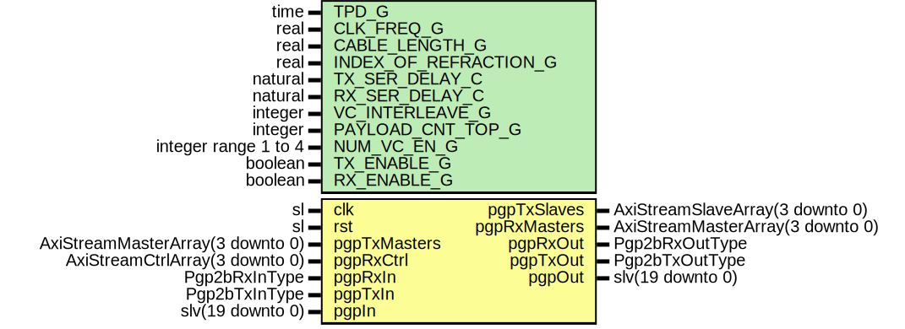

# Entity: PgpParallelSimModel

- **File**: PgpParallelSimModel.vhd
## Diagram

## Description

-----------------------------------------------------------------------------
 Title      : PGPv2b: https://confluence.slac.stanford.edu/x/q86fD
-----------------------------------------------------------------------------
 Company    : SLAC National Accelerator Laboratory
-----------------------------------------------------------------------------
 Description: Simulation Testbed for PGP
-----------------------------------------------------------------------------
 This file is part of 'SLAC Firmware Standard Library'.
 It is subject to the license terms in the LICENSE.txt file found in the
 top-level directory of this distribution and at:
    https://confluence.slac.stanford.edu/display/ppareg/LICENSE.html.
 No part of 'SLAC Firmware Standard Library', including this file,
 may be copied, modified, propagated, or distributed except according to
 the terms contained in the LICENSE.txt file.
-----------------------------------------------------------------------------
## Generics

| Generic name          | Type                 | Value      | Description                                               |
| --------------------- | -------------------- | ---------- | --------------------------------------------------------- |
| TPD_G                 | time                 | 1 ns       |                                                           |
| CLK_FREQ_G            | real                 | 156.250E+6 |  In units of HZ                                           |
| CABLE_LENGTH_G        | real                 | 1.0        |  In units of meters                                       |
| INDEX_OF_REFRACTION_G | real                 | 1.5        |  Default is 1.5 index of refraction for fiber optic cable |
| TX_SER_DELAY_C        | natural              | 5          |                                                           |
| RX_SER_DELAY_C        | natural              | 5          |                                                           |
| VC_INTERLEAVE_G       | integer              | 1          |  Interleave Frames                                        |
| PAYLOAD_CNT_TOP_G     | integer              | 7          |  Top bit for payload counter                              |
| NUM_VC_EN_G           | integer range 1 to 4 | 4          |                                                           |
| TX_ENABLE_G           | boolean              | true       |  Enable TX direction                                      |
| RX_ENABLE_G           | boolean              | true       |                                                           |
## Ports

| Port name    | Direction | Type                             | Description              |
| ------------ | --------- | -------------------------------- | ------------------------ |
| clk          | in        | sl                               | System Signals           |
| rst          | in        | sl                               |                          |
| pgpTxMasters | in        | AxiStreamMasterArray(3 downto 0) | Frame Transmit Interface |
| pgpTxSlaves  | out       | AxiStreamSlaveArray(3 downto 0)  |                          |
| pgpRxMasters | out       | AxiStreamMasterArray(3 downto 0) | Frame Receive Interface  |
| pgpRxCtrl    | in        | AxiStreamCtrlArray(3 downto 0)   |                          |
| pgpRxIn      | in        | Pgp2bRxInType                    | Non VC Rx Signals        |
| pgpRxOut     | out       | Pgp2bRxOutType                   |                          |
| pgpTxIn      | in        | Pgp2bTxInType                    | Non VC Tx Signals        |
| pgpTxOut     | out       | Pgp2bTxOutType                   |                          |
| pgpIn        | in        | slv(19 downto 0)                 | PGP 8B/10B Encoded       |
| pgpOut       | out       | slv(19 downto 0)                 |                          |
## Signals

| Name          | Type                           | Description |
| ------------- | ------------------------------ | ----------- |
| phyTxReady    | sl                             |             |
| phyRxReady    | sl                             |             |
| pgpInDly      | slv(19 downto 0)               |             |
| dataIn        | slv(19 downto 0)               |             |
| dataOut       | slv(19 downto 0)               |             |
| phyTxLanesOut | Pgp2bTxPhyLaneOutArray(0 to 0) |             |
| phyRxLanesIn  | Pgp2bRxPhyLaneInArray(0 to 0)  |             |
## Constants

| Name                | Type    | Value                                                                       | Description                       |
| ------------------- | ------- | --------------------------------------------------------------------------- | --------------------------------- |
| SPEED_OF_LIGHT_C    | real    |  299792458.0                                                                |  speed of light in a vacuum (m/s) |
| SPEED_OF_FIBER_C    | real    |  SPEED_OF_LIGHT_C / INDEX_OF_REFRACTION_G                                   |  speed of light in a fiber (m/s)  |
| CLK_PER_METER_C     | real    |  CLK_FREQ_G / SPEED_OF_FIBER_C                                              |  # of clock cycles per meter      |
| CABLE_DELAY_FLOAT_C | real    |  CABLE_LENGTH_G * CLK_PER_METER_C                                           |                                   |
| CABLE_DELAY_C       | natural |  getTimeRatio(CABLE_DELAY_FLOAT_C,  1.0) |                                   |
| WIDTH_C             | natural |  20                                                                         |  2 bytes of 8B10B is 20 bits      |
## Instantiations

- U_CableDelay: surf.SlvDelay
- U_RxSerDelay: surf.SlvDelay
- U_Decoder8b10b: surf.Decoder8b10b
- U_Pgp2bLane: surf.Pgp2bLane
- U_Encoder8b10b: surf.Encoder8b10b
- U_TxSerDelay: surf.SlvDelay
