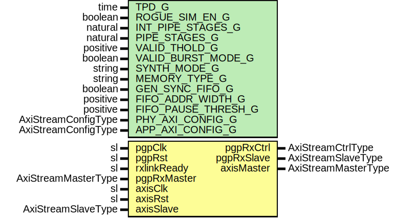

# Entity: PgpRxVcFifo

- **File**: PgpRxVcFifo.vhd
## Diagram

## Description

Company    : SLAC National Accelerator Laboratory
Description: General PGP RX Virtual Channel FIFO
This file is part of 'SLAC Firmware Standard Library'.
It is subject to the license terms in the LICENSE.txt file found in the
top-level directory of this distribution and at:
   https://confluence.slac.stanford.edu/display/ppareg/LICENSE.html.
No part of 'SLAC Firmware Standard Library', including this file,
may be copied, modified, propagated, or distributed except according to
the terms contained in the LICENSE.txt file.
## Generics

| Generic name        | Type                | Value      | Description |
| ------------------- | ------------------- | ---------- | ----------- |
| TPD_G               | time                | 1 ns       |             |
| ROGUE_SIM_EN_G      | boolean             | false      |             |
| INT_PIPE_STAGES_G   | natural             | 0          |             |
| PIPE_STAGES_G       | natural             | 1          |             |
| VALID_THOLD_G       | positive            | 1          |             |
| VALID_BURST_MODE_G  | boolean             | false      |             |
| SYNTH_MODE_G        | string              | "inferred" |             |
| MEMORY_TYPE_G       | string              | "block"    |             |
| GEN_SYNC_FIFO_G     | boolean             | false      |             |
| FIFO_ADDR_WIDTH_G   | positive            | 9          |             |
| FIFO_PAUSE_THRESH_G | positive            | 256        |             |
| PHY_AXI_CONFIG_G    | AxiStreamConfigType |            |             |
| APP_AXI_CONFIG_G    | AxiStreamConfigType |            |             |
## Ports

| Port name   | Direction | Type                | Description                     |
| ----------- | --------- | ------------------- | ------------------------------- |
| pgpClk      | in        | sl                  | PGP Interface (pgpClk domain)   |
| pgpRst      | in        | sl                  |                                 |
| rxlinkReady | in        | sl                  |                                 |
| pgpRxMaster | in        | AxiStreamMasterType |                                 |
| pgpRxCtrl   | out       | AxiStreamCtrlType   |                                 |
| pgpRxSlave  | out       | AxiStreamSlaveType  |                                 |
| axisClk     | in        | sl                  | AXIS Interface (axisClk domain) |
| axisRst     | in        | sl                  |                                 |
| axisMaster  | out       | AxiStreamMasterType |                                 |
| axisSlave   | in        | AxiStreamSlaveType  |                                 |
## Signals

| Name      | Type                | Description |
| --------- | ------------------- | ----------- |
| pgpMaster | AxiStreamMasterType |             |
| axisReset | sl                  |             |
| pgpReset  | sl                  |             |
## Processes
- BLOWOFF_FILTER: ( pgpRxMaster, rxlinkReady )
## Instantiations

- U_axisRst: surf.RstPipeline
- U_pgpRst: surf.RstPipeline
- U_Fifo: surf.AxiStreamFifoV2
