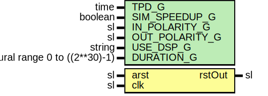

# Entity: PwrUpRst

## Diagram

## Description

Company    : SLAC National Accelerator Laboratory
Description: Synchronizes a reset signal and holds it for a parametrized
number of cycles.
This file is part of 'SLAC Firmware Standard Library'.
It is subject to the license terms in the LICENSE.txt file found in the
top-level directory of this distribution and at:
   https://confluence.slac.stanford.edu/display/ppareg/LICENSE.html.
No part of 'SLAC Firmware Standard Library', including this file,
may be copied, modified, propagated, or distributed except according to
the terms contained in the LICENSE.txt file.
## Generics

| Generic name   | Type                           | Value     | Description |
| -------------- | ------------------------------ | --------- | ----------- |
| TPD_G          | time                           | 1 ns      |             |
| SIM_SPEEDUP_G  | boolean                        | false     |             |
| IN_POLARITY_G  | sl                             | '1'       |             |
| OUT_POLARITY_G | sl                             | '1'       |             |
| USE_DSP_G      | string                         | "no"      |             |
| DURATION_G     | natural range 0 to ((2**30)-1) | 156250000 |             |
## Ports

| Port name | Direction | Type | Description |
| --------- | --------- | ---- | ----------- |
| arst      | in        | sl   |             |
| clk       | in        | sl   |             |
| rstOut    | out       | sl   |             |
## Signals

| Name       | Type                          | Description |
| ---------- | ----------------------------- | ----------- |
| rstSync    | sl                            |             |
| 
      rst | sl                            |             |
| cnt        | natural range 0 to DURATION_G |             |
## Constants

| Name       | Type    | Value                                                                                                        | Description |
| ---------- | ------- | ------------------------------------------------------------------------------------------------------------ | ----------- |
| CNT_SIZE_C | natural |  ite(SIM_SPEEDUP_G,  127,  DURATION_G) |             |
## Processes
- unnamed: ( clk )
## Instantiations

- RstSync_Inst: surf.RstSync
