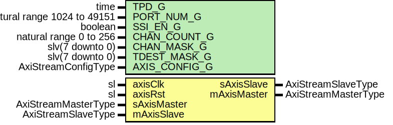

# Entity: RogueTcpStreamWrap

- **File**: RogueTcpStreamWrap.vhd
## Diagram

## Description

-----------------------------------------------------------------------------
 Company    : SLAC National Accelerator Laboratory
-----------------------------------------------------------------------------
 Description: Wrapper for Rogue Stream Module
-----------------------------------------------------------------------------
 This file is part of 'SLAC Firmware Standard Library'.
 It is subject to the license terms in the LICENSE.txt file found in the
 top-level directory of this distribution and at:
    https://confluence.slac.stanford.edu/display/ppareg/LICENSE.html.
 No part of 'SLAC Firmware Standard Library', including this file,
 may be copied, modified, propagated, or distributed except according to
 the terms contained in the LICENSE.txt file.
-----------------------------------------------------------------------------
## Generics

| Generic name  | Type                        | Value      | Description                            |
| ------------- | --------------------------- | ---------- | -------------------------------------- |
| TPD_G         | time                        | 1 ns       |                                        |
| PORT_NUM_G    | natural range 1024 to 49151 | 9000       |                                        |
| SSI_EN_G      | boolean                     | true       |                                        |
| CHAN_COUNT_G  | natural range 0 to 256      | 1          |                                        |
| CHAN_MASK_G   | slv(7 downto 0)             | "00000000" |  Overrides CHAN_COUNT_G if non-zero    |
| TDEST_MASK_G  | slv(7 downto 0)             | x"00"      |  Sets output TDEST when CHAN_COUNT_G=1 |
| AXIS_CONFIG_G | AxiStreamConfigType         |            |                                        |
## Ports

| Port name   | Direction | Type                | Description     |
| ----------- | --------- | ------------------- | --------------- |
| axisClk     | in        | sl                  | Clock and Reset |
| axisRst     | in        | sl                  |                 |
| sAxisMaster | in        | AxiStreamMasterType | Slave Port      |
| sAxisSlave  | out       | AxiStreamSlaveType  |                 |
| mAxisMaster | out       | AxiStreamMasterType | Master Port     |
| mAxisSlave  | in        | AxiStreamSlaveType  |                 |
## Signals

| Name      | Type                                          | Description     |
| --------- | --------------------------------------------- | --------------- |
| dmMasters | AxiStreamMasterArray(CHAN_COUNT_C-1 downto 0) |  Local Signals  |
| dmSlaves  | AxiStreamSlaveArray(CHAN_COUNT_C-1 downto 0)  |                 |
| ibMasters | AxiStreamMasterArray(CHAN_COUNT_C-1 downto 0) |                 |
| ibSlaves  | AxiStreamSlaveArray(CHAN_COUNT_C-1 downto 0)  |                 |
| obMasters | AxiStreamMasterArray(CHAN_COUNT_C-1 downto 0) |                 |
| obSlaves  | AxiStreamSlaveArray(CHAN_COUNT_C-1 downto 0)  |                 |
| mxMasters | AxiStreamMasterArray(CHAN_COUNT_C-1 downto 0) |                 |
| mxSlaves  | AxiStreamSlaveArray(CHAN_COUNT_C-1 downto 0)  |                 |
| portMap   | Slv16Array(CHAN_COUNT_C-1 downto 0)           |                 |
## Constants

| Name         | Type                           | Value                                                                                                                                                                                                                                                                                                                                                                                                                                          | Description                                                                    |
| ------------ | ------------------------------ | ---------------------------------------------------------------------------------------------------------------------------------------------------------------------------------------------------------------------------------------------------------------------------------------------------------------------------------------------------------------------------------------------------------------------------------------------- | ------------------------------------------------------------------------------ |
| INT_CONFIG_C | AxiStreamConfigType            |  (       TSTRB_EN_C    => false,        TDATA_BYTES_C => 8,        TDEST_BITS_C  => 8,        TID_BITS_C    => 0,        TKEEP_MODE_C  => TKEEP_NORMAL_C,        TUSER_BITS_C  => 8,        TUSER_MODE_C  => TUSER_NORMAL_C) |                                                                                |
| CHAN_COUNT_C | integer                        |  ite(CHAN_MASK_G = X"00",  CHAN_COUNT_G,                                            2**conv_integer(onesCount(CHAN_MASK_G)))                                                                                                                                                                                                                                             |  Use CHAN_MASK_G to determine CHAN_COUNT_C if non-zero, else use CHAN_COUNT_G  |
| CHAN_MASK_C  | slv(7 downto 0)                |  ite(CHAN_MASK_G /= X"00",  CHAN_MASK_G,                                                   toSlv(2**log2(CHAN_COUNT_G)-1,  8))                                                                                                                                                                                                        |  Generate a correct channel mask if using CHAN_COUNT_G                         |
| CHAN_MAP_C   | Slv8Array(0 to CHAN_COUNT_C-1) |  channelMap                                                                                                                                                                                                                                                                                                                                                                                                                                    |                                                                                |
## Functions
- channelMap () return Slv8Array 
