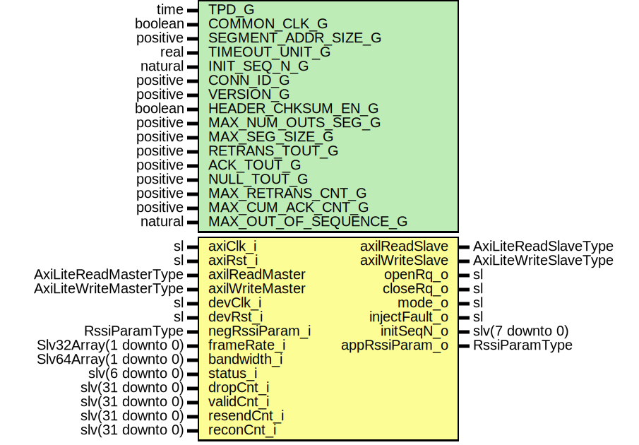

# Entity: RssiAxiLiteRegItf

- **File**: RssiAxiLiteRegItf.vhd
## Diagram

## Description

-----------------------------------------------------------------------------
 Title      : RSSI Protocol: https://confluence.slac.stanford.edu/x/1IyfD
-----------------------------------------------------------------------------
 Company    : SLAC National Accelerator Laboratory
-----------------------------------------------------------------------------
 Description:  Register decoding for RSSI core
               0x00 (RW)- Control register [4:0]:
                   bit 0: Open connection request (Default '0')
                   bit 1: Close connection request (Default '0')
                   bit 2: Mode (Default '0'):
                            - '0': Use internal parameters from generics
                            - '1': Use parameters from Axil
                   bit 3: Header checksum enable (Default '1')
                   bit 4: Inject fault to the next packet header checksum (Default '0')
                            Acts on rising edge - injects exactly one fault in next segment (ACK, NULL, or DATA)
               0x01 (RW)- Initial sequence number [7:0] (Default x"80")
               0x02 (RW)- Version register [3:0](Default x"1")
               0x03 (RW)- Maximum out standing segments [7:0](Default "008"):
                            Defines the max number of segments in the RSSI receiver buffer
               0x04 (RW)- Maximum segment size [15:0](Default x"0400")
                            Defines the size of segment buffer! Number of bytes!
               0x05 (RW)- Retransmission timeout [15:0](Default 50)
                            Unit depends on TIMEOUT_UNIT_G
               0x06 (RW)- Cumulative acknowledgment timeout [15:0](Default 50)
                            Unit depends on TIMEOUT_UNIT_G
               0x07 (RW)- Null segment timeout [15:0](Default 50)
                            Unit depends on TIMEOUT_UNIT_G
                            Server: Close connection if Null segment missed!
                            Client: Transmit Null segment when nullSegTout/2 reached!
               0x08 (RW)- Maximum number of retransmissions [7:0](Default x"02")
                            How many times segments are retransmitted before the connection gets broken.
               0x09 (RW)- Maximum cumulative acknowledgments [7:0](Default x"03")
                            When more than maxCumAck are received and not acknowledged the
                            ACK packet will be sent to acknowledge the received packets. Even though the
                            cumulative acknowledgment timeout has not been reached yet!
               0x0A (RW)- Max out of sequence segments (EACK) [7:0](Default x"03")
                            Currently not used TBD
               0x0B (RW)- Connection ID [31:0](Default x"12345678")
                            Every connection should have unique connection ID.
               Statuses
               0x10 (R)- Status register [5:0]:
                   bit(0) : Connection Active
                   bit(1) : Maximum retransmissions exceeded retransMax
                   bit(2) : Null timeout reached (server) r.nullTout
                   bit(3) : Error in acknowledgment mechanism
                   bit(4) : SSI Frame length too long
                   bit(5) : Connection to peer timed out
                   bit(6) : Parameters from peer rejected (Client) or new proposed(Server)
                0x11 (R)- Number of valid segments [31:0]:
                   The value rests to 0 when new connection open is requested.
                0x12 (R)- Number of dropped segments [31:0]:
                   The value rests to 0 when new connection open is requested.
                0x13 (R)- Counts all retransmission requests within the active connection [31:0]:
                   The value rests to 0 when new connection open is requested.
                0x14 (R)- Counts all reconnections from reset [31:0]:
                   The value rests to 0 when module is reset.
----------------------------------------------------------------------------
 This file is part of 'SLAC Firmware Standard Library'.
 It is subject to the license terms in the LICENSE.txt file found in the
 top-level directory of this distribution and at:
    https://confluence.slac.stanford.edu/display/ppareg/LICENSE.html.
 No part of 'SLAC Firmware Standard Library', including this file,
 may be copied, modified, propagated, or distributed except according to
 the terms contained in the LICENSE.txt file.
-----------------------------------------------------------------------------
## Generics

| Generic name          | Type     | Value        | Description                                               |
| --------------------- | -------- | ------------ | --------------------------------------------------------- |
| TPD_G                 | time     | 1 ns         | General Configurations                                    |
| COMMON_CLK_G          | boolean  | false        |  true if axiClk_i = devClk_i                              |
| SEGMENT_ADDR_SIZE_G   | positive | 7            |  2^SEGMENT_ADDR_SIZE_G = Number of 64 bit wide data words |
| TIMEOUT_UNIT_G        | real     | 1.0E-6       | Defaults form generics                                    |
| INIT_SEQ_N_G          | natural  | 16#80#       |                                                           |
| CONN_ID_G             | positive | 16#12345678# |                                                           |
| VERSION_G             | positive | 1            |                                                           |
| HEADER_CHKSUM_EN_G    | boolean  | true         |                                                           |
| MAX_NUM_OUTS_SEG_G    | positive | 8            |    <=(2**WINDOW_ADDR_SIZE_G)                              |
| MAX_SEG_SIZE_G        | positive | 1024         |  Number of bytes                                          |
| RETRANS_TOUT_G        | positive | 50           |  unit depends on TIMEOUT_UNIT_G                           |
| ACK_TOUT_G            | positive | 25           |  unit depends on TIMEOUT_UNIT_G                           |
| NULL_TOUT_G           | positive | 200          |  unit depends on TIMEOUT_UNIT_G                           |
| MAX_RETRANS_CNT_G     | positive | 2            |                                                           |
| MAX_CUM_ACK_CNT_G     | positive | 3            |                                                           |
| MAX_OUT_OF_SEQUENCE_G | natural  | 3            |                                                           |
## Ports

| Port name       | Direction | Type                   | Description                                 |
| --------------- | --------- | ---------------------- | ------------------------------------------- |
| axiClk_i        | in        | sl                     | AXI Clk                                     |
| axiRst_i        | in        | sl                     |                                             |
| axilReadMaster  | in        | AxiLiteReadMasterType  | Axi-Lite Register Interface (locClk domain) |
| axilReadSlave   | out       | AxiLiteReadSlaveType   |                                             |
| axilWriteMaster | in        | AxiLiteWriteMasterType |                                             |
| axilWriteSlave  | out       | AxiLiteWriteSlaveType  |                                             |
| devClk_i        | in        | sl                     | Rssi Clk                                    |
| devRst_i        | in        | sl                     |                                             |
| openRq_o        | out       | sl                     | RegistersControl (RW)                       |
| closeRq_o       | out       | sl                     |                                             |
| mode_o          | out       | sl                     |                                             |
| injectFault_o   | out       | sl                     |                                             |
| initSeqN_o      | out       | slv(7 downto 0)        |                                             |
| appRssiParam_o  | out       | RssiParamType          |                                             |
| negRssiParam_i  | in        | RssiParamType          |                                             |
| frameRate_i     | in        | Slv32Array(1 downto 0) | Status (RO)                                 |
| bandwidth_i     | in        | Slv64Array(1 downto 0) |                                             |
| status_i        | in        | slv(6 downto 0)        |                                             |
| dropCnt_i       | in        | slv(31 downto 0)       |                                             |
| validCnt_i      | in        | slv(31 downto 0)       |                                             |
| resendCnt_i     | in        | slv(31 downto 0)       |                                             |
| reconCnt_i      | in        | slv(31 downto 0)       |                                             |
## Signals

| Name         | Type                | Description             |
| ------------ | ------------------- | ----------------------- |
| r            | RegType             |                         |
| rin          | RegType             |                         |
| s_RdAddr     | natural             |  Integer address        |
| s_WrAddr     | natural             |                         |
| s_status     | slv(status_i'range) |  Synced status signals  |
| s_dropCnt    | slv(31 downto 0)    |                         |
| s_validCnt   | slv(31 downto 0)    |                         |
| s_reconCnt   | slv(31 downto 0)    |                         |
| s_resendCnt  | slv(31 downto 0)    |                         |
| dummyBit     | sl                  |                         |
| negRssiParam | RssiParamType       |                         |
## Constants

| Name       | Type    | Value                                                                                                                                                                                                                                                                                                                                                                                                                                                                                                                                                                                                                                                                                                                                                                                                                                                                                                                                                                                                                                                                                                                                                                                                                                                                                                                                                                                                                                                                                                                                                                                                                                                                                                                                                                                                                                                                                                                                                                               | Description |
| ---------- | ------- | ----------------------------------------------------------------------------------------------------------------------------------------------------------------------------------------------------------------------------------------------------------------------------------------------------------------------------------------------------------------------------------------------------------------------------------------------------------------------------------------------------------------------------------------------------------------------------------------------------------------------------------------------------------------------------------------------------------------------------------------------------------------------------------------------------------------------------------------------------------------------------------------------------------------------------------------------------------------------------------------------------------------------------------------------------------------------------------------------------------------------------------------------------------------------------------------------------------------------------------------------------------------------------------------------------------------------------------------------------------------------------------------------------------------------------------------------------------------------------------------------------------------------------------------------------------------------------------------------------------------------------------------------------------------------------------------------------------------------------------------------------------------------------------------------------------------------------------------------------------------------------------------------------------------------------------------------------------------------------------- | ----------- |
| REG_INIT_C | RegType |  (       -- Control (RW)       control => "01000",         -- Parameters (RW)       initSeqN        => toSlv(INIT_SEQ_N_G,  8),        appRssiParam    => (          version      => toSlv(VERSION_G,  4),           chksumEn     => "1",           timeoutUnit  => toSlv(integer(0.0 - (ieee.math_real.log(TIMEOUT_UNIT_G)/ieee.math_real.log(10.0))),  8),           maxOutsSeg   => toSlv(MAX_NUM_OUTS_SEG_G,  8),           maxSegSize   => toSlv(MAX_SEG_SIZE_G,  16),           retransTout  => toSlv(RETRANS_TOUT_G,  16),           cumulAckTout => toSlv(ACK_TOUT_G,  16),           nullSegTout  => toSlv(NULL_TOUT_G,  16),           maxRetrans   => toSlv(MAX_RETRANS_CNT_G,  8),           maxCumAck    => toSlv(MAX_CUM_ACK_CNT_G,  8),           maxOutofseq  => toSlv(MAX_OUT_OF_SEQUENCE_G,  8),           connectionId => toSlv(CONN_ID_G,  32)),         -- AXI lite       axilReadSlave  => AXI_LITE_READ_SLAVE_INIT_C,        axilWriteSlave => AXI_LITE_WRITE_SLAVE_INIT_C) |             |
## Types

| Name    | Type | Description |
| ------- | ---- | ----------- |
| RegType |      |             |
## Processes
- comb: ( axiRst_i, axilReadMaster, axilWriteMaster, bandwidth_i,
                   frameRate_i, negRssiParam, r, s_RdAddr, s_WrAddr, s_dropCnt,
                   s_reconCnt, s_resendCnt, s_status, s_validCnt )
- seq: ( axiClk_i )
## Instantiations

- U_status: surf.SynchronizerVector
- U_validCnt: surf.SynchronizerFifo
- U_dropCnt: surf.SynchronizerFifo
- U_resendCnt: surf.SynchronizerFifo
- U_reconCnt: surf.SynchronizerFifo
- U_SyncVecOut: surf.SynchronizerVector
- U_initSeqN: surf.SynchronizerVector
- U_RssiParamSync_In: surf.RssiParamSync
- U_RssiParamSync_Out: surf.RssiParamSync
