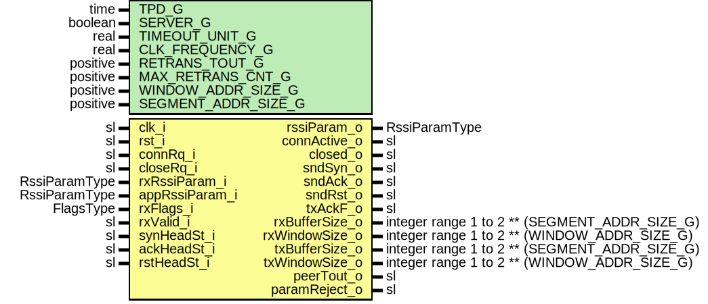

# Entity: RssiConnFsm

## Diagram

## Description

Title      : RSSI Protocol: https://confluence.slac.stanford.edu/x/1IyfD
Company    : SLAC National Accelerator Laboratory
Description: Connection establishment mechanism:
               - Connection open/close request,
               - Parameter negotiation,
               - Server-client mode (More comments below).
This file is part of 'SLAC Firmware Standard Library'.
It is subject to the license terms in the LICENSE.txt file found in the
top-level directory of this distribution and at:
   https://confluence.slac.stanford.edu/display/ppareg/LICENSE.html.
No part of 'SLAC Firmware Standard Library', including this file,
may be copied, modified, propagated, or distributed except according to
the terms contained in the LICENSE.txt file.
## Generics

| Generic name        | Type     | Value   | Description                                                              |
| ------------------- | -------- | ------- | ------------------------------------------------------------------------ |
| TPD_G               | time     | 1 ns    |                                                                          |
| SERVER_G            | boolean  | true    |                                                                          |
| TIMEOUT_UNIT_G      | real     | 1.0E-6  | us                                                                       |
| CLK_FREQUENCY_G     | real     | 100.0E6 |                                                                          |
| RETRANS_TOUT_G      | positive | 50      | Time the module waits for the response until it retransmits SYN segment  |
| MAX_RETRANS_CNT_G   | positive | 2       |                                                                          |
| WINDOW_ADDR_SIZE_G  | positive | 3       |                                                                          |
| SEGMENT_ADDR_SIZE_G | positive | 7       | 2^SEGMENT_ADDR_SIZE_G = Number of 64 bit wide data words                 |
## Ports

| Port name      | Direction | Type                                          | Description                                              |
| -------------- | --------- | --------------------------------------------- | -------------------------------------------------------- |
| clk_i          | in        | sl                                            |                                                          |
| rst_i          | in        | sl                                            |                                                          |
| connRq_i       | in        | sl                                            | Connection request (open/close)                          |
| closeRq_i      | in        | sl                                            |                                                          |
| rxRssiParam_i  | in        | RssiParamType                                 | Parameters received from peer (Server)                   |
| appRssiParam_i | in        | RssiParamType                                 | Parameters set by high level App or generic (Client)     |
| rssiParam_o    | out       | RssiParamType                                 | Negotiated parameters                                    |
| rxFlags_i      | in        | FlagsType                                     | Flags from Rx module                                     |
| rxValid_i      | in        | sl                                            | Valid received packet                                    |
| synHeadSt_i    | in        | sl                                            |                                                          |
| ackHeadSt_i    | in        | sl                                            |                                                          |
| rstHeadSt_i    | in        | sl                                            |                                                          |
| connActive_o   | out       | sl                                            | Connection FSM indicating active connection              |
| closed_o       | out       | sl                                            | FSM in closed state (indicating when to initialize seqN) |
| sndSyn_o       | out       | sl                                            |                                                          |
| sndAck_o       | out       | sl                                            |                                                          |
| sndRst_o       | out       | sl                                            |                                                          |
| txAckF_o       | out       | sl                                            |                                                          |
| rxBufferSize_o | out       | integer range 1 to 2 ** (SEGMENT_ADDR_SIZE_G) | Window size and buffer size different for Rx and Tx      |
| rxWindowSize_o | out       | integer range 1 to 2 ** (WINDOW_ADDR_SIZE_G)  |                                                          |
| txBufferSize_o | out       | integer range 1 to 2 ** (SEGMENT_ADDR_SIZE_G) |                                                          |
| txWindowSize_o | out       | integer range 1 to 2 ** (WINDOW_ADDR_SIZE_G)  |                                                          |
| peerTout_o     | out       | sl                                            | Status signals                                           |
| paramReject_o  | out       | sl                                            |                                                          |
## Signals

| Name | Type    | Description |
| ---- | ------- | ----------- |
| r    | RegType |             |
| rin  | RegType |             |
## Constants

| Name               | Type    | Value                                                                                                                                                                                                                                                                                                                                                                                                                                                                                                                                                                                                                                                                                                                                                                                                                                                                                               | Description |
| ------------------ | ------- | --------------------------------------------------------------------------------------------------------------------------------------------------------------------------------------------------------------------------------------------------------------------------------------------------------------------------------------------------------------------------------------------------------------------------------------------------------------------------------------------------------------------------------------------------------------------------------------------------------------------------------------------------------------------------------------------------------------------------------------------------------------------------------------------------------------------------------------------------------------------------------------------------- | ----------- |
| SAMPLES_PER_TIME_C | integer |  integer(TIMEOUT_UNIT_G * CLK_FREQUENCY_G)                                                                                                                                                                                                                                                                                                                                                                                                                                                                                                                                                                                                                                                                                                                                                                                                                                                          |             |
| REG_INIT_C         | RegType |  (       connActive  => '0',        closed      => '1',        sndSyn      => '0',        sndAck      => '0',        sndRst      => '0',        txAckF      => '0',        peerTout    => '0',        paramReject => '0',         rssiParam   => RSSI_PARAM_INIT_C,         timeoutCntr => 0,        resendCntr  => 0,        --       txBufferSize=> 1,        txWindowSize=> 1,         ---       state  => CLOSED_S     ) |             |
## Types

| Name      | Type                                                                                                                                                                                                                                                                                                                                                                                                        | Description |
| --------- | ----------------------------------------------------------------------------------------------------------------------------------------------------------------------------------------------------------------------------------------------------------------------------------------------------------------------------------------------------------------------------------------------------------- | ----------- |
| StateType | ( CLOSED_S,  SEND_SYN_S,  WAIT_SYN_S,  LISTEN_S,  SEND_ACK_S,  SEND_SYN_ACK_S,  WAIT_ACK_S,  SEND_RST_S,  OPEN_S )  |             |
| RegType   |                                                                                                                                                                                                                                                                                                                                                                                                             |             |
## Processes
- comb: ( r, rst_i, connRq_i, rxRssiParam_i, synHeadSt_i, rxFlags_i,
                   ackHeadSt_i, rstHeadSt_i, appRssiParam_i, rxValid_i, closeRq_i )
- seq: ( clk_i )
