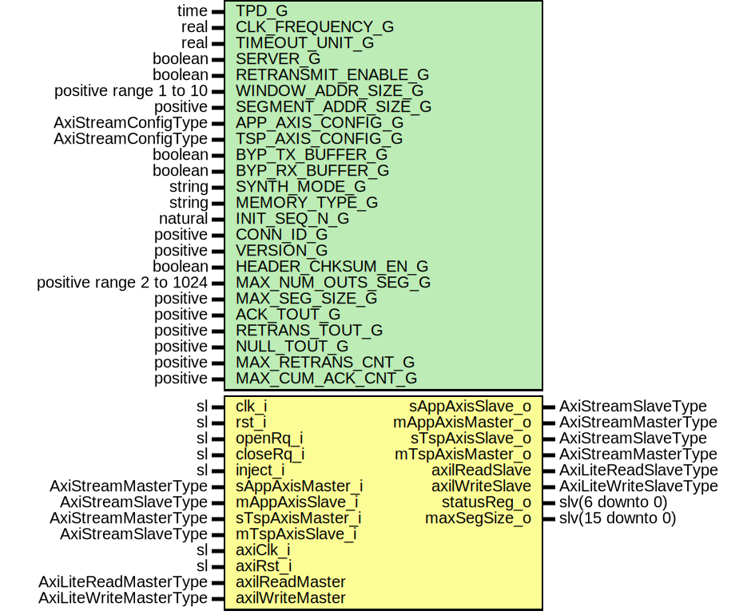

# Entity: RssiCore

- **File**: RssiCore.vhd
## Diagram

## Description

Title      : RSSI Protocol: https://confluence.slac.stanford.edu/x/1IyfD
Company    : SLAC National Accelerator Laboratory
Description: The module is based upon RUDP (Cisco implementation) RFC-908, RFC-1151, draft-ietf-sigtran-reliable-udp-00.
             The specifications in the drafts are modified by internal simplifications and improvements.
             Interfaces to transport and application side through AxiStream ports
             The AxiStream IO port widths can be adjusted (AxiStream FIFOs added to IO)
             Optional AxiLite Register interface. More info on registers is in RssiAxiLiteRegItf.vhd
             The module can act as Server or Client:
                - Server: - Passively listens for connection request from client,
                          - Monitors connection activity NULL segment timeouts
                - Client: - Actively requests connection
                          - Sends NULL packages if there is no incoming data
 Status register:
   statusReg_o(0) : Connection Active
   statusReg_o(1) : Maximum retransmissions exceeded r.retransMax and
   statusReg_o(2) : Null timeout reached (server) r.nullTout;
   statusReg_o(3) : Error in acknowledgment mechanism
   statusReg_o(4) : SSI Frame length too long
   statusReg_o(5) : Connection to peer timed out
   statusReg_o(6) : Client rejected the connection (parameters out of range)
                    Server proposed new parameters (parameters out of range)
This file is part of 'SLAC Firmware Standard Library'.
It is subject to the license terms in the LICENSE.txt file found in the
top-level directory of this distribution and at:
   https://confluence.slac.stanford.edu/display/ppareg/LICENSE.html.
No part of 'SLAC Firmware Standard Library', including this file,
may be copied, modified, propagated, or distributed except according to
the terms contained in the LICENSE.txt file.
## Generics

| Generic name        | Type                     | Value        | Description                                                                                        |
| ------------------- | ------------------------ | ------------ | -------------------------------------------------------------------------------------------------- |
| TPD_G               | time                     | 1 ns         |                                                                                                    |
| CLK_FREQUENCY_G     | real                     | 100.0E6      |                                                                                                    |
| TIMEOUT_UNIT_G      | real                     | 1.0E-6       | us (Applies to all the timeouts in the core)                                                       |
| SERVER_G            | boolean                  | true         | Module is server or client                                                                         |
| RETRANSMIT_ENABLE_G | boolean                  | true         | Enable/Disable retransmissions in tx module                                                        |
| WINDOW_ADDR_SIZE_G  | positive range 1 to 10   | 3            | 2^WINDOW_ADDR_SIZE_G  = Max number of segments in buffer                                           |
| SEGMENT_ADDR_SIZE_G | positive                 | 7            | 2^SEGMENT_ADDR_SIZE_G = Number of 64 bit wide data words                                           |
| APP_AXIS_CONFIG_G   | AxiStreamConfigType      |              | AXIS Configurations                                                                                |
| TSP_AXIS_CONFIG_G   | AxiStreamConfigType      |              |                                                                                                    |
| BYP_TX_BUFFER_G     | boolean                  | false        | Generic RSSI parameters                                                                            |
| BYP_RX_BUFFER_G     | boolean                  | false        |                                                                                                    |
| SYNTH_MODE_G        | string                   | "inferred"   |                                                                                                    |
| MEMORY_TYPE_G       | string                   | "block"      |                                                                                                    |
| INIT_SEQ_N_G        | natural                  | 16#80#       | Version and connection ID                                                                          |
| CONN_ID_G           | positive                 | 16#12345678# |                                                                                                    |
| VERSION_G           | positive                 | 1            |                                                                                                    |
| HEADER_CHKSUM_EN_G  | boolean                  | true         |                                                                                                    |
| MAX_NUM_OUTS_SEG_G  | positive range 2 to 1024 | 8            | <=(2**WINDOW_ADDR_SIZE_G)                                                                          |
| MAX_SEG_SIZE_G      | positive                 | 1024         | <= (2**SEGMENT_ADDR_SIZE_G)*8 Number of bytes                                                      |
| ACK_TOUT_G          | positive                 | 25           | unit depends on TIMEOUT_UNIT_G                                                                     |
| RETRANS_TOUT_G      | positive                 | 50           | unit depends on TIMEOUT_UNIT_G  (Recommended >= MAX_NUM_OUTS_SEG_G*Data segment transmission time) |
| NULL_TOUT_G         | positive                 | 200          | unit depends on TIMEOUT_UNIT_G  (Recommended >= 4*RETRANS_TOUT_G)                                  |
| MAX_RETRANS_CNT_G   | positive                 | 2            | Counters                                                                                           |
| MAX_CUM_ACK_CNT_G   | positive                 | 3            |                                                                                                    |
## Ports

| Port name        | Direction | Type                   | Description                            |
| ---------------- | --------- | ---------------------- | -------------------------------------- |
| clk_i            | in        | sl                     |                                        |
| rst_i            | in        | sl                     |                                        |
| openRq_i         | in        | sl                     | High level  Application side interface |
| closeRq_i        | in        | sl                     |                                        |
| inject_i         | in        | sl                     |                                        |
| sAppAxisMaster_i | in        | AxiStreamMasterType    | SSI Application side                   |
| sAppAxisSlave_o  | out       | AxiStreamSlaveType     |                                        |
| mAppAxisMaster_o | out       | AxiStreamMasterType    |                                        |
| mAppAxisSlave_i  | in        | AxiStreamSlaveType     |                                        |
| sTspAxisMaster_i | in        | AxiStreamMasterType    | SSI Transport side                     |
| sTspAxisSlave_o  | out       | AxiStreamSlaveType     |                                        |
| mTspAxisMaster_o | out       | AxiStreamMasterType    |                                        |
| mTspAxisSlave_i  | in        | AxiStreamSlaveType     |                                        |
| axiClk_i         | in        | sl                     | AXI-Lite Register Interface            |
| axiRst_i         | in        | sl                     |                                        |
| axilReadMaster   | in        | AxiLiteReadMasterType  |                                        |
| axilReadSlave    | out       | AxiLiteReadSlaveType   |                                        |
| axilWriteMaster  | in        | AxiLiteWriteMasterType |                                        |
| axilWriteSlave   | out       | AxiLiteWriteSlaveType  |                                        |
| statusReg_o      | out       | slv(6 downto 0)        | Internal statuses                      |
| maxSegSize_o     | out       | slv(15 downto 0)       |                                        |
## Signals

| Name              | Type                                          | Description                                                        |
| ----------------- | --------------------------------------------- | ------------------------------------------------------------------ |
| s_rxBuffBusy      | sl                                            |                                                                    |
| s_appRssiParam    | RssiParamType                                 | RSSI Parameters                                                    |
| s_rxRssiParam     | RssiParamType                                 |                                                                    |
| s_rssiParam       | RssiParamType                                 |                                                                    |
| s_sndResend       | sl                                            | Tx Segment requests                                                |
| s_sndSyn          | sl                                            |                                                                    |
| s_sndAck          | sl                                            |                                                                    |
| s_sndAckMon       | sl                                            |                                                                    |
| s_sndAckCon       | sl                                            |                                                                    |
| s_sndRst          | sl                                            |                                                                    |
| s_sndNull         | sl                                            |                                                                    |
| s_synHeadSt       | sl                                            | Header states                                                      |
| s_rstHeadSt       | sl                                            |                                                                    |
| s_dataHeadSt      | sl                                            |                                                                    |
| s_nullHeadSt      | sl                                            |                                                                    |
| s_ackHeadSt       | sl                                            |                                                                    |
| s_txSeqN          | slv(7 downto 0)                               | Current transmitted or received SeqN and AckN                      |
| s_txAckN          | slv(7 downto 0)                               |                                                                    |
| s_rxLastSeqN      | slv(7 downto 0)                               |                                                                    |
| s_rxAckN          | slv(7 downto 0)                               |                                                                    |
| s_rxLastAckN      | slv(7 downto 0)                               |                                                                    |
| s_headerAddr      | slv(7 downto 0)                               | Tx Header                                                          |
| s_headerData      | slv(RSSI_WORD_WIDTH_C*8-1 downto 0)           |                                                                    |
| s_headerRdy       | sl                                            |                                                                    |
| s_txChkEnable     | sl                                            | Tx Checksum                                                        |
| s_txChkValid      | sl                                            |                                                                    |
| s_txChkStrobe     | sl                                            |                                                                    |
| s_txChkLength     | positive                                      |                                                                    |
| s_txChksum        | slv(15 downto 0)                              |                                                                    |
| s_rxChkEnable     | sl                                            | Rx Checksum                                                        |
| s_rxChkValid      | sl                                            |                                                                    |
| s_rxChkCheck      | sl                                            |                                                                    |
| s_rxChkStrobe     | sl                                            |                                                                    |
| s_rxChkLength     | positive                                      |                                                                    |
| s_rxValidSeg      | sl                                            | Rx Statuses                                                        |
| s_rxDropSeg       | sl                                            |                                                                    |
| s_rxFlags         | flagsType                                     |                                                                    |
| s_rxBufferSize    | integer range 1 to 2 ** (SEGMENT_ADDR_SIZE_G) | Rx segment buffer                                                  |
| s_rxWindowSize    | integer range 1 to 2 ** (WINDOW_ADDR_SIZE_G)  |                                                                    |
| s_rxWrBuffAddr    | slv(BUFFER_ADDR_WIDTH_C-1 downto 0)           |                                                                    |
| s_rxWrBuffData    | slv(RSSI_WORD_WIDTH_C*8-1 downto 0)           |                                                                    |
| s_rxWrBuffWe      | sl                                            |                                                                    |
| s_rxRdBuffRe      | sl                                            |                                                                    |
| s_rxRdBuffAddr    | slv(BUFFER_ADDR_WIDTH_C-1 downto 0)           |                                                                    |
| s_rxRdBuffData    | slv(RSSI_WORD_WIDTH_C*8-1 downto 0)           |                                                                    |
| s_txBufferSize    | integer range 1 to 2 ** (SEGMENT_ADDR_SIZE_G) | Tx segment buffer                                                  |
| s_txWindowSize    | integer range 1 to 2 ** (WINDOW_ADDR_SIZE_G)  |                                                                    |
| s_txWrBuffAddr    | slv(BUFFER_ADDR_WIDTH_C-1 downto 0)           |                                                                    |
| s_txWrBuffData    | slv(RSSI_WORD_WIDTH_C*8-1 downto 0)           |                                                                    |
| s_txWrBuffWe      | sl                                            |                                                                    |
| s_txRdBuffRe      | sl                                            |                                                                    |
| s_txRdBuffAddr    | slv(BUFFER_ADDR_WIDTH_C-1 downto 0)           |                                                                    |
| s_txRdBuffData    | slv(RSSI_WORD_WIDTH_C*8-1 downto 0)           |                                                                    |
| s_rxAck           | sl                                            | Acknowledge pulse when valid segmentwith acknowledge flag received |
| s_rstFifo         | sl                                            | Application Fifo reset when connection is closed                   |
| s_sAppAxisMaster  | AxiStreamMasterType                           | AXIS Application side                                              |
| s_sAppAxisSlave   | AxiStreamSlaveType                            |                                                                    |
| s_mAppAxisMaster  | AxiStreamMasterType                           |                                                                    |
| s_mAppAxisSlave   | AxiStreamSlaveType                            |                                                                    |
| s_mAppAxisCtrl    | AxiStreamCtrlType                             |                                                                    |
| s_sAppSsiMaster   | SsiMasterType                                 | SSI Application side                                               |
| s_sAppSsiSlave    | SsiSlaveType                                  |                                                                    |
| s_mAppSsiMaster   | SsiMasterType                                 |                                                                    |
| s_mAppSsiSlave    | SsiSlaveType                                  |                                                                    |
| s_sTspAxisMaster  | AxiStreamMasterType                           | AXIS Transport side                                                |
| s_sTspAxisSlave   | AxiStreamSlaveType                            |                                                                    |
| s_mTspAxisMaster  | AxiStreamMasterType                           |                                                                    |
| s_mTspAxisSlave   | AxiStreamSlaveType                            |                                                                    |
| s_mTspAxisCtrl    | AxiStreamCtrlType                             |                                                                    |
| s_sTspSsiMaster   | SsiMasterType                                 | SSI Transport side                                                 |
| s_sTspSsiSlave    | SsiSlaveType                                  |                                                                    |
| s_mTspSsiMaster   | SsiMasterType                                 |                                                                    |
| s_mTspSsiSlave    | SsiSlaveType                                  |                                                                    |
| s_txBufferEmpty   | sl                                            | Monitor input signals                                              |
| s_lenErr          | sl                                            |                                                                    |
| s_ackErr          | sl                                            |                                                                    |
| s_peerConnTout    | sl                                            |                                                                    |
| s_paramReject     | sl                                            |                                                                    |
| s_initSeqN        | slv(7 downto 0)                               | Connection control and parameters                                  |
| s_connActive      | sl                                            |                                                                    |
| s_closeRq         | sl                                            |                                                                    |
| s_closed          | sl                                            |                                                                    |
| s_openRq          | sl                                            |                                                                    |
| s_intCloseRq      | sl                                            |                                                                    |
| s_txAckF          | sl                                            |                                                                    |
| s_injectFaultReg  | sl                                            | Fault injection                                                    |
| s_injectFault     | sl                                            |                                                                    |
| s_openRqReg       | sl                                            | Axi Lite registers                                                 |
| s_closeRqReg      | sl                                            |                                                                    |
| s_modeReg         | sl                                            | '0': Use internal parameters from generics                         |
| s_initSeqNReg     | slv(7 downto 0)                               | '1': Use parameters from Axil                                      |
| s_appRssiParamReg | RssiParamType                                 |                                                                    |
| s_statusReg       | slv(statusReg_o'range)                        |                                                                    |
| s_dropCntReg      | slv(31 downto 0)                              |                                                                    |
| s_validCntReg     | slv(31 downto 0)                              |                                                                    |
| s_reconCntReg     | slv(31 downto 0)                              |                                                                    |
| s_resendCntReg    | slv(31 downto 0)                              |                                                                    |
| monMasters        | AxiStreamMasterArray(1 downto 0)              |                                                                    |
| monSlaves         | AxiStreamSlaveArray(1 downto 0)               |                                                                    |
| frameRate         | Slv32Array(1 downto 0)                        |                                                                    |
| bandwidth         | Slv64Array(1 downto 0)                        |                                                                    |
## Constants

| Name                | Type     | Value                                     | Description |
| ------------------- | -------- | ----------------------------------------- | ----------- |
| BUFFER_ADDR_WIDTH_C | positive |  (SEGMENT_ADDR_SIZE_G+WINDOW_ADDR_SIZE_G) |             |
## Processes
- combParamAssign: ( closeRq_i, openRq_i, s_appRssiParamReg, s_closeRqReg, s_initSeqNReg,
                              s_intCloseRq, s_modeReg, s_openRqReg )
**Description**
/////////////////////////////////////////////////////////
Parameter assignment
/////////////////////////////////////////////////////////

## Instantiations

- AxiLiteRegItf_INST: surf.RssiAxiLiteRegItf
**Description**
/////////////////////////////////////////////////////////
Register interface
/////////////////////////////////////////////////////////

- U_AppIn: surf.AxiStreamResize
**Description**
Application side

- U_TspIn: surf.AxiStreamResize
**Description**
Transport side

- ConnFSM_INST: surf.RssiConnFsm
**Description**
/////////////////////////////////////////////////////////
Connection and monitoring part

- Monitor_INST: surf.RssiMonitor
- HeaderReg_INST: surf.RssiHeaderReg
**Description**
/////////////////////////////////////////////////////////
TX part
/////////////////////////////////////////////////////////
Header decoder module

- TxFSM_INST: surf.RssiTxFsm
- tx_Chksum_INST: surf.RssiChksum
- RxFSM_INST: surf.RssiRxFsm
**Description**
/////////////////////////////////////////////////////////
RX part
/////////////////////////////////////////////////////////

- rx_Chksum_INST: surf.RssiChksum
- AppFifoOut_INST: surf.AxiStreamFifoV2
**Description**
/////////////////////////////////////////////////////////
Output AXIS fifos
/////////////////////////////////////////////////////////
Application side

- TspFifoOut_INST: surf.AxiStreamFifoV2
**Description**
Transport side

