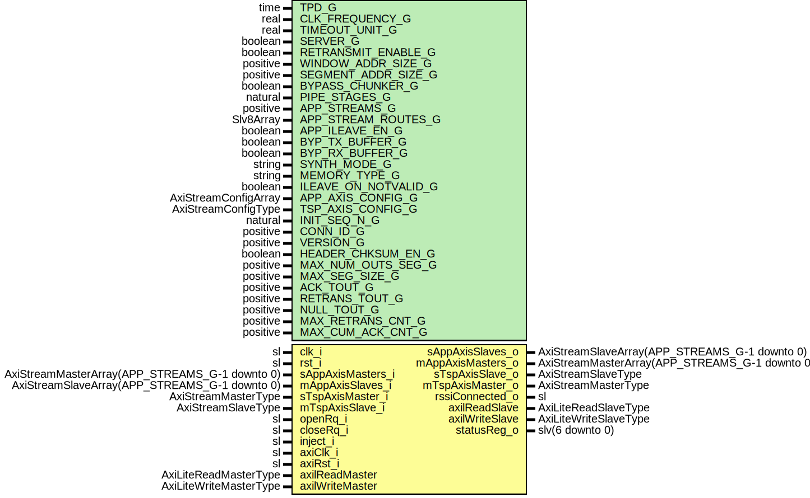

# Entity: RssiCoreWrapper

- **File**: RssiCoreWrapper.vhd
## Diagram

## Description

-----------------------------------------------------------------------------
 Title      : RSSI Protocol: https://confluence.slac.stanford.edu/x/1IyfD
-----------------------------------------------------------------------------
 Company    : SLAC National Accelerator Laboratory
-----------------------------------------------------------------------------
 Description: Wrapper for RSSI + AXIS packetizer
-----------------------------------------------------------------------------
 This file is part of 'SLAC Firmware Standard Library'.
 It is subject to the license terms in the LICENSE.txt file found in the
 top-level directory of this distribution and at:
    https://confluence.slac.stanford.edu/display/ppareg/LICENSE.html.
 No part of 'SLAC Firmware Standard Library', including this file,
 may be copied, modified, propagated, or distributed except according to
 the terms contained in the LICENSE.txt file.
-----------------------------------------------------------------------------
## Generics

| Generic name         | Type                 | Value             | Description                                                                                         |
| -------------------- | -------------------- | ----------------- | --------------------------------------------------------------------------------------------------- |
| TPD_G                | time                 | 1 ns              |                                                                                                     |
| CLK_FREQUENCY_G      | real                 | 156.25E+6         |  In units of Hz                                                                                     |
| TIMEOUT_UNIT_G       | real                 | 1.0E-3            |  In units of seconds                                                                                |
| SERVER_G             | boolean              | true              |  Module is server or client                                                                         |
| RETRANSMIT_ENABLE_G  | boolean              | true              |  Enable/Disable retransmissions in tx module                                                        |
| WINDOW_ADDR_SIZE_G   | positive             | 3                 |  2^WINDOW_ADDR_SIZE_G  = Max number of segments in buffer                                           |
| SEGMENT_ADDR_SIZE_G  | positive             | 7                 |  Unused (legacy generic)                                                                            |
| BYPASS_CHUNKER_G     | boolean              | false             |  Bypass the AXIS chunker layer                                                                      |
| PIPE_STAGES_G        | natural              | 0                 |                                                                                                     |
| APP_STREAMS_G        | positive             | 1                 |                                                                                                     |
| APP_STREAM_ROUTES_G  | Slv8Array            | (0 => "--------") |                                                                                                     |
| APP_ILEAVE_EN_G      | boolean              | false             |                                                                                                     |
| BYP_TX_BUFFER_G      | boolean              | false             |                                                                                                     |
| BYP_RX_BUFFER_G      | boolean              | false             |                                                                                                     |
| SYNTH_MODE_G         | string               | "inferred"        |                                                                                                     |
| MEMORY_TYPE_G        | string               | "block"           |                                                                                                     |
| ILEAVE_ON_NOTVALID_G | boolean              | false             |  Unused (legacy generic)                                                                            |
| APP_AXIS_CONFIG_G    | AxiStreamConfigArray |                   | AXIS Configurations                                                                                 |
| TSP_AXIS_CONFIG_G    | AxiStreamConfigType  |                   |                                                                                                     |
| INIT_SEQ_N_G         | natural              | 16#80#            | Version and connection ID                                                                           |
| CONN_ID_G            | positive             | 16#12345678#      |                                                                                                     |
| VERSION_G            | positive             | 1                 |                                                                                                     |
| HEADER_CHKSUM_EN_G   | boolean              | true              |                                                                                                     |
| MAX_NUM_OUTS_SEG_G   | positive             | 8                 |  Unused (legacy generic)                                                                            |
| MAX_SEG_SIZE_G       | positive             | 1024              |  <= (2**SEGMENT_ADDR_SIZE_G)*8 Number of bytes                                                      |
| ACK_TOUT_G           | positive             | 25                |  unit depends on TIMEOUT_UNIT_G                                                                     |
| RETRANS_TOUT_G       | positive             | 50                |  unit depends on TIMEOUT_UNIT_G  (Recommended >= MAX_NUM_OUTS_SEG_G*Data segment transmission time) |
| NULL_TOUT_G          | positive             | 200               |  unit depends on TIMEOUT_UNIT_G  (Recommended >= 4*RETRANS_TOUT_G)                                  |
| MAX_RETRANS_CNT_G    | positive             | 2                 | Counters                                                                                            |
| MAX_CUM_ACK_CNT_G    | positive             | 3                 |                                                                                                     |
## Ports

| Port name         | Direction | Type                                           | Description                            |
| ----------------- | --------- | ---------------------------------------------- | -------------------------------------- |
| clk_i             | in        | sl                                             | Clock and Reset                        |
| rst_i             | in        | sl                                             |                                        |
| sAppAxisMasters_i | in        | AxiStreamMasterArray(APP_STREAMS_G-1 downto 0) | SSI Application side                   |
| sAppAxisSlaves_o  | out       | AxiStreamSlaveArray(APP_STREAMS_G-1 downto 0)  |                                        |
| mAppAxisMasters_o | out       | AxiStreamMasterArray(APP_STREAMS_G-1 downto 0) |                                        |
| mAppAxisSlaves_i  | in        | AxiStreamSlaveArray(APP_STREAMS_G-1 downto 0)  |                                        |
| sTspAxisMaster_i  | in        | AxiStreamMasterType                            | SSI Transport side                     |
| sTspAxisSlave_o   | out       | AxiStreamSlaveType                             |                                        |
| mTspAxisMaster_o  | out       | AxiStreamMasterType                            |                                        |
| mTspAxisSlave_i   | in        | AxiStreamSlaveType                             |                                        |
| openRq_i          | in        | sl                                             | High level  Application side interface |
| closeRq_i         | in        | sl                                             |                                        |
| inject_i          | in        | sl                                             |                                        |
| rssiConnected_o   | out       | sl                                             |                                        |
| axiClk_i          | in        | sl                                             | AXI-Lite Register Interface            |
| axiRst_i          | in        | sl                                             |                                        |
| axilReadMaster    | in        | AxiLiteReadMasterType                          |                                        |
| axilReadSlave     | out       | AxiLiteReadSlaveType                           |                                        |
| axilWriteMaster   | in        | AxiLiteWriteMasterType                         |                                        |
| axilWriteSlave    | out       | AxiLiteWriteSlaveType                          |                                        |
| statusReg_o       | out       | slv(6 downto 0)                                | Internal statuses                      |
## Signals

| Name                | Type                                           | Description |
| ------------------- | ---------------------------------------------- | ----------- |
| rxMasters           | AxiStreamMasterArray(APP_STREAMS_G-1 downto 0) |             |
| rxSlaves            | AxiStreamSlaveArray(APP_STREAMS_G-1 downto 0)  |             |
| depacketizerMasters | AxiStreamMasterArray(1 downto 0)               |             |
| depacketizerSlaves  | AxiStreamSlaveArray(1 downto 0)                |             |
| packetizerMasters   | AxiStreamMasterArray(1 downto 0)               |             |
| packetizerSlaves    | AxiStreamSlaveArray(1 downto 0)                |             |
| txMasters           | AxiStreamMasterArray(APP_STREAMS_G-1 downto 0) |             |
| txSlaves            | AxiStreamSlaveArray(APP_STREAMS_G-1 downto 0)  |             |
| statusReg           | slv(6 downto 0)                                |             |
| rssiNotConnected    | sl                                             |             |
| rssiConnected       | sl                                             |             |
| maxObSegSize        | slv(15 downto 0)                               |             |
| maxSegs             | slv(MAX_SEGS_BITS_C - 1 downto 0)              |             |
| ileaveRearb         | slv(11 downto 0)                               |             |
## Constants

| Name                     | Type                | Value                                                                                                                                                                                                                                                                                                                                                                                                                                            | Description                                                                                                                                 |
| ------------------------ | ------------------- | ------------------------------------------------------------------------------------------------------------------------------------------------------------------------------------------------------------------------------------------------------------------------------------------------------------------------------------------------------------------------------------------------------------------------------------------------ | ------------------------------------------------------------------------------------------------------------------------------------------- |
| PACKETIZER_AXIS_CONFIG_C | AxiStreamConfigType |  (       TSTRB_EN_C    => false,        TDATA_BYTES_C => 8,        TDEST_BITS_C  => 8,        TID_BITS_C    => 8,        TKEEP_MODE_C  => TKEEP_COMP_C,        TUSER_BITS_C  => 8,        TUSER_MODE_C  => TUSER_FIRST_LAST_C) |  This should really go in a AxiStreamPacketizerPkg                                                                                          |
| CONV_AXIS_CONFIG_C       | AxiStreamConfigType |  ite(BYPASS_CHUNKER_G,  RSSI_AXIS_CONFIG_C,  PACKETIZER_AXIS_CONFIG_C)                                                                                                                                                                                                                                                                                                     |  If bypassing chunker, convert directly to RSSI AXIS config  else use Packetizer AXIS format. Packetizer will then convert to RSSI config.  |
| MAX_SEGS_BITS_C          | positive            |  bitSize(MAX_SEG_SIZE_G)                                                                                                                                                                                                                                                                                                                                                                                                                         |                                                                                                                                             |
## Processes
- unnamed: ( clk_i )
**Description**
 Register to help with timing 
## Instantiations

- U_AxiStreamMux: surf.AxiStreamMux
- U_RssiCore: surf.RssiCore
- U_AxiStreamDeMux: surf.AxiStreamDeMux
