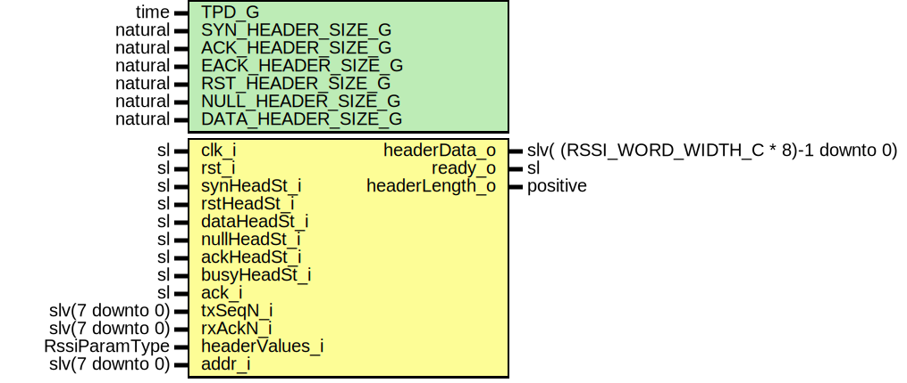

# Entity: RssiHeaderReg

## Diagram

## Description

Title      : RSSI Protocol: https://confluence.slac.stanford.edu/x/1IyfD
Company    : SLAC National Accelerator Laboratory
Description: Combines and decodes the header values from input parameters headerValues_i
             Header is selected by xxxHeadSt_i and addressed by addr_i
             Outputs the addressed headerData_o and headerLength_o values with 1 Clock Cycle delay
             Outputs (oth=>'0')If no header is addressed
This file is part of 'SLAC Firmware Standard Library'.
It is subject to the license terms in the LICENSE.txt file found in the
top-level directory of this distribution and at:
   https://confluence.slac.stanford.edu/display/ppareg/LICENSE.html.
No part of 'SLAC Firmware Standard Library', including this file,
may be copied, modified, propagated, or distributed except according to
the terms contained in the LICENSE.txt file.
## Generics

| Generic name       | Type    | Value | Description |
| ------------------ | ------- | ----- | ----------- |
| TPD_G              | time    | 1 ns  |             |
| SYN_HEADER_SIZE_G  | natural | 24    |             |
| ACK_HEADER_SIZE_G  | natural | 8     |             |
| EACK_HEADER_SIZE_G | natural | 8     |             |
| RST_HEADER_SIZE_G  | natural | 8     |             |
| NULL_HEADER_SIZE_G | natural | 8     |             |
| DATA_HEADER_SIZE_G | natural | 8     |             |
## Ports

| Port name      | Direction | Type                                     | Description                                                       |
| -------------- | --------- | ---------------------------------------- | ----------------------------------------------------------------- |
| clk_i          | in        | sl                                       |                                                                   |
| rst_i          | in        | sl                                       |                                                                   |
| synHeadSt_i    | in        | sl                                       | Header control inputs (must hold values while reading header)     |
| rstHeadSt_i    | in        | sl                                       |                                                                   |
| dataHeadSt_i   | in        | sl                                       |                                                                   |
| nullHeadSt_i   | in        | sl                                       |                                                                   |
| ackHeadSt_i    | in        | sl                                       |                                                                   |
| busyHeadSt_i   | in        | sl                                       |                                                                   |
| ack_i          | in        | sl                                       | Ack sequence number valid                                         |
| txSeqN_i       | in        | slv(7 downto 0)                          | Sequence number of the current packet                             |
| rxAckN_i       | in        | slv(7 downto 0)                          | Acknowledgment number of the recived packet handelled by receiver |
| headerValues_i | in        | RssiParamType                            | Negotiated or from GENERICS                                       |
| addr_i         | in        | slv(7 downto 0)                          | Out of order sequence numbers from received EACK packet           |
| headerData_o   | out       | slv( (RSSI_WORD_WIDTH_C * 8)-1 downto 0) |                                                                   |
| ready_o        | out       | sl                                       |                                                                   |
| headerLength_o | out       | positive                                 |                                                                   |
## Signals

| Name    | Type    | Description |
| ------- | ------- | ----------- |
| r       | RegType |             |
| rin     | RegType |             |
| addrInt | integer |             |
## Constants

| Name       | Type    | Value                                                                                                                                                                                                                                                                                                                                                                                 | Description |
| ---------- | ------- | ------------------------------------------------------------------------------------------------------------------------------------------------------------------------------------------------------------------------------------------------------------------------------------------------------------------------------------------------------------------------------------- | ----------- |
| REG_INIT_C | RegType |  (       headerData  => (others =>'0'),        rdy         => '0',         ack        => '0',        busy        => '0',        txSeqN     => (others =>'0'),        rxAckN     => (others =>'0')    ) |             |
## Types

| Name    | Type | Description |
| ------- | ---- | ----------- |
| RegType |      |             |
## Processes
- comb: ( r, rst_i, headerValues_i, addrInt, txSeqN_i, rxAckN_i, busyHeadSt_i,
                   synHeadSt_i, rstHeadSt_i, dataHeadSt_i, nullHeadSt_i, ackHeadSt_i, ack_i )
- seq: ( clk_i )
