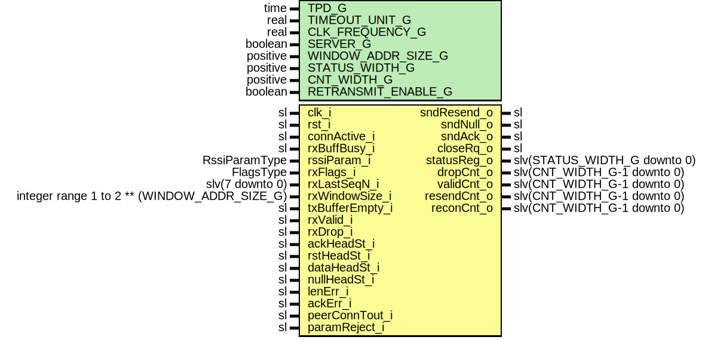

# Entity: RssiMonitor

## Diagram

## Description

Title      : RSSI Protocol: https://confluence.slac.stanford.edu/x/1IyfD
Company    : SLAC National Accelerator Laboratory
Description:
 Handles RSSI counters, timeouts, and statuses:
 - Re-transmission timeout and request,
 - NULL segment transmission (Client),
 - NULL timeout detection (Server),
 - Acknowledgment timeout and request,
 - Valid segment counter,
 - Dropped segment counter.
 Status register:
   statusReg_o(0) : Connection Active
   statusReg_o(1) : Maximum retransmissions exceeded r.retransMax and
   statusReg_o(2) : Null timeout reached (server) r.nullTout;
   statusReg_o(3) : Error in acknowledgment mechanism
   statusReg_o(4) : SSI Frame length too long
   statusReg_o(5) : Connection to peer timed out
   statusReg_o(6) : Client rejected the connection (parameters out of range)
                    Server proposed new parameters (parameters out of range)
This file is part of 'SLAC Firmware Standard Library'.
It is subject to the license terms in the LICENSE.txt file found in the
top-level directory of this distribution and at:
   https://confluence.slac.stanford.edu/display/ppareg/LICENSE.html.
No part of 'SLAC Firmware Standard Library', including this file,
may be copied, modified, propagated, or distributed except according to
the terms contained in the LICENSE.txt file.
## Generics

| Generic name        | Type     | Value   | Description |
| ------------------- | -------- | ------- | ----------- |
| TPD_G               | time     | 1 ns    |             |
| TIMEOUT_UNIT_G      | real     | 1.0E-6  | us          |
| CLK_FREQUENCY_G     | real     | 100.0E6 |             |
| SERVER_G            | boolean  | true    |             |
| WINDOW_ADDR_SIZE_G  | positive | 7       |             |
| STATUS_WIDTH_G      | positive | 6       |             |
| CNT_WIDTH_G         | positive | 32      |             |
| RETRANSMIT_ENABLE_G | boolean  | true    |             |
## Ports

| Port name       | Direction | Type                                         | Description                                 |
| --------------- | --------- | -------------------------------------------- | ------------------------------------------- |
| clk_i           | in        | sl                                           |                                             |
| rst_i           | in        | sl                                           |                                             |
| connActive_i    | in        | sl                                           | Connection FSM indicating active connection |
| rxBuffBusy_i    | in        | sl                                           | RX Buffer Full                              |
| rssiParam_i     | in        | RssiParamType                                | Timeout and counter values                  |
| rxFlags_i       | in        | FlagsType                                    | Flags from Rx module                        |
| rxLastSeqN_i    | in        | slv(7 downto 0)                              |                                             |
| rxWindowSize_i  | in        | integer range 1 to 2 ** (WINDOW_ADDR_SIZE_G) |                                             |
| txBufferEmpty_i | in        | sl                                           | Do not request resend if tx buffer empty    |
| rxValid_i       | in        | sl                                           | Valid received packet                       |
| rxDrop_i        | in        | sl                                           |                                             |
| ackHeadSt_i     | in        | sl                                           |                                             |
| rstHeadSt_i     | in        | sl                                           |                                             |
| dataHeadSt_i    | in        | sl                                           |                                             |
| nullHeadSt_i    | in        | sl                                           |                                             |
| lenErr_i        | in        | sl                                           | Internal Errors and Timeouts                |
| ackErr_i        | in        | sl                                           |                                             |
| peerConnTout_i  | in        | sl                                           |                                             |
| paramReject_i   | in        | sl                                           |                                             |
| sndResend_o     | out       | sl                                           | Packet transmission requests                |
| sndNull_o       | out       | sl                                           |                                             |
| sndAck_o        | out       | sl                                           |                                             |
| closeRq_o       | out       | sl                                           | Connection close request                    |
| statusReg_o     | out       | slv(STATUS_WIDTH_G  downto 0)                | Internal statuses                           |
| dropCnt_o       | out       | slv(CNT_WIDTH_G-1  downto 0)                 |                                             |
| validCnt_o      | out       | slv(CNT_WIDTH_G-1  downto 0)                 |                                             |
| resendCnt_o     | out       | slv(CNT_WIDTH_G-1  downto 0)                 |                                             |
| reconCnt_o      | out       | slv(CNT_WIDTH_G-1  downto 0)                 |                                             |
## Signals

| Name     | Type                             | Description |
| -------- | -------------------------------- | ----------- |
| r        | RegType                          |             |
| rin      | RegType                          |             |
| s_status | slv(STATUS_WIDTH_G - 1 downto 0) |             |
## Constants

| Name                    | Type                                                                      | Value                                                                                                                                                                                                                                                                                                                                                                                                                                                                                                                                                                                                                                                                                                                                                                                                                                                                                                                                                                                                                                                                                                                                                                                                                                                                                                                                                                                                                                      | Description |
| ----------------------- | ------------------------------------------------------------------------- | ------------------------------------------------------------------------------------------------------------------------------------------------------------------------------------------------------------------------------------------------------------------------------------------------------------------------------------------------------------------------------------------------------------------------------------------------------------------------------------------------------------------------------------------------------------------------------------------------------------------------------------------------------------------------------------------------------------------------------------------------------------------------------------------------------------------------------------------------------------------------------------------------------------------------------------------------------------------------------------------------------------------------------------------------------------------------------------------------------------------------------------------------------------------------------------------------------------------------------------------------------------------------------------------------------------------------------------------------------------------------------------------------------------------------------------------ | ----------- |
| SAMPLES_PER_TIME_C      | integer                                                                   |  integer(TIMEOUT_UNIT_G * CLK_FREQUENCY_G)                                                                                                                                                                                                                                                                                                                                                                                                                                                                                                                                                                                                                                                                                                                                                                                                                                                                                                                                                                                                                                                                                                                                                                                                                                                                                                                                                                                                 |             |
| SAMPLES_PER_TIME_DIV3_C | integer                                                                   |  integer(TIMEOUT_UNIT_G * CLK_FREQUENCY_G)/3                                                                                                                                                                                                                                                                                                                                                                                                                                                                                                                                                                                                                                                                                                                                                                                                                                                                                                                                                                                                                                                                                                                                                                                                                                                                                                                                                                                               |             |
| MAX_TOUT_CNT_C          | slv(rssiParam_i.retransTout'left + bitSize(SAMPLES_PER_TIME_C) downto 0)  |  (others=>'1')                                                                                                                                                                                                                                                                                                                                                                                                                                                                                                                                                                                                                                                                                                                                                                                                                                                                                                                                                                                                                                                                                                                                                                                                                                                                                                                                                                                                                             |             |
| MAX_RETRANS_CNT_C       | slv(rssiParam_i.maxRetrans'left + bitSize(SAMPLES_PER_TIME_C) downto 0)   |  (others=>'1')                                                                                                                                                                                                                                                                                                                                                                                                                                                                                                                                                                                                                                                                                                                                                                                                                                                                                                                                                                                                                                                                                                                                                                                                                                                                                                                                                                                                                             |             |
| MAX_NULL_CNT_C          | slv(rssiParam_i.nullSegTout'left + bitSize(SAMPLES_PER_TIME_C) downto 0)  |  (others=>'1')                                                                                                                                                                                                                                                                                                                                                                                                                                                                                                                                                                                                                                                                                                                                                                                                                                                                                                                                                                                                                                                                                                                                                                                                                                                                                                                                                                                                                             |             |
| MAX_ACK_TOUT_CNT_C      | slv(rssiParam_i.cumulAckTout'left + bitSize(SAMPLES_PER_TIME_C) downto 0) |  (others=>'1')                                                                                                                                                                                                                                                                                                                                                                                                                                                                                                                                                                                                                                                                                                                                                                                                                                                                                                                                                                                                                                                                                                                                                                                                                                                                                                                                                                                                                             |             |
| REG_INIT_C              | RegType                                                                   |  (       -- Retransmission       retransToutCnt    => (others=>'0'),        sndResend         => '0',        sndResendD1       => '0',        retransCnt        => (others=>'0'),        retransMax        => '0',         -- Null packet send/timeout       nullToutCnt => (others=>'0'),        sndnull     => '0',        nullTout    => '0',        rxBuffBusy  => '0',         -- Ack packet cumulative/timeout       ackToutCnt  => (others=>'0'),        lastAckSeqN => (others=>'0'),        sndAck      => '0',         -- For detecting rising edge on connActive       connActiveD1  => '0',         -- Statuses       status      => (others=>'0'),        validCnt    => (others=>'0'),        dropCnt     => (others=>'0'),        reconCnt    => (others=>'0'),        resendCnt   => (others=>'0')    ) |             |
## Types

| Name    | Type | Description |
| ------- | ---- | ----------- |
| RegType |      |             |
## Processes
- comb: ( r, rst_i, rxFlags_i, rssiParam_i, rxValid_i, rxDrop_i, dataHeadSt_i, rstHeadSt_i, nullHeadSt_i, ackHeadSt_i, rxBuffBusy_i,
                   connActive_i, rxLastSeqN_i, rxWindowSize_i, txBufferEmpty_i, s_status )
- seq: ( clk_i )
