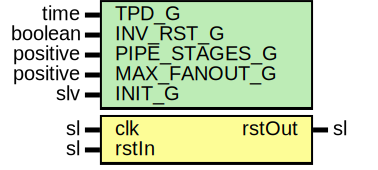

# Entity: RstPipeline

- **File**: RstPipeline.vhd
## Diagram

## Description

Company    : SLAC National Accelerator Laboratory
Description:   Reset pipeline register stages
This file is part of 'SLAC Firmware Standard Library'.
It is subject to the license terms in the LICENSE.txt file found in the
top-level directory of this distribution and at:
   https://confluence.slac.stanford.edu/display/ppareg/LICENSE.html.
No part of 'SLAC Firmware Standard Library', including this file,
may be copied, modified, propagated, or distributed except according to
the terms contained in the LICENSE.txt file.
## Generics

| Generic name  | Type     | Value | Description |
| ------------- | -------- | ----- | ----------- |
| TPD_G         | time     | 1 ns  |             |
| INV_RST_G     | boolean  | false |             |
| PIPE_STAGES_G | positive | 3     |             |
| MAX_FANOUT_G  | positive | 16384 |             |
| INIT_G        | slv      | "1"   |             |
## Ports

| Port name | Direction | Type | Description |
| --------- | --------- | ---- | ----------- |
| clk       | in        | sl   |             |
| rstIn     | in        | sl   |             |
| rstOut    | out       | sl   |             |
## Signals

| Name | Type    | Description |
| ---- | ------- | ----------- |
| r    | RegType |             |
| rin  | RegType |             |
## Constants

| Name       | Type                          | Value                                                                                                                     | Description |
| ---------- | ----------------------------- | ------------------------------------------------------------------------------------------------------------------------- | ----------- |
| INIT_C     | slv(PIPE_STAGES_G-1 downto 0) |  ite(INIT_G = "1",  slvOne(PIPE_STAGES_G),  INIT_G) |             |
| REG_INIT_C | RegType                       |  (       shift => INIT_C)                                                                                                 |             |
## Types

| Name    | Type | Description |
| ------- | ---- | ----------- |
| RegType |      |             |
## Processes
- comb: ( r, rstIn )
- seq: ( clk )
