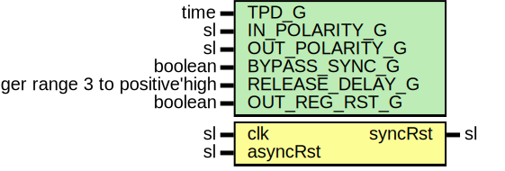

# Entity: RstSync

- **File**: RstSync.vhd
## Diagram

## Description

-----------------------------------------------------------------------------
 Company    : SLAC National Accelerator Laboratory
-----------------------------------------------------------------------------
 Description: Synchronizes the trailing edge of an asynchronous reset to a
              given clock.
-----------------------------------------------------------------------------
 This file is part of 'SLAC Firmware Standard Library'.
 It is subject to the license terms in the LICENSE.txt file found in the
 top-level directory of this distribution and at:
    https://confluence.slac.stanford.edu/display/ppareg/LICENSE.html.
 No part of 'SLAC Firmware Standard Library', including this file,
 may be copied, modified, propagated, or distributed except according to
 the terms contained in the LICENSE.txt file.
-----------------------------------------------------------------------------
## Generics

| Generic name    | Type                             | Value | Description                                                    |
| --------------- | -------------------------------- | ----- | -------------------------------------------------------------- |
| TPD_G           | time                             | 1 ns  |  Simulation FF output delay                                    |
| IN_POLARITY_G   | sl                               | '1'   |  0 for active low rst, 1 for high                              |
| OUT_POLARITY_G  | sl                               | '1'   |                                                                |
| BYPASS_SYNC_G   | boolean                          | false |  Bypass Synchronizer module for synchronous data configuration |
| RELEASE_DELAY_G | integer range 3 to positive'high | 3     |  Delay between deassertion of async and sync resets            |
| OUT_REG_RST_G   | boolean                          | true  |                                                                |
## Ports

| Port name | Direction | Type | Description |
| --------- | --------- | ---- | ----------- |
| clk       | in        | sl   |             |
| asyncRst  | in        | sl   |             |
| syncRst   | out       | sl   |             |
## Signals

| Name    | Type | Description |
| ------- | ---- | ----------- |
| syncInt | sl   |             |
## Processes
- OUT_REG: ( clk, asyncRst )
 **Description**
 Final stage does not have async constraints applied, can be duplicated to ease timing 
## Instantiations

- Synchronizer_1: surf.Synchronizer
