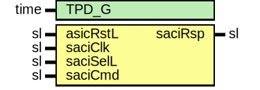

# Entity: SaciSlaveWrapper

## Diagram

## Description

Title      : SACI Protocol: https://confluence.slac.stanford.edu/x/YYcRDQ
Company    : SLAC National Accelerator Laboratory
Description: Simulation testbed for SaciSlaveWrapper
This file is part of 'SLAC Firmware Standard Library'.
It is subject to the license terms in the LICENSE.txt file found in the
top-level directory of this distribution and at:
   https://confluence.slac.stanford.edu/display/ppareg/LICENSE.html.
No part of 'SLAC Firmware Standard Library', including this file,
may be copied, modified, propagated, or distributed except according to
the terms contained in the LICENSE.txt file.
## Generics

| Generic name | Type | Value | Description |
| ------------ | ---- | ----- | ----------- |
| TPD_G        | time | 1 ns  |             |
## Ports

| Port name | Direction | Type | Description |
| --------- | --------- | ---- | ----------- |
| asicRstL  | in        | sl   |             |
| saciClk   | in        | sl   |             |
| saciSelL  | in        | sl   | chipSelect  |
| saciCmd   | in        | sl   |             |
| saciRsp   | out       | sl   |             |
## Signals

| Name          | Type             | Description |
| ------------- | ---------------- | ----------- |
| saciSlaveRstL | sl               |             |
| exec          | sl               |             |
| ack           | sl               |             |
| readL         | sl               |             |
| cmd           | slv(6 downto 0)  |             |
| addr          | slv(11 downto 0) |             |
| wrData        | slv(31 downto 0) |             |
| rdData        | slv(31 downto 0) |             |
| saciRspInt    | sl               |             |
## Instantiations

- SaciSlave_i: surf.SaciSlave
- SaciSlaveRam_1: surf.SaciSlaveRam
