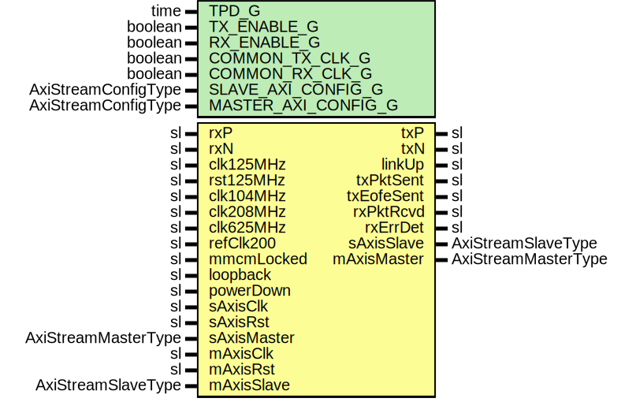

# Entity: Salt7Series

## Diagram

## Description

Company    : SLAC National Accelerator Laboratory
Description: SLAC Asynchronous Logic Transceiver (SALT) 7-series Core
This file is part of 'SLAC Firmware Standard Library'.
It is subject to the license terms in the LICENSE.txt file found in the
top-level directory of this distribution and at:
   https://confluence.slac.stanford.edu/display/ppareg/LICENSE.html.
No part of 'SLAC Firmware Standard Library', including this file,
may be copied, modified, propagated, or distributed except according to
the terms contained in the LICENSE.txt file.
## Generics

| Generic name        | Type                | Value | Description                                        |
| ------------------- | ------------------- | ----- | -------------------------------------------------- |
| TPD_G               | time                | 1 ns  |                                                    |
| TX_ENABLE_G         | boolean             | true  |                                                    |
| RX_ENABLE_G         | boolean             | true  |                                                    |
| COMMON_TX_CLK_G     | boolean             | false | Set to true if sAxisClk and clk are the same clock |
| COMMON_RX_CLK_G     | boolean             | false | Set to true if mAxisClk and clk are the same clock |
| SLAVE_AXI_CONFIG_G  | AxiStreamConfigType |       |                                                    |
| MASTER_AXI_CONFIG_G | AxiStreamConfigType |       |                                                    |
## Ports

| Port name   | Direction | Type                | Description       |
| ----------- | --------- | ------------------- | ----------------- |
| txP         | out       | sl                  | TX Serial Stream  |
| txN         | out       | sl                  |                   |
| rxP         | in        | sl                  | RX Serial Stream  |
| rxN         | in        | sl                  |                   |
| clk125MHz   | in        | sl                  | Reference Signals |
| rst125MHz   | in        | sl                  |                   |
| clk104MHz   | in        | sl                  |                   |
| clk208MHz   | in        | sl                  |                   |
| clk625MHz   | in        | sl                  |                   |
| refClk200   | in        | sl                  |                   |
| mmcmLocked  | in        | sl                  |                   |
| loopback    | in        | sl                  |                   |
| powerDown   | in        | sl                  |                   |
| linkUp      | out       | sl                  |                   |
| txPktSent   | out       | sl                  |                   |
| txEofeSent  | out       | sl                  |                   |
| rxPktRcvd   | out       | sl                  |                   |
| rxErrDet    | out       | sl                  |                   |
| sAxisClk    | in        | sl                  | Slave Port        |
| sAxisRst    | in        | sl                  |                   |
| sAxisMaster | in        | AxiStreamMasterType |                   |
| sAxisSlave  | out       | AxiStreamSlaveType  |                   |
| mAxisClk    | in        | sl                  | Master Port       |
| mAxisRst    | in        | sl                  |                   |
| mAxisMaster | out       | AxiStreamMasterType |                   |
| mAxisSlave  | in        | AxiStreamSlaveType  |                   |
## Signals

| Name   | Type             | Description |
| ------ | ---------------- | ----------- |
| config | slv(4 downto 0)  |             |
| status | slv(15 downto 0) |             |
| txEn   | sl               |             |
| txData | slv(7 downto 0)  |             |
| rxEn   | sl               |             |
| rxErr  | sl               |             |
| rxData | slv(7 downto 0)  |             |
## Instantiations

- U_Salt7SeriesCore: Salt7SeriesCore
**Description**
Auto-Negotiation Disabled

