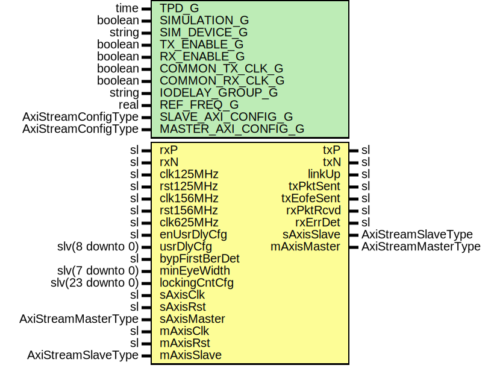

# Entity: SaltCore

- **File**: SaltCore.vhd
## Diagram

## Description

-----------------------------------------------------------------------------
 Company    : SLAC National Accelerator Laboratory
-----------------------------------------------------------------------------
 Description: SLAC Asynchronous Logic Transceiver (SALT) Core
-----------------------------------------------------------------------------
 This file is part of 'SLAC Firmware Standard Library'.
 It is subject to the license terms in the LICENSE.txt file found in the
 top-level directory of this distribution and at:
    https://confluence.slac.stanford.edu/display/ppareg/LICENSE.html.
 No part of 'SLAC Firmware Standard Library', including this file,
 may be copied, modified, propagated, or distributed except according to
 the terms contained in the LICENSE.txt file.
-----------------------------------------------------------------------------
## Generics

| Generic name        | Type                | Value        | Description                                         |
| ------------------- | ------------------- | ------------ | --------------------------------------------------- |
| TPD_G               | time                | 1 ns         |                                                     |
| SIMULATION_G        | boolean             | false        |                                                     |
| SIM_DEVICE_G        | string              | "ULTRASCALE" |                                                     |
| TX_ENABLE_G         | boolean             | true         |                                                     |
| RX_ENABLE_G         | boolean             | true         |                                                     |
| COMMON_TX_CLK_G     | boolean             | false        |  Set to true if sAxisClk and clk are the same clock |
| COMMON_RX_CLK_G     | boolean             | false        |  Set to true if mAxisClk and clk are the same clock |
| IODELAY_GROUP_G     | string              | "SALT_GROUP" |                                                     |
| REF_FREQ_G          | real                | 200.0        |  IDELAYCTRL's REFCLK (in units of Hz)               |
| SLAVE_AXI_CONFIG_G  | AxiStreamConfigType |              |                                                     |
| MASTER_AXI_CONFIG_G | AxiStreamConfigType |              |                                                     |
## Ports

| Port name      | Direction | Type                | Description                                                                                                                  |
| -------------- | --------- | ------------------- | ---------------------------------------------------------------------------------------------------------------------------- |
| txP            | out       | sl                  | 1.25 Gbps LVDS TX                                                                                                            |
| txN            | out       | sl                  |                                                                                                                              |
| rxP            | in        | sl                  | 1.25 Gbps LVDS RX                                                                                                            |
| rxN            | in        | sl                  |                                                                                                                              |
| clk125MHz      | in        | sl                  | Reference Signals                                                                                                            |
| rst125MHz      | in        | sl                  |                                                                                                                              |
| clk156MHz      | in        | sl                  |                                                                                                                              |
| rst156MHz      | in        | sl                  |                                                                                                                              |
| clk625MHz      | in        | sl                  |                                                                                                                              |
| linkUp         | out       | sl                  | Status Interface                                                                                                             |
| txPktSent      | out       | sl                  |                                                                                                                              |
| txEofeSent     | out       | sl                  |                                                                                                                              |
| rxPktRcvd      | out       | sl                  |                                                                                                                              |
| rxErrDet       | out       | sl                  |                                                                                                                              |
| enUsrDlyCfg    | in        | sl                  |  Enable User delay config                                                                                                    |
| usrDlyCfg      | in        | slv(8 downto 0)     |  User delay config                                                                                                           |
| bypFirstBerDet | in        | sl                  |  Set to '1' if IDELAY full scale range > 2 Unit Intervals (UI) of serial rate (example: IDELAY range 2.5ns  > 1 ns "1Gb/s" ) |
| minEyeWidth    | in        | slv(7 downto 0)     |  Sets the minimum eye width required for locking (units of IDELAY step)                                                      |
| lockingCntCfg  | in        | slv(23 downto 0)    |  Number of error-free event before state=LOCKED_S                                                                            |
| sAxisClk       | in        | sl                  | Slave Port                                                                                                                   |
| sAxisRst       | in        | sl                  |                                                                                                                              |
| sAxisMaster    | in        | AxiStreamMasterType |                                                                                                                              |
| sAxisSlave     | out       | AxiStreamSlaveType  |                                                                                                                              |
| mAxisClk       | in        | sl                  | Master Port                                                                                                                  |
| mAxisRst       | in        | sl                  |                                                                                                                              |
| mAxisMaster    | out       | AxiStreamMasterType |                                                                                                                              |
| mAxisSlave     | in        | AxiStreamSlaveType  |                                                                                                                              |
## Signals

| Name     | Type            | Description |
| -------- | --------------- | ----------- |
| txEn     | sl              |             |
| txData   | slv(7 downto 0) |             |
| rxEn     | sl              |             |
| rxErr    | sl              |             |
| rxData   | slv(7 downto 0) |             |
| rxLinkUp | sl              |             |
