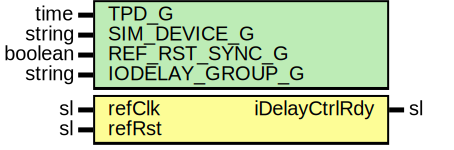

# Entity: SaltDelayCtrl

## Diagram

## Description

Company    : SLAC National Accelerator Laboratory
Description: Wrapper for IDELAYCTRL
This file is part of 'SLAC Firmware Standard Library'.
It is subject to the license terms in the LICENSE.txt file found in the
top-level directory of this distribution and at:
   https://confluence.slac.stanford.edu/display/ppareg/LICENSE.html.
No part of 'SLAC Firmware Standard Library', including this file,
may be copied, modified, propagated, or distributed except according to
the terms contained in the LICENSE.txt file.
## Generics

| Generic name    | Type    | Value              | Description                      |
| --------------- | ------- | ------------------ | -------------------------------- |
| TPD_G           | time    | 1 ns               |                                  |
| SIM_DEVICE_G    | string  | "7SERIES"          | Either "7SERIES" or "ULTRASCALE" |
| REF_RST_SYNC_G  | boolean | true               | Synchronize refRst to refClk.    |
| IODELAY_GROUP_G | string  | "SALT_IODELAY_GRP" |                                  |
## Ports

| Port name     | Direction | Type | Description |
| ------------- | --------- | ---- | ----------- |
| iDelayCtrlRdy | out       | sl   |             |
| refClk        | in        | sl   |             |
| refRst        | in        | sl   |             |
## Signals

| Name    | Type | Description |
| ------- | ---- | ----------- |
| syncRst | sl   |             |
## Instantiations

- RstSync_Inst: surf.RstSync
- SALT_IDELAY_CTRL_Inst: IDELAYCTRL
