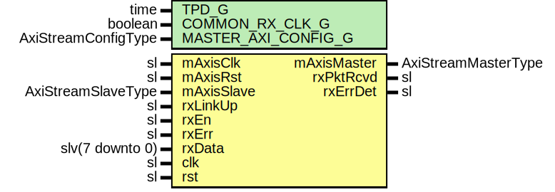

# Entity: SaltRx

## Diagram

## Description

Company    : SLAC National Accelerator Laboratory
Description: SALT RX Engine Module
This file is part of 'SLAC Firmware Standard Library'.
It is subject to the license terms in the LICENSE.txt file found in the
top-level directory of this distribution and at:
   https://confluence.slac.stanford.edu/display/ppareg/LICENSE.html.
No part of 'SLAC Firmware Standard Library', including this file,
may be copied, modified, propagated, or distributed except according to
the terms contained in the LICENSE.txt file.
## Generics

| Generic name        | Type                | Value | Description                                        |
| ------------------- | ------------------- | ----- | -------------------------------------------------- |
| TPD_G               | time                | 1 ns  |                                                    |
| COMMON_RX_CLK_G     | boolean             | false | Set to true if mAxisClk and clk are the same clock |
| MASTER_AXI_CONFIG_G | AxiStreamConfigType |       |                                                    |
## Ports

| Port name   | Direction | Type                | Description    |
| ----------- | --------- | ------------------- | -------------- |
| mAxisClk    | in        | sl                  | Master Port    |
| mAxisRst    | in        | sl                  |                |
| mAxisMaster | out       | AxiStreamMasterType |                |
| mAxisSlave  | in        | AxiStreamSlaveType  |                |
| rxLinkUp    | in        | sl                  | GMII Interface |
| rxPktRcvd   | out       | sl                  |                |
| rxErrDet    | out       | sl                  |                |
| rxEn        | in        | sl                  |                |
| rxErr       | in        | sl                  |                |
| rxData      | in        | slv(7 downto 0)     |                |
| clk         | in        | sl                  |                |
| rst         | in        | sl                  |                |
## Signals

| Name     | Type                | Description |
| -------- | ------------------- | ----------- |
| r        | RegType             |             |
| rin      | RegType             |             |
| txMaster | AxiStreamMasterType |             |
| txSlave  | AxiStreamSlaveType  |             |
## Constants

| Name       | Type    | Value                                                                                                                                                                                                                                                                                                                                                                                                                                                                                                                                                                                                                                                                                                                                                                                                                                                                                                                                                                                                                                                                                                              | Description |
| ---------- | ------- | ------------------------------------------------------------------------------------------------------------------------------------------------------------------------------------------------------------------------------------------------------------------------------------------------------------------------------------------------------------------------------------------------------------------------------------------------------------------------------------------------------------------------------------------------------------------------------------------------------------------------------------------------------------------------------------------------------------------------------------------------------------------------------------------------------------------------------------------------------------------------------------------------------------------------------------------------------------------------------------------------------------------------------------------------------------------------------------------------------------------ | ----------- |
| REG_INIT_C | RegType |  (       rxPktRcvd => '0',        rxErrDet  => '0',        sof       => '1',        eofe      => '0',        align     => '0',        seqCnt    => (others => '0'),        tDest     => (others => '0'),        tKeep     => (others => '0'),        size      => (others => '0'),        cnt       => (others => '0'),        checksum  => (others => '0'),        alignCnt  => 0,        dly       => (others => AXI_STREAM_MASTER_INIT_C),        txMaster  => AXI_STREAM_MASTER_INIT_C,        rxMaster  => AXI_STREAM_MASTER_INIT_C,        state     => IDLE_S) |             |
## Types

| Name      | Type                                                                                                                                                                                             | Description |
| --------- | ------------------------------------------------------------------------------------------------------------------------------------------------------------------------------------------------ | ----------- |
| StateType | ( IDLE_S,  LENGTH_S,  MOVE_S,  CHECKSUM_S,  DONE_S)  |             |
| RegType   |                                                                                                                                                                                                  |             |
## Processes
- comb: ( r, rst, rxData, rxEn, rxErr, rxLinkUp, txSlave )
- seq: ( clk )
## Instantiations

- FIFO_TX: surf.SsiFifo
