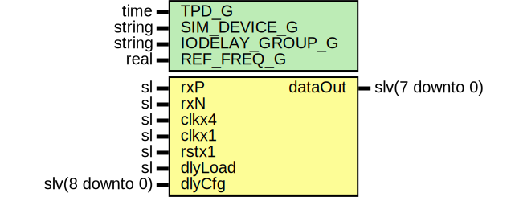

# Entity: SaltRxDeser

- **File**: SaltRxDeser.vhd
## Diagram

## Description

Company    : SLAC National Accelerator Laboratory
Description: Wrapper for SelectioDeser
This file is part of 'SLAC Firmware Standard Library'.
It is subject to the license terms in the LICENSE.txt file found in the
top-level directory of this distribution and at:
   https://confluence.slac.stanford.edu/display/ppareg/LICENSE.html.
No part of 'SLAC Firmware Standard Library', including this file,
may be copied, modified, propagated, or distributed except according to
the terms contained in the LICENSE.txt file.
## Generics

| Generic name    | Type   | Value        | Description |
| --------------- | ------ | ------------ | ----------- |
| TPD_G           | time   | 1 ns         |             |
| IODELAY_GROUP_G | string | "SALT_GROUP" |             |
| REF_FREQ_G      | real   | 200.0        |             |
## Ports

| Port name | Direction | Type            | Description               |
| --------- | --------- | --------------- | ------------------------- |
| rxP       | in        | sl              | SELECTIO Ports            |
| rxN       | in        | sl              |                           |
| clkx4     | in        | sl              | Clock and Reset Interface |
| clkx1     | in        | sl              |                           |
| rstx1     | in        | sl              |                           |
| dlyLoad   | in        | sl              | Delay Configuration       |
| dlyCfg    | in        | slv(8 downto 0) |                           |
| dataOut   | out       | slv(7 downto 0) | Output                    |
## Instantiations

- U_Deser: surf.SelectioDeserLaneUltraScale
