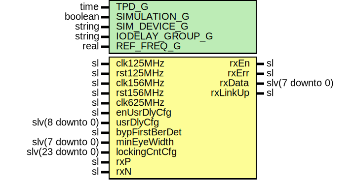

# Entity: SaltRxLvds

- **File**: SaltRxLvds.vhd
## Diagram

## Description

Company    : SLAC National Accelerator Laboratory
Description: SALT TX Engine Module
This file is part of 'SLAC Firmware Standard Library'.
It is subject to the license terms in the LICENSE.txt file found in the
top-level directory of this distribution and at:
   https://confluence.slac.stanford.edu/display/ppareg/LICENSE.html.
No part of 'SLAC Firmware Standard Library', including this file,
may be copied, modified, propagated, or distributed except according to
the terms contained in the LICENSE.txt file.
## Generics

| Generic name    | Type    | Value        | Description |
| --------------- | ------- | ------------ | ----------- |
| TPD_G           | time    | 1 ns         |             |
| SIMULATION_G    | boolean | false        |             |
| IODELAY_GROUP_G | string  | "SALT_GROUP" |             |
| REF_FREQ_G      | real    | 200.0        |             |
## Ports

| Port name      | Direction | Type             | Description                                                                                                                 |
| -------------- | --------- | ---------------- | --------------------------------------------------------------------------------------------------------------------------- |
| clk125MHz      | in        | sl               | Clocks and Resets                                                                                                           |
| rst125MHz      | in        | sl               |                                                                                                                             |
| clk156MHz      | in        | sl               |                                                                                                                             |
| rst156MHz      | in        | sl               |                                                                                                                             |
| clk625MHz      | in        | sl               |                                                                                                                             |
| rxEn           | out       | sl               | GMII Interface                                                                                                              |
| rxErr          | out       | sl               |                                                                                                                             |
| rxData         | out       | slv(7 downto 0)  |                                                                                                                             |
| rxLinkUp       | out       | sl               |                                                                                                                             |
| enUsrDlyCfg    | in        | sl               | Enable User delay config                                                                                                    |
| usrDlyCfg      | in        | slv(8 downto 0)  | User delay config                                                                                                           |
| bypFirstBerDet | in        | sl               | Set to '1' if IDELAY full scale range > 2 Unit Intervals (UI) of serial rate (example: IDELAY range 2.5ns  > 1 ns "1Gb/s" ) |
| minEyeWidth    | in        | slv(7 downto 0)  | Sets the minimum eye width required for locking (units of IDELAY step)                                                      |
| lockingCntCfg  | in        | slv(23 downto 0) | Number of error-free event before state=LOCKED_S                                                                            |
| rxP            | in        | sl               | LVDS RX Port                                                                                                                |
| rxN            | in        | sl               |                                                                                                                             |
## Signals

| Name               | Type             | Description |
| ------------------ | ---------------- | ----------- |
| r                  | RegType          |             |
| rin                | RegType          |             |
| dlyLoad            | sl               |             |
| dlyCfg             | slv(8 downto 0)  |             |
| data8b             | slv(7 downto 0)  |             |
| data10b            | slv(9 downto 0)  |             |
| data               | slv(7 downto 0)  |             |
| dataK              | sl               |             |
| codeError          | sl               |             |
| dispError          | sl               |             |
| slip               | sl               |             |
| linkUp             | sl               |             |
| enUsrDlyCfgSync    | sl               |             |
| usrDlyCfgSync      | slv(8 downto 0)  |             |
| bypFirstBerDetSync | sl               |             |
| minEyeWidthSync    | slv(7 downto 0)  |             |
| lockingCntCfgSync  | slv(23 downto 0) |             |
## Constants

| Name       | Type    | Value                                                                                                                                                                                                             | Description |
| ---------- | ------- | ----------------------------------------------------------------------------------------------------------------------------------------------------------------------------------------------------------------- | ----------- |
| REG_INIT_C | RegType |  (       rxEn   => '0',        rxErr  => '0',        rxData => (others => '0'),        state  => IDLE_S) |             |
## Types

| Name      | Type                                                   | Description |
| --------- | ------------------------------------------------------ | ----------- |
| StateType | ( IDLE_S,  MOVE_S)  |             |
| RegType   |                                                        |             |
## Processes
- comb: ( data, dataK, linkUp, r, rst125MHz )
- seq: ( clk125MHz )
## Instantiations

- U_SaltRxDeser: surf.SaltRxDeser
- U_Gearbox: surf.AsyncGearbox
- U_decoder: surf.Decoder8b10b
- U_GearboxAligner: surf.SelectIoRxGearboxAligner
- U_SyncConfig: surf.SynchronizerVector
