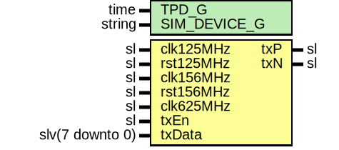

# Entity: SaltTxLvds

- **File**: SaltTxLvds.vhd
## Diagram

## Description

Company    : SLAC National Accelerator Laboratory
Description: SALT TX Engine Module
This file is part of 'SLAC Firmware Standard Library'.
It is subject to the license terms in the LICENSE.txt file found in the
top-level directory of this distribution and at:
   https://confluence.slac.stanford.edu/display/ppareg/LICENSE.html.
No part of 'SLAC Firmware Standard Library', including this file,
may be copied, modified, propagated, or distributed except according to
the terms contained in the LICENSE.txt file.
## Generics

| Generic name | Type | Value | Description |
| ------------ | ---- | ----- | ----------- |
| TPD_G        | time | 1 ns  |             |
## Ports

| Port name | Direction | Type            | Description       |
| --------- | --------- | --------------- | ----------------- |
| clk125MHz | in        | sl              | Clocks and Resets |
| rst125MHz | in        | sl              |                   |
| clk156MHz | in        | sl              |                   |
| rst156MHz | in        | sl              |                   |
| clk625MHz | in        | sl              |                   |
| txEn      | in        | sl              | GMII Interface    |
| txData    | in        | slv(7 downto 0) |                   |
| txP       | out       | sl              | LVDS TX Port      |
| txN       | out       | sl              |                   |
## Signals

| Name    | Type            | Description |
| ------- | --------------- | ----------- |
| r       | RegType         |             |
| rin     | RegType         |             |
| data10b | slv(9 downto 0) |             |
| data8b  | slv(7 downto 0) |             |
## Constants

| Name       | Type    | Value                                                                                                                                                                                                                  | Description |
| ---------- | ------- | ---------------------------------------------------------------------------------------------------------------------------------------------------------------------------------------------------------------------- | ----------- |
| REG_INIT_C | RegType |  (       txData => (others => '0'),        dataK  => '1',        data   => K_28_5_C,        state  => IDLE_S) |             |
## Types

| Name      | Type                                                                                               | Description |
| --------- | -------------------------------------------------------------------------------------------------- | ----------- |
| StateType | ( IDLE_S,  MOVE_S,  TERM_S)  |             |
| RegType   |                                                                                                    |             |
## Processes
- comb: ( r, rst125MHz, txData, txEn )
- seq: ( clk125MHz )
## Instantiations

- U_Encoder: surf.Encoder8b10b
- U_Gearbox: surf.AsyncGearbox
- U_TxSer: surf.SaltTxSer
