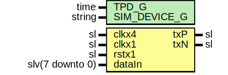

# Entity: SaltTxSer

- **File**: SaltTxSer.vhd
## Diagram

## Description

-----------------------------------------------------------------------------
 Company    : SLAC National Accelerator Laboratory
-----------------------------------------------------------------------------
 Description: Wrapper for SelectioSer
-----------------------------------------------------------------------------
 This file is part of 'SLAC Firmware Standard Library'.
 It is subject to the license terms in the LICENSE.txt file found in the
 top-level directory of this distribution and at:
    https://confluence.slac.stanford.edu/display/ppareg/LICENSE.html.
 No part of 'SLAC Firmware Standard Library', including this file,
 may be copied, modified, propagated, or distributed except according to
 the terms contained in the LICENSE.txt file.
-----------------------------------------------------------------------------
## Generics

| Generic name | Type   | Value        | Description |
| ------------ | ------ | ------------ | ----------- |
| TPD_G        | time   | 1 ns         |             |
| SIM_DEVICE_G | string | "ULTRASCALE" |             |
## Ports

| Port name | Direction | Type            | Description               |
| --------- | --------- | --------------- | ------------------------- |
| txP       | out       | sl              | SELECTIO Ports            |
| txN       | out       | sl              |                           |
| clkx4     | in        | sl              | Clock and Reset Interface |
| clkx1     | in        | sl              |                           |
| rstx1     | in        | sl              |                           |
| dataIn    | in        | slv(7 downto 0) | Output                    |
## Signals

| Name | Type | Description |
| ---- | ---- | ----------- |
| tx   | sl   |             |
## Instantiations

- U_OSERDESE3: OSERDESE3
- U_OBUFDS: OBUFDS
