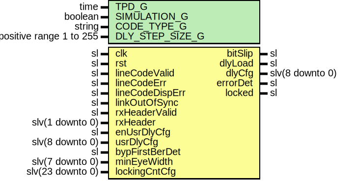

# Entity: SelectIoRxGearboxAligner

## Diagram

## Description

Company    : SLAC National Accelerator Laboratory
Description: Aligns the SELECTIO LVDS RX gearbox.
This file is part of 'SLAC Firmware Standard Library'.
It is subject to the license terms in the LICENSE.txt file found in the
top-level directory of this distribution and at:
   https://confluence.slac.stanford.edu/display/ppareg/LICENSE.html.
No part of 'SLAC Firmware Standard Library', including this file,
may be copied, modified, propagated, or distributed except according to
the terms contained in the LICENSE.txt file.
## Generics

| Generic name    | Type                    | Value       | Description    |
| --------------- | ----------------------- | ----------- | -------------- |
| TPD_G           | time                    | 1 ns        |                |
| SIMULATION_G    | boolean                 | false       |                |
| CODE_TYPE_G     | string                  | "LINE_CODE" | or "SCRAMBLER" |
| DLY_STEP_SIZE_G | positive range 1 to 255 | 1           |                |
## Ports

| Port name       | Direction | Type             | Description                                                                                                                 |
| --------------- | --------- | ---------------- | --------------------------------------------------------------------------------------------------------------------------- |
| clk             | in        | sl               | Clock and Reset                                                                                                             |
| rst             | in        | sl               |                                                                                                                             |
| lineCodeValid   | in        | sl               | Line-Code Interface (CODE_TYPE_G = "LINE_CODE")                                                                             |
| lineCodeErr     | in        | sl               |                                                                                                                             |
| lineCodeDispErr | in        | sl               |                                                                                                                             |
| linkOutOfSync   | in        | sl               |                                                                                                                             |
| rxHeaderValid   | in        | sl               | 64b/66b Interface (CODE_TYPE_G = "SCRAMBLER")                                                                               |
| rxHeader        | in        | slv(1 downto 0)  |                                                                                                                             |
| bitSlip         | out       | sl               | Gearbox Slip                                                                                                                |
| dlyLoad         | out       | sl               | IDELAY (DELAY_TYPE="VAR_LOAD") Interface                                                                                    |
| dlyCfg          | out       | slv(8 downto 0)  | Ultrascale: CNTVALUEIN=dlyCfg(8 downto 0), 7-series: CNTVALUEIN=dlyCfg(8 downto 4)                                          |
| enUsrDlyCfg     | in        | sl               | Enable User delay config                                                                                                    |
| usrDlyCfg       | in        | slv(8 downto 0)  | User delay config                                                                                                           |
| bypFirstBerDet  | in        | sl               | Set to '1' if IDELAY full scale range > 2 Unit Intervals (UI) of serial rate (example: IDELAY range 2.5ns  > 1 ns "1Gb/s" ) |
| minEyeWidth     | in        | slv(7 downto 0)  | Sets the minimum eye width required for locking (units of IDELAY step)                                                      |
| lockingCntCfg   | in        | slv(23 downto 0) | Number of error-free event before state=LOCKED_S                                                                            |
| errorDet        | out       | sl               | Status Interface                                                                                                            |
| locked          | out       | sl               |                                                                                                                             |
## Signals

| Name | Type    | Description |
| ---- | ------- | ----------- |
| r    | RegType |             |
| rin  | RegType |             |
## Constants

| Name        | Type     | Value                                                                                                                                                                                                                                                                                                                                                                                                                                                                                                                                                                                                                                                                                                                                                                                                                                                                                                                               | Description |
| ----------- | -------- | ----------------------------------------------------------------------------------------------------------------------------------------------------------------------------------------------------------------------------------------------------------------------------------------------------------------------------------------------------------------------------------------------------------------------------------------------------------------------------------------------------------------------------------------------------------------------------------------------------------------------------------------------------------------------------------------------------------------------------------------------------------------------------------------------------------------------------------------------------------------------------------------------------------------------------------- | ----------- |
| SLIP_WAIT_C | positive |  100                                                                                                                                                                                                                                                                                                                                                                                                                                                                                                                                                                                                                                                                                                                                                                                                                                                                                                                                |             |
| REG_INIT_C  | RegType  |  (       enUsrDlyCfg => '0',        usrDlyCfg   => (others => '0'),        dlyLoad     => (others => '0'),        dlyConfig   => (others => '0'),        dlyCache    => (others => '0'),        slipWaitCnt => 0,        goodCnt     => (others => '0'),        bitSlip     => '0',        errorDet    => '0',        firstError  => '0',        armed       => '0',        scanDone    => '0',        locked      => '0',        state       => UNLOCKED_S) |             |
## Types

| Name      | Type                                                                                                                                                                                                                                                                                                          | Description |
| --------- | ------------------------------------------------------------------------------------------------------------------------------------------------------------------------------------------------------------------------------------------------------------------------------------------------------------- | ----------- |
| StateType | ( UNLOCKED_S,  SLIP_WAIT_S,  LOCKING_S,  EYE_SCAN_S,  BIT_WAIT_S,  BIT_ALIGN_S,  LOCKED_S)  |             |
| RegType   |                                                                                                                                                                                                                                                                                                               |             |
## Processes
- comb: ( bypFirstBerDet, enUsrDlyCfg, lineCodeDispErr, lineCodeErr,
                   lineCodeValid, linkOutOfSync, lockingCntCfg, minEyeWidth, r,
                   rst, rxHeader, rxHeaderValid, usrDlyCfg )
- seq: ( clk )
