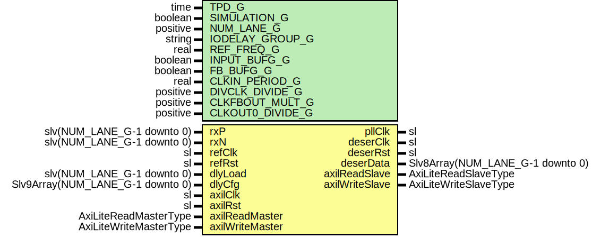

# Entity: SelectioDeser7Series

- **File**: SelectioDeser7Series.vhd
## Diagram

## Description

Company    : SLAC National Accelerator Laboratory
Description: PLL and Deserialization
This file is part of 'SLAC Firmware Standard Library'.
It is subject to the license terms in the LICENSE.txt file found in the
top-level directory of this distribution and at:
   https://confluence.slac.stanford.edu/display/ppareg/LICENSE.html.
No part of 'SLAC Firmware Standard Library', including this file,
may be copied, modified, propagated, or distributed except according to
the terms contained in the LICENSE.txt file.
## Generics

| Generic name     | Type     | Value         | Description                          |
| ---------------- | -------- | ------------- | ------------------------------------ |
| TPD_G            | time     | 1 ns          |                                      |
| SIMULATION_G     | boolean  | false         |                                      |
| NUM_LANE_G       | positive | 1             |                                      |
| IODELAY_GROUP_G  | string   | "DESER_GROUP" |                                      |
| REF_FREQ_G       | real     | 300.0         | IDELAYCTRL's REFCLK (in units of Hz) |
| INPUT_BUFG_G     | boolean  | false         |                                      |
| FB_BUFG_G        | boolean  | false         |                                      |
| CLKIN_PERIOD_G   | real     | 10.0          | 100 MHz                              |
| DIVCLK_DIVIDE_G  | positive | 1             |                                      |
| CLKFBOUT_MULT_G  | positive | 10            | 1 GHz = 100 MHz x 10 / 1             |
| CLKOUT0_DIVIDE_G | positive | 2             |                                      |
## Ports

| Port name       | Direction | Type                             | Description                                 |
| --------------- | --------- | -------------------------------- | ------------------------------------------- |
| rxP             | in        | slv(NUM_LANE_G-1 downto 0)       | SELECTIO Ports                              |
| rxN             | in        | slv(NUM_LANE_G-1 downto 0)       |                                             |
| pllClk          | out       | sl                               |                                             |
| refClk          | in        | sl                               | Reference Clock and Reset                   |
| refRst          | in        | sl                               |                                             |
| deserClk        | out       | sl                               | Deserialization Interface (deserClk domain) |
| deserRst        | out       | sl                               |                                             |
| deserData       | out       | Slv8Array(NUM_LANE_G-1 downto 0) |                                             |
| dlyLoad         | in        | slv(NUM_LANE_G-1 downto 0)       |                                             |
| dlyCfg          | in        | Slv9Array(NUM_LANE_G-1 downto 0) |                                             |
| axilClk         | in        | sl                               | AXI-Lite Interface (axilClk domain)         |
| axilRst         | in        | sl                               |                                             |
| axilReadMaster  | in        | AxiLiteReadMasterType            |                                             |
| axilReadSlave   | out       | AxiLiteReadSlaveType             |                                             |
| axilWriteMaster | in        | AxiLiteWriteMasterType           |                                             |
| axilWriteSlave  | out       | AxiLiteWriteSlaveType            |                                             |
## Signals

| Name  | Type | Description |
| ----- | ---- | ----------- |
| clkx4 | sl   |             |
| clkx1 | sl   |             |
| rstx1 | sl   |             |
| rstx4 | sl   |             |
## Instantiations

- U_MMCM: surf.ClockManager7
