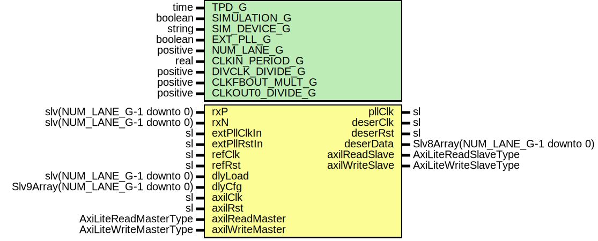

# Entity: SelectioDeserUltraScale

- **File**: SelectioDeserUltraScale.vhd
## Diagram

## Description

Company    : SLAC National Accelerator Laboratory
Description: PLL and Deserialization
This file is part of 'SLAC Firmware Standard Library'.
It is subject to the license terms in the LICENSE.txt file found in the
top-level directory of this distribution and at:
   https://confluence.slac.stanford.edu/display/ppareg/LICENSE.html.
No part of 'SLAC Firmware Standard Library', including this file,
may be copied, modified, propagated, or distributed except according to
the terms contained in the LICENSE.txt file.
## Generics

| Generic name     | Type     | Value | Description              |
| ---------------- | -------- | ----- | ------------------------ |
| TPD_G            | time     | 1 ns  |                          |
| SIMULATION_G     | boolean  | false |                          |
| EXT_PLL_G        | boolean  | false |                          |
| NUM_LANE_G       | positive | 1     |                          |
| CLKIN_PERIOD_G   | real     | 10.0  | 100 MHz                  |
| DIVCLK_DIVIDE_G  | positive | 1     |                          |
| CLKFBOUT_MULT_G  | positive | 10    | 1 GHz = 100 MHz x 10 / 1 |
| CLKOUT0_DIVIDE_G | positive | 2     |                          |
## Ports

| Port name       | Direction | Type                             | Description                                 |
| --------------- | --------- | -------------------------------- | ------------------------------------------- |
| rxP             | in        | slv(NUM_LANE_G-1 downto 0)       | SELECTIO Ports                              |
| rxN             | in        | slv(NUM_LANE_G-1 downto 0)       |                                             |
| pllClk          | out       | sl                               |                                             |
| extPllClkIn     | in        | sl                               | External PLL Interface                      |
| extPllRstIn     | in        | sl                               |                                             |
| refClk          | in        | sl                               | Reference Clock and Reset                   |
| refRst          | in        | sl                               |                                             |
| deserClk        | out       | sl                               | Deserialization Interface (deserClk domain) |
| deserRst        | out       | sl                               |                                             |
| deserData       | out       | Slv8Array(NUM_LANE_G-1 downto 0) |                                             |
| dlyLoad         | in        | slv(NUM_LANE_G-1 downto 0)       |                                             |
| dlyCfg          | in        | Slv9Array(NUM_LANE_G-1 downto 0) |                                             |
| axilClk         | in        | sl                               | AXI-Lite Interface (axilClk domain)         |
| axilRst         | in        | sl                               |                                             |
| axilReadMaster  | in        | AxiLiteReadMasterType            |                                             |
| axilReadSlave   | out       | AxiLiteReadSlaveType             |                                             |
| axilWriteMaster | in        | AxiLiteWriteMasterType           |                                             |
| axilWriteSlave  | out       | AxiLiteWriteSlaveType            |                                             |
## Signals

| Name    | Type             | Description |
| ------- | ---------------- | ----------- |
| drpRdy  | sl               |             |
| drpEn   | sl               |             |
| drpWe   | sl               |             |
| drpAddr | slv(6 downto 0)  |             |
| drpDi   | slv(15 downto 0) |             |
| drpDo   | slv(15 downto 0) |             |
| locked  | sl               |             |
| clkFb   | sl               |             |
| clkout0 | sl               |             |
| clkx4   | sl               |             |
| clkx1   | sl               |             |
| reset   | sl               |             |
| rstx1   | sl               |             |
## Instantiations

- U_Bufg: BUFGCE_DIV
**Description**
clkx1 is the ISERDESE3/OSERDESE3's CLKDIV port
Refer to "Figure 3-49: Sub-Optimal to Optimal Clocking Topologies for OSERDESE3" in UG949 (v2018.2)
https://www.xilinx.com/support/answers/67885.html

- U_reset: surf.RstSync
- U_rstx1: surf.RstPipeline
