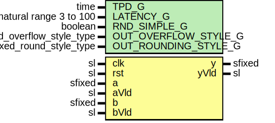

# Entity: sfixedMult

- **File**: SfixedMult.vhd
## Diagram

## Description

Company    : SLAC National Accelerator Laboratory
Description: signed fixed point multiplier using VHDL2008 fixed_pkg and
             unconstrained input/output ports.  Can infer 27x18 mult
             (1 DSP48) with latency >= 3 or 35x27 mult (2 DSP48) with
             lantecy >= 4
This file is part of 'SLAC Firmware Standard Library'.
It is subject to the license terms in the LICENSE.txt file found in the
top-level directory of this distribution and at:
   https://confluence.slac.stanford.edu/display/ppareg/LICENSE.html.
No part of 'SLAC Firmware Standard Library', including this file,
may be copied, modified, propagated, or distributed except according to
the terms contained in the LICENSE.txt file.
sfixed multiplier use LATENCY_G >= 3 for 27x18 (1 DSP48E2 slice)
sfixed multiplier use LATENCY_G >= 4 for 35x27 (2 DSP48E2 slices)
Using the reset may cause issues inferring correct DSP48 structure
## Generics

| Generic name         | Type                      | Value          | Description                                     |
| -------------------- | ------------------------- | -------------- | ----------------------------------------------- |
| TPD_G                | time                      | 1 ns           |                                                 |
| LATENCY_G            | natural range 3 to 100    | 3              |                                                 |
| RND_SIMPLE_G         | boolean                   | false          | may interfere with large mult inference (35x27) |
| OUT_OVERFLOW_STYLE_G | fixed_overflow_style_type | fixed_wrap     |                                                 |
| OUT_ROUNDING_STYLE_G | fixed_round_style_type    | fixed_truncate |                                                 |
## Ports

| Port name | Direction | Type   | Description                          |
| --------- | --------- | ------ | ------------------------------------ |
| clk       | in        | sl     |                                      |
| rst       | in        | sl     | rst may cause issues inferring DSP48 |
| a         | in        | sfixed |                                      |
| aVld      | in        | sl     |                                      |
| b         | in        | sfixed |                                      |
| bVld      | in        | sl     |                                      |
| y         | out       | sfixed | outputs                              |
| yVld      | out       | sl     |                                      |
## Signals

| Name | Type                                    | Description |
| ---- | --------------------------------------- | ----------- |
| c    | sfixed(C_HIGH_BIT_C downto C_LOW_BIT_C) |             |
| r    | RegType                                 |             |
| rin  | RegType                                 |             |
## Constants

| Name         | Type    | Value                                                                                                                                                                                                                                                                                                                          | Description |
| ------------ | ------- | ------------------------------------------------------------------------------------------------------------------------------------------------------------------------------------------------------------------------------------------------------------------------------------------------------------------------------ | ----------- |
| C_HIGH_BIT_C | integer |  a'high + b'high + 1                                                                                                                                                                                                                                                                                                           |             |
| C_LOW_BIT_C  | integer |  a'low  + b'low                                                                                                                                                                                                                                                                                                                |             |
| REG_INIT_C   | RegType |  (       areg  => (others => '0'),        breg  => (others => '0'),        mreg  => (others => '0'),        preg  => (others => (others => '0')),        vld   => (others => '0')) |             |
## Types

| Name        | Type                              | Description |
| ----------- | --------------------------------- | ----------- |
| sfixedArray | array(natural range<>) of sfixed  |             |
| RegType     |                                   |             |
## Processes
- comb: ( a, b, c, aVld, bVld, r )
- seq: ( clk )
