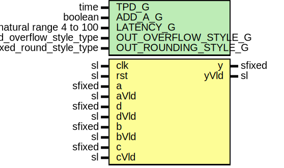

# Entity: sfixedPreAddMultAdd

- **File**: SfixedPreAddMultAdd.vhd
## Diagram

## Description

Company    : SLAC National Accelerator Laboratory
Description: signed fixed point preAdd mult add module using VHDL2008 fixed_pkg.
             (D + A)*B + C (ADD_A_G = true)
             (D - A)*B + C (ADD_A_G = false)
             lantecy >= 4
This file is part of 'SLAC Firmware Standard Library'.
It is subject to the license terms in the LICENSE.txt file found in the
top-level directory of this distribution and at:
   https://confluence.slac.stanford.edu/display/ppareg/LICENSE.html.
No part of 'SLAC Firmware Standard Library', including this file,
may be copied, modified, propagated, or distributed except according to
the terms contained in the LICENSE.txt file.
## Generics

| Generic name         | Type                      | Value          | Description |
| -------------------- | ------------------------- | -------------- | ----------- |
| TPD_G                | time                      | 1 ns           |             |
| ADD_A_G              | boolean                   | true           | (D+A)*B+C   |
| LATENCY_G            | natural range 4 to 100    | 4              |             |
| OUT_OVERFLOW_STYLE_G | fixed_overflow_style_type | fixed_wrap     |             |
| OUT_ROUNDING_STYLE_G | fixed_round_style_type    | fixed_truncate |             |
## Ports

| Port name | Direction | Type   | Description                          |
| --------- | --------- | ------ | ------------------------------------ |
| clk       | in        | sl     |                                      |
| rst       | in        | sl     | rst may cause issues inferring DSP48 |
| a         | in        | sfixed |                                      |
| aVld      | in        | sl     |                                      |
| d         | in        | sfixed |                                      |
| dVld      | in        | sl     |                                      |
| b         | in        | sfixed |                                      |
| bVld      | in        | sl     |                                      |
| c         | in        | sfixed |                                      |
| cVld      | in        | sl     |                                      |
| y         | out       | sfixed | outputs                              |
| yVld      | out       | sl     |                                      |
## Signals

| Name | Type    | Description |
| ---- | ------- | ----------- |
| r    | RegType |             |
| rin  | RegType |             |
## Constants

| Name           | Type    | Value                                                                                                                                                                                                                                                                                                                                                                                                                                                                                                                                                                                                                                                                                                                                                             | Description |
| -------------- | ------- | ----------------------------------------------------------------------------------------------------------------------------------------------------------------------------------------------------------------------------------------------------------------------------------------------------------------------------------------------------------------------------------------------------------------------------------------------------------------------------------------------------------------------------------------------------------------------------------------------------------------------------------------------------------------------------------------------------------------------------------------------------------------- | ----------- |
| PRE_ADD_HIGH_C | integer |  maximum(a'high,  d'high) + 1                                                                                                                                                                                                                                                                                                                                                                                                                                                                                                                                                                                                                                                                                                  |             |
| PRE_ADD_LOW_C  | integer |  minimum(a'low,  d'low)                                                                                                                                                                                                                                                                                                                                                                                                                                                                                                                                                                                                                                                                                                        |             |
| REG_INIT_C     | RegType |  (       areg   => (others => '0'),        dreg   => (others => '0'),        breg   => (others => '0'),        brreg  => (others => '0'),        creg   => (others => '0'),        crreg  => (others => '0'),        crrreg => (others => '0'),        preAdd => (others => '0'),        mreg   => (others => '0'),        preg   => (others => (others => '0')),        vld    => (others => '0')) |             |
## Types

| Name        | Type                              | Description |
| ----------- | --------------------------------- | ----------- |
| sfixedArray | array(natural range<>) of sfixed  |             |
| RegType     |                                   |             |
## Processes
- comb: ( a, d, b, c, aVld, dVld, bVld, cVld, r )
- seq: ( clk )
