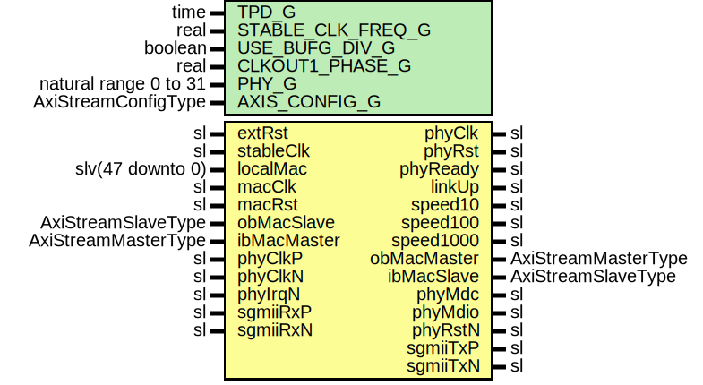

# Entity: Sgmii88E1111LvdsUltraScale

- **File**: Sgmii88E1111LvdsUltraScale.vhd
## Diagram

## Description

Company    : SLAC National Accelerator Laboratory
Description: Wrapper for Marvell 88E1111 PHY + GigEthLvdsUltraScaleWrapper
This file is part of 'SLAC Firmware Standard Library'.
It is subject to the license terms in the LICENSE.txt file found in the
top-level directory of this distribution and at:
   https://confluence.slac.stanford.edu/display/ppareg/LICENSE.html.
No part of 'SLAC Firmware Standard Library', including this file,
may be copied, modified, propagated, or distributed except according to
the terms contained in the LICENSE.txt file.
## Generics

| Generic name      | Type                  | Value              | Description |
| ----------------- | --------------------- | ------------------ | ----------- |
| TPD_G             | time                  | 1 ns               |             |
| STABLE_CLK_FREQ_G | real                  | 156.25E+6          |             |
| USE_BUFG_DIV_G    | boolean               | false              |             |
| CLKOUT1_PHASE_G   | real                  | 90.0               |             |
| PHY_G             | natural range 0 to 31 | 7                  |             |
| AXIS_CONFIG_G     | AxiStreamConfigType   | EMAC_AXIS_CONFIG_C |             |
## Ports

| Port name   | Direction | Type                | Description                                         |
| ----------- | --------- | ------------------- | --------------------------------------------------- |
| extRst      | in        | sl                  | active high                                         |
| stableClk   | in        | sl                  | Stable clock reference                              |
| phyClk      | out       | sl                  |                                                     |
| phyRst      | out       | sl                  |                                                     |
| localMac    | in        | slv(47 downto 0)    |  big-Endian configuration                           |
| phyReady    | out       | sl                  |                                                     |
| linkUp      | out       | sl                  |                                                     |
| speed10     | out       | sl                  |                                                     |
| speed100    | out       | sl                  |                                                     |
| speed1000   | out       | sl                  |                                                     |
| macClk      | in        | sl                  | Interface to Ethernet Media Access Controller (MAC) |
| macRst      | in        | sl                  |                                                     |
| obMacMaster | out       | AxiStreamMasterType |                                                     |
| obMacSlave  | in        | AxiStreamSlaveType  |                                                     |
| ibMacMaster | in        | AxiStreamMasterType |                                                     |
| ibMacSlave  | out       | AxiStreamSlaveType  |                                                     |
| phyClkP     | in        | sl                  | 625.0 MHz                                           |
| phyClkN     | in        | sl                  |                                                     |
| phyMdc      | out       | sl                  |                                                     |
| phyMdio     | inout     | sl                  |                                                     |
| phyRstN     | out       | sl                  | active low                                          |
| phyIrqN     | in        | sl                  | active low                                          |
| sgmiiRxP    | in        | sl                  | LVDS SGMII Ports                                    |
| sgmiiRxN    | in        | sl                  |                                                     |
| sgmiiTxP    | out       | sl                  |                                                     |
| sgmiiTxN    | out       | sl                  |                                                     |
## Signals

| Name        | Type | Description |
| ----------- | ---- | ----------- |
| phyClock    | sl   |             |
| phyReset    | sl   |             |
| phyInitRst  | sl   |             |
| phyIrq      | sl   |             |
| phyMdi      | sl   |             |
| phyMdo      | sl   |             |
| extPhyRstN  | sl   |             |
| extPhyReady | sl   |             |
| sp10_100    | sl   |             |
| sp100       | sl   |             |
| initDone    | sl   |             |
## Instantiations

- U_PwrUpRst0: surf.PwrUpRst
**Description**
We must hold reset for >10ms and then wait >5ms until we may talk
to it (we actually wait also >10ms) which is indicated by 'extPhyReady'

- U_PwrUpRst1: surf.PwrUpRst
- U_PhyInitRstSync: surf.RstSync
**Description**
The MDIO controller which talks to the external PHY must be held
in reset until extPhyReady; it works in a different clock domain...

- U_PhyCtrl: surf.Sgmii88E1111Mdio
**Description**
The SaltCore does not support auto-negotiation on the SGMII link
(mac<->phy) - however, the Marvell PHY (by default) assumes it does.
We need to disable auto-negotiation in the PHY on the SGMII side
and handle link changes (aneg still enabled on copper) flagged
by the PHY...

- U_SyncMdi: surf.Synchronizer
**Description**
synchronize MDI and IRQ signals into 'clk' domain

- U_SyncIrq: surf.Synchronizer
- U_1GigE: surf.GigEthLvdsUltraScaleWrapper
