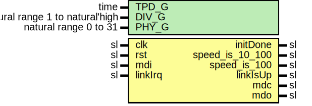

# Entity: Sgmii88E1111Mdio

- **File**: Sgmii88E1111Mdio.vhd
## Diagram

## Description

Company    : SLAC National Accelerator Laboratory
Description: Controller for the Marvell 88E1111 PHY
This file is part of 'SLAC Firmware Standard Library'.
It is subject to the license terms in the LICENSE.txt file found in the
top-level directory of this distribution and at:
   https://confluence.slac.stanford.edu/display/ppareg/LICENSE.html.
No part of 'SLAC Firmware Standard Library', including this file,
may be copied, modified, propagated, or distributed except according to
the terms contained in the LICENSE.txt file.
## Generics

| Generic name | Type                            | Value | Description                       |
| ------------ | ------------------------------- | ----- | --------------------------------- |
| TPD_G        | time                            | 1 ns  |                                   |
| DIV_G        | natural range 1 to natural'high | 1     | half-period of MDC in clk cycles  |
| PHY_G        | natural range 0 to 31           | 7     |                                   |
## Ports

| Port name       | Direction | Type | Description                  |
| --------------- | --------- | ---- | ---------------------------- |
| clk             | in        | sl   | clock and reset              |
| rst             | in        | sl   |                              |
| initDone        | out       | sl   | misc                         |
| speed_is_10_100 | out       | sl   |                              |
| speed_is_100    | out       | sl   |                              |
| linkIsUp        | out       | sl   |                              |
| mdc             | out       | sl   | MDIO interface               |
| mdo             | out       | sl   |                              |
| mdi             | in        | sl   |                              |
| linkIrq         | in        | sl   | link status change interrupt |
## Signals

| Name     | Type                                 | Description |
| -------- | ------------------------------------ | ----------- |
| r        | RegType                              |             |
| rin      | RegType                              |             |
| hdlrDone | sl                                   |             |
| args     | Slv16Array(0 to NUM_READ_ARGS_C - 1) |             |
## Constants

| Name            | Type             | Value                                                                                                                                                                                                                                                                                                                                                                                                                                                                                                                                                                                                                                                                                                                                                                                                                                                                                                                                                                                                                                                                                                                                                                                                                                                                                                                                                                                                                                                                                                                                                                                    | Description                                                                                                               |
| --------------- | ---------------- | ---------------------------------------------------------------------------------------------------------------------------------------------------------------------------------------------------------------------------------------------------------------------------------------------------------------------------------------------------------------------------------------------------------------------------------------------------------------------------------------------------------------------------------------------------------------------------------------------------------------------------------------------------------------------------------------------------------------------------------------------------------------------------------------------------------------------------------------------------------------------------------------------------------------------------------------------------------------------------------------------------------------------------------------------------------------------------------------------------------------------------------------------------------------------------------------------------------------------------------------------------------------------------------------------------------------------------------------------------------------------------------------------------------------------------------------------------------------------------------------------------------------------------------------------------------------------------------------- | ------------------------------------------------------------------------------------------------------------------------- |
| P_INIT_C        | MdioProgramArray |        (          mdioWriteInst(PHY_G,  22,  X"0001",  false),   -- select page 1          mdioWriteInst(PHY_G,  0,  X"0140",  false),   -- disable ANEG on SMII side          mdioWriteInst(PHY_G,  22,  X"0000",  false),   -- select page 0          mdioWriteInst(PHY_G,  4,  X"0140",  false),   -- advertise 10/100 FD only          mdioWriteInst(PHY_G,  9,  X"0200",  false),   -- advertise 1000   FD only          mdioWriteInst(PHY_G,  18,  X"0c00",  false),   -- enable link status and ANEG IRQ          mdioWriteInst(PHY_G,  0,  X"1340",  true)    -- restart copper ANEG          ) |                                                                                                                           |
| REG19_IDX_C     | natural          |  0                                                                                                                                                                                                                                                                                                                                                                                                                                                                                                                                                                                                                                                                                                                                                                                                                                                                                                                                                                                                                                                                                                                                                                                                                                                                                                                                                                                                                                                                                                                                                                                       |                                                                                                                           |
| REG17_IDX_C     | natural          |  1                                                                                                                                                                                                                                                                                                                                                                                                                                                                                                                                                                                                                                                                                                                                                                                                                                                                                                                                                                                                                                                                                                                                                                                                                                                                                                                                                                                                                                                                                                                                                                                       |                                                                                                                           |
| P_HDLR_C        | MdioProgramArray |        (          REG19_IDX_C => mdioReadInst(PHY_G,  19,  false),   -- read/ack/clear interrupt          REG17_IDX_C => mdioReadInst(PHY_G,  17,  true)  -- read current speed and link status          )                                                                                                                                                                                                                                                                                                                                                                                                                                                                                                                                                                                                                                                                                                                                                                                                                                                                                                                                                                                                                                                                                                                                                                                                | IRQ Handler sequence: 1) read back and clear interrupts (reading does clear them) 2) obtain current link status and speed |
| NUM_READ_ARGS_C | natural          |  mdioProgNumReadTransactions(P_HDLR_C)                                                                                                                                                                                                                                                                                                                                                                                                                                                                                                                                                                                                                                                                                                                                                                                                                                                                                                                                                                                                                                                                                                                                                                                                                                                                                                                                                                                                                                                                                                                                                   |                                                                                                                           |
| REG_INIT_C      | RegType          |  (       s10_100  => '0',        s100     => '0',        linkIsUp => '0'       )                                                                                                                                                                                                                                                                                                                                                                                                                                                                                                                                                                                                                                                                                                                                                                                                                                                                                                                                                                                                                                                                                                                                                                                                                                                                                                                                                                                                                                   |                                                                                                                           |
## Types

| Name    | Type | Description |
| ------- | ---- | ----------- |
| RegType |      |             |
## Processes
- COMB: ( args, hdlrDone, r )
- SEQ: ( clk )
## Instantiations

- U_MdioLinkIrqHandler: surf.MdioLinkIrqHandler
