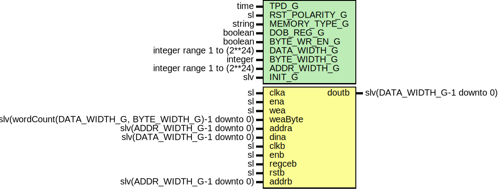

# Entity: SimpleDualPortRam

- **File**: SimpleDualPortRam.vhd
## Diagram

## Description

Company    : SLAC National Accelerator Laboratory
Description: This will infer this module as either Block RAM or distributed RAM
This file is part of 'SLAC Firmware Standard Library'.
It is subject to the license terms in the LICENSE.txt file found in the
top-level directory of this distribution and at:
   https://confluence.slac.stanford.edu/display/ppareg/LICENSE.html.
No part of 'SLAC Firmware Standard Library', including this file,
may be copied, modified, propagated, or distributed except according to
the terms contained in the LICENSE.txt file.
## Generics

| Generic name   | Type                       | Value   | Description                                 |
| -------------- | -------------------------- | ------- | ------------------------------------------- |
| TPD_G          | time                       | 1 ns    |                                             |
| RST_POLARITY_G | sl                         | '1'     | '1' for active high rst, '0' for active low |
| MEMORY_TYPE_G  | string                     | "block" |                                             |
| DOB_REG_G      | boolean                    | false   | Extra reg on doutb (folded into BRAM)       |
| BYTE_WR_EN_G   | boolean                    | false   |                                             |
| DATA_WIDTH_G   | integer range 1 to (2**24) | 16      |                                             |
| BYTE_WIDTH_G   | integer                    | 8       | If BRAM, should be multiple or 8 or 9       |
| ADDR_WIDTH_G   | integer range 1 to (2**24) | 4       |                                             |
| INIT_G         | slv                        | "0"     |                                             |
## Ports

| Port name | Direction | Type                                                  | Description |
| --------- | --------- | ----------------------------------------------------- | ----------- |
| clka      | in        | sl                                                    | Port A      |
| ena       | in        | sl                                                    |             |
| wea       | in        | sl                                                    |             |
| weaByte   | in        | slv(wordCount(DATA_WIDTH_G, BYTE_WIDTH_G)-1 downto 0) |             |
| addra     | in        | slv(ADDR_WIDTH_G-1 downto 0)                          |             |
| dina      | in        | slv(DATA_WIDTH_G-1 downto 0)                          |             |
| clkb      | in        | sl                                                    | Port B      |
| enb       | in        | sl                                                    |             |
| regceb    | in        | sl                                                    |             |
| rstb      | in        | sl                                                    |             |
| addrb     | in        | slv(ADDR_WIDTH_G-1 downto 0)                          |             |
| doutb     | out       | slv(DATA_WIDTH_G-1 downto 0)                          |             |
## Signals

| Name       | Type                              | Description |
| ---------- | --------------------------------- | ----------- |
| doutBInt   | slv(FULL_DATA_WIDTH_C-1 downto 0) |             |
| weaByteInt | slv(weaByte'range)                |             |
## Constants

| Name              | Type                              | Value                                                                                                                          | Description |
| ----------------- | --------------------------------- | ------------------------------------------------------------------------------------------------------------------------------ | ----------- |
| BYTE_WIDTH_C      | natural                           |  ite(BYTE_WR_EN_G,  BYTE_WIDTH_G,  DATA_WIDTH_G)         |             |
| NUM_BYTES_C       | natural                           |  wordCount(DATA_WIDTH_G,  BYTE_WIDTH_C)                                                     |             |
| FULL_DATA_WIDTH_C | natural                           |  NUM_BYTES_C*BYTE_WIDTH_C                                                                                                      |             |
| INIT_C            | slv(FULL_DATA_WIDTH_C-1 downto 0) |  ite(INIT_G = "0",  slvZero(FULL_DATA_WIDTH_C),  INIT_G) |             |
| XST_BRAM_STYLE_C  | string                            |  MEMORY_TYPE_G                                                                                                                 |             |
## Types

| Name     | Type | Description   |
| -------- | ---- | ------------- |
| mem_type |      | Shared memory |
## Processes
- unnamed: ( clka )
**Description**
Port A

- unnamed: ( clkb )
**Description**
Port B

