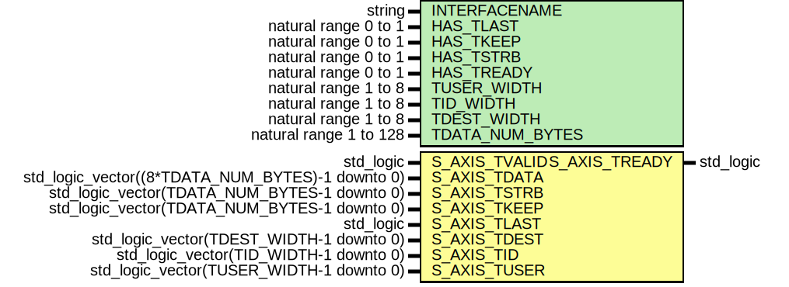

# Entity: SlaveAxiStreamTerminateIpIntegrator

- **File**: SlaveAxiStreamTerminateIpIntegrator.vhd
## Diagram

## Description

-----------------------------------------------------------------------------
 Company    : SLAC National Accelerator Laboratory
-----------------------------------------------------------------------------
 Description: IP Integrator Wrapper for terminating a SLAVE AXI stream bus
-----------------------------------------------------------------------------
 TCL Command: create_bd_cell -type module -reference SlaveAxiStreamTerminateIpIntegrator SlaveAxisTerm_0
-----------------------------------------------------------------------------
 This file is part of 'SLAC Firmware Standard Library'.
 It is subject to the license terms in the LICENSE.txt file found in the
 top-level directory of this distribution and at:
    https://confluence.slac.stanford.edu/display/ppareg/LICENSE.html.
 No part of 'SLAC Firmware Standard Library', including this file,
 may be copied, modified, propagated, or distributed except according to
 the terms contained in the LICENSE.txt file.
-----------------------------------------------------------------------------
## Generics

| Generic name    | Type                   | Value    | Description |
| --------------- | ---------------------- | -------- | ----------- |
| INTERFACENAME   | string                 | "S_AXIS" |             |
| HAS_TLAST       | natural range 0 to 1   | 1        |             |
| HAS_TKEEP       | natural range 0 to 1   | 1        |             |
| HAS_TSTRB       | natural range 0 to 1   | 0        |             |
| HAS_TREADY      | natural range 0 to 1   | 1        |             |
| TUSER_WIDTH     | natural range 1 to 8   | 2        |             |
| TID_WIDTH       | natural range 1 to 8   | 1        |             |
| TDEST_WIDTH     | natural range 1 to 8   | 1        |             |
| TDATA_NUM_BYTES | natural range 1 to 128 | 1        |             |
## Ports

| Port name     | Direction | Type                                             | Description                        |
| ------------- | --------- | ------------------------------------------------ | ---------------------------------- |
| S_AXIS_TVALID | in        | std_logic                                        | IP Integrator AXI Stream Interface |
| S_AXIS_TDATA  | in        | std_logic_vector((8*TDATA_NUM_BYTES)-1 downto 0) |                                    |
| S_AXIS_TSTRB  | in        | std_logic_vector(TDATA_NUM_BYTES-1 downto 0)     |                                    |
| S_AXIS_TKEEP  | in        | std_logic_vector(TDATA_NUM_BYTES-1 downto 0)     |                                    |
| S_AXIS_TLAST  | in        | std_logic                                        |                                    |
| S_AXIS_TDEST  | in        | std_logic_vector(TDEST_WIDTH-1 downto 0)         |                                    |
| S_AXIS_TID    | in        | std_logic_vector(TID_WIDTH-1 downto 0)           |                                    |
| S_AXIS_TUSER  | in        | std_logic_vector(TUSER_WIDTH-1 downto 0)         |                                    |
| S_AXIS_TREADY | out       | std_logic                                        |                                    |
## Instantiations

- U_ShimLayer: surf.SlaveAxiStreamIpIntegrator
